# Android中数据的处理和调用(1501210399-闻征涛）

本编文章涵盖的内容比较宽泛，作者是想通过这篇技术文章，结合上课时所做的天气预报项目，谈一谈数据在安卓中是怎样被处理、保存和调用的。就天气预报项目来说，对xml数据的解析方式不在本文的讨论范围内，而是从数据被本地程序解析完成之后，如何处理z这些内容，显然从网络解析得到的数据要被本地存储，并在需要的时候能够调用出来，还有一点是数据搜索和匹配工作，这在城市列表的索引时要用到。

首先声明一点，我在上课之前没有接触过安卓开发，对java的学习也是在上这门课的时候临时学的，所以存在很多疏漏和疑问，正好就写这篇文章的机会再来详细了解一下java的数据结构和数据存储。因此本文不局限于介绍Android的内容，还会结合一下java的知识，如果你像我一样是个初学者，那么我相信此文一定会对你有所帮助。同时有不足和错误的地方（一定会有的），读者可以踊跃纠正之。

Android中用来显示数据的控件很多，例如ListView、TextView，但在这些控件发挥作用之前，都需要对数据进行保存之后，才能调用用。于是在获得数据与使用数据之间就有了一个存储和管理的环节，通常我们立刻会想到数据库，如果是处理很多的数据用数据库毫无疑问，但是如果只是普通的一些数据需要保存当然不能随时都用数据库，实际开发中也是如此，用到最多的就是ArryList和List。它们确实都是java的内容，放到Android中不太合适，但是在Android中有大量应用，具体的实现细节比较令我困惑，所以我就先介绍一下ArryList、List和HashTable，之后再介绍Android中的5种数据存储方式，包括SharedPreferences存储数据、ContentProvider存储、文件存储、SQLite存储和网络存储。

在打开List的源代码时发现它是继承自Collection接口，它是集合的父接口，所有的接口都是继承自它。什么是集合，它不同于数组，在数组中我们只能存储单一的数据类型，而对于集合它可以存储不同的对象，称之为元素。Collection接口提供了添加、删除等管理元素的功能。根据数据管理方式的不同Collection接口可以分为三种：Map接口、Set接口、List接口，外加一种用来遍历Collection接口中每一个元素的iterator()方法。
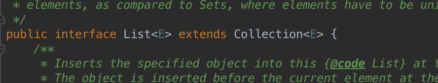
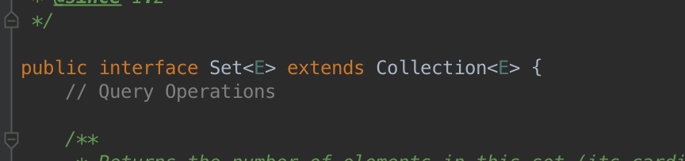
                                图1：Collection接口

在日常开发中用到的数组和列表等数据结构，基本上都是对List和Set接口的实现。List接口是有序的Collection，用户通过索引类似于在数组中搜索下标的方式访问list，list是允许相同元素出现的一种数据结构，实现List接口的常用类有LinkedList和ArryList，后者在天气预报程序中经常用到，用来保存城市信息。ArrayList数组列表类实现了可变大小的数组，允许存储所有元素。Arrylist支持常见的add、isEmpty等方法，还有些常见的问题需要解释。首先是泛型<>的感念，我一直很不明白为什么程序要这样写，这个尖括号里的City是什么意思，City在程序里明明是一个类。

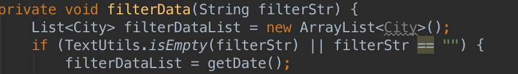
图2：泛型应用

在查阅了有关资料后才知道原来此处<>用的是泛型，就是将ArrayList数组里的对象限制成City类里的对象，这样是为了防止不属于City类型的对象被误存入数组中。其次是当使用remove方法想要将一个元素移出ArrayList时，若移除的事null时，是否会报错的问题。我们知道arraylist是支持空元素的，当我们在存入了一个空元素之后想要移除，如图中的源代码所示：

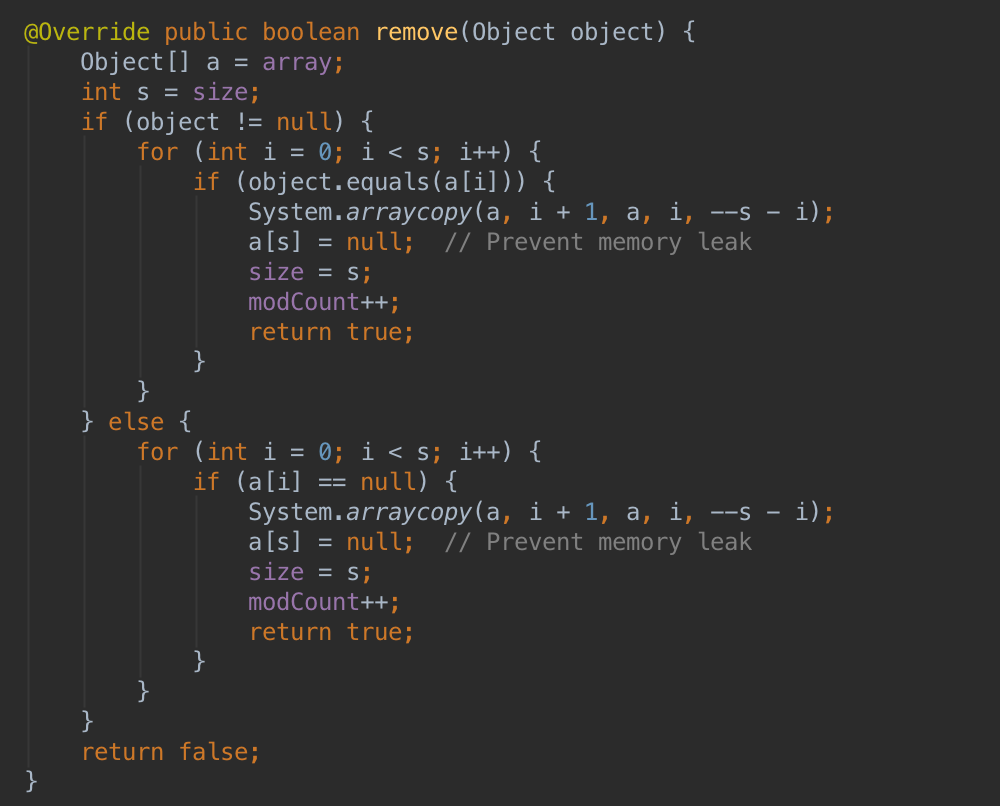
图3：arrayList的remove方法

程序首先会比对要移除的元素是否为空元素，若为空元素则挨个查询，但值得注意的是并不会一次将所有要remove的元素全部删除，正因为arrayList是可以存入重复元素的，所以每调用一次remove就只删除一个元素，顺序和存入的顺序相同。在实际应用中我们还需要将arraylist转换成数组的形式，我们不需要用for循环的方式将元素一个个复制到新的数组中去，只需要使用toArray方法。

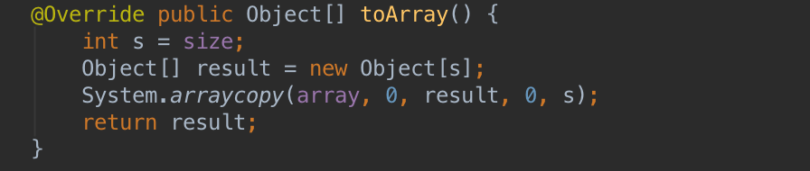
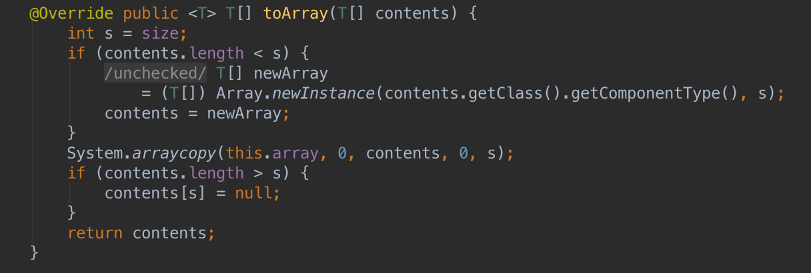
图4：toArray方法

此处有两个toArray方法，第一个是默认的自动新建一个和现有arraylist对象相同大小的数组，将元素全部放入并返回。第二个是你已经有一个数组了，使用toArray给这个数组赋值，那么就会有两种情况，如果你给的数组比arrlist对象小，那只能保留已有数组容量的元素。反之多余的位置会被null填充。

看完了arraylist的源代码后，在天气预报的程序中涉及到对list集合对象的访问，如下图所示，用的不是常见的for循环方式，但也没有使用迭代器。

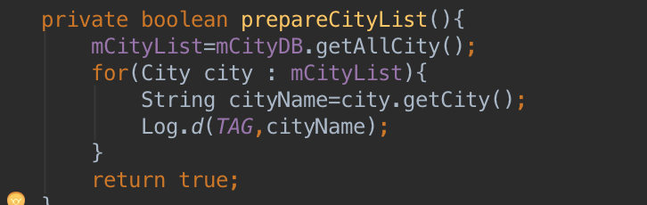
图5：for循环方式

以此处的prepareCityList为例，mCityList是一个List<City>对象，cityDB是处理数据库的类的对象，getAllCity方法返回了数据库中所保存的有关城市名、拼音、城市代码等数据，此方法返回了一个arraylist<City>对象list，如下图所示，可以很好地说明list集合可以存入很多个City对象item，有点像是对象数组，而不单单只能存数据。

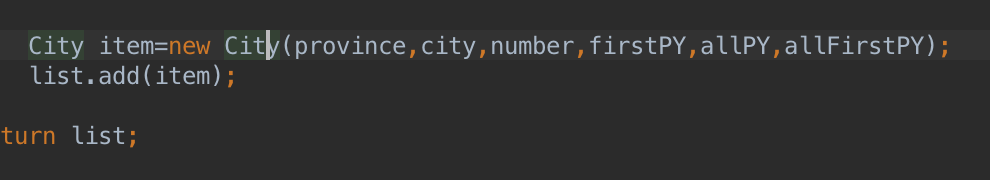
图6：向list里添加对象

于是mCityList对象被赋值为list，属于同类对象的赋值。下面的for循环是为了检验是否从数据库中成功获取了数据，而意图在logcat中打印城市名称，需要将list列表里的每一个City对象取出，并调用getCity方法才行。这里一共有三种方法可以实现。第一种用传统的for循环：

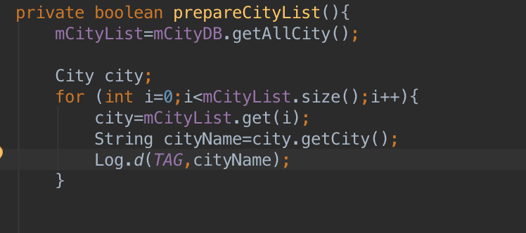
图7：第二种for循环

这种比较好理解，但程序比较繁琐，新建一个City对象city，每一次从mCityList中取出一个City对象赋给city，在调用相应的getCity方法获得每一个对象的cityName，在mCityList中有几个对象就执行几次。经过验证还可以简化上述代码：

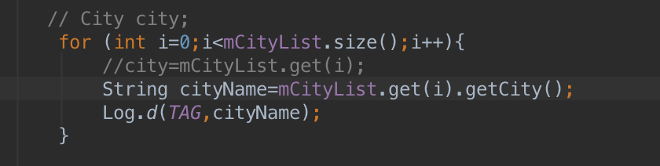
图8：第三种for循环

第二种就如图5所示使用的是增强型的for循环语句，在循环中就完成了对象赋值，执行速度和代码简介度都要优于第一种。第三种使用的是迭代器的方式，迭代器是List集合中自带的用来遍历集合成员的游标（Cursor），它一直指向的是两个元素之间的位置，在使用hasNext方法时若它的下方还有元素则返回true，在使用next方法时，则返回下一个元素并指向下两个元素之间的位置。迭代器是为容器对象而生的，专门用于访问容器对象而不会暴露对象的内部细节。在天气预报项目中，mCityList就可以算作一个容器对象，里面装载着很多City对象。

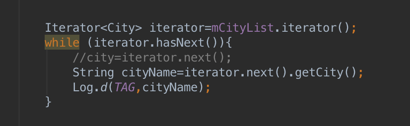
图9：迭代器

至此，List接口下的ArrayList实现算基本介绍完了，其他实现例如Set这里就不在阐述。

再次就是程序中在主界面和城市选择界面会用Intent来传递信息，如图所示：

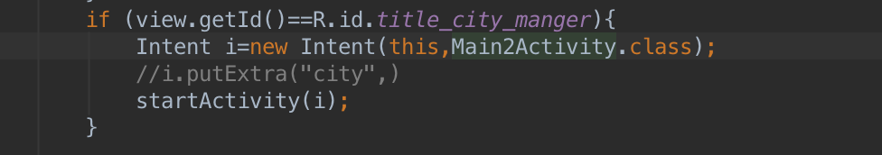
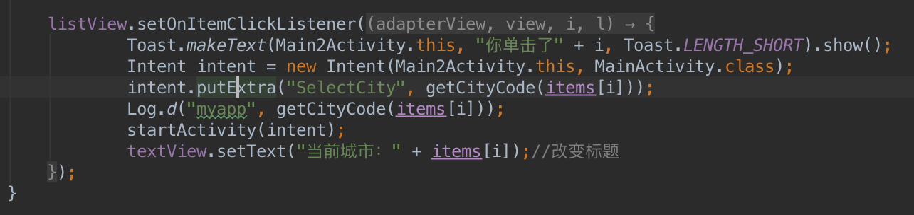
图10：Intent传递对象

使用了putExtra方法，一路go to declaration就来到了如下图所示的位置：

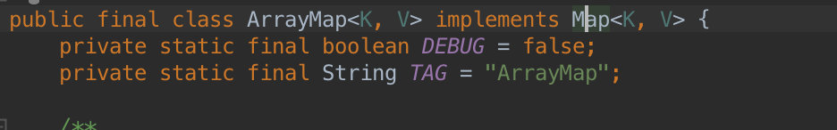
图11：Map方式存储

那么类似于List接口的新的一种接口Map就出现了，继续go to会发现Map并没有继承自Collection集合，看一下官方介绍：

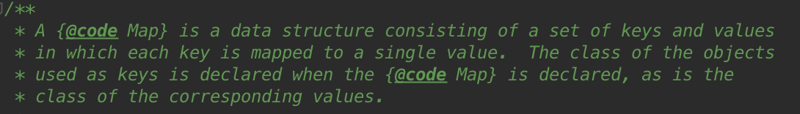
图12：Map介绍

Map提供key到value的映射，每一个key对应一个value，key名不能重复，这有点像每一个地址下对应一个数据。ArrayMap是对Map接口的一个实现，它是一个比HashMap更高效的数据结构，利用key—>value的映射关系存储数据，内部将所有的key构成一个数组，将所有的value构成一个数组，在需要时只要增加数组长度而不需要占用固定的内存空间，因此在手机这样内存较少的平台上有很好的优化效果。在程序中是通过它来传递单击选择的城市代码的，利用putExtra方法，使关键SelectCity和Citycode相关联，在MainActivity中利用getStringExtra方法获得城市代码，如图所示：

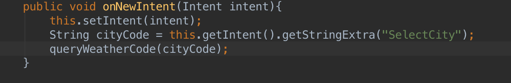
图13：新建接受intent

接下来进入Android五中数据存储方式，其中在天气预报应用到的事SharedPreferences和SQLite了。SharedPreferences是Android平台上一个轻量级的数据存储类，它使用Map数据结构—key/value。所以SharedPreferences常用来存储一些配置信息，最典型的应用就是在一个Activity调用onPause方法暂停时，总有一些数据需要暂时存储一下，留待此Activity重新活动时继续使用，我们就可以使用SharedPreferences来保存这些数据。在天气预报项目中的用法如下图所示：

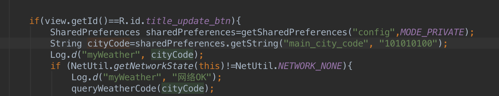
图14：SharedPreferences存储

SharedPreferences有四种操作模式，分别是Private、Append、World_Readable、World_Writeable，我们所使用的是第一种代表该SharedPreferences文件是私有文件只能被本应用访问。Append模式会检查指定的文件是否存在，若存在则会往文件里追加类容，若不存在则新建文件。Readable和Writeable标识出文件是否可以被其他应用读取和写入。可见SharedPreferences不仅可以让Activity之间共享数据（Intent之外）还可以让不同的应用共享数据，这是因为使用SharedPreferences存入的数据其实是保存在了xml文件里，而不是在内存中。使用SharedPreferences的第一步就是实例化一个对象并设置工作模式，此处不需要被其他应用程序共享因此选择Private模式，下一行使用getString方法获得城市代码，但是我奇怪的是前面并没有用过putString方法保存过有关main_city_code的value，为什么可以直接取得value呢？通过查找getString的声明，如下图：

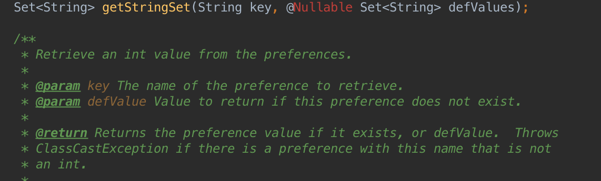
图15：defValue

发现此处的城市代码是defValue默认值，在key不存在的时候就返回此默认值。在写这里的时候上网查阅资料发现SharedPreferences的对象分为两种：Context的对象和Activity的对象。Context是一个应用级别的抽象类，通过该类我们可以在整个Android应用的层面配置和管理信息，因此新建为Context对象的SharedPreferences对象可以在整个应用层面被调用，相反新建为Activity对象的SharedPreferences对象只能在本Activity中调用，新建方法分别是Context.MODE_PRIVATE和Activity.MODE_PRIVATE，上面的程序并没有指定是哪一种，通过查看发现默认的MODE_PRIVATE是属于Context类的。

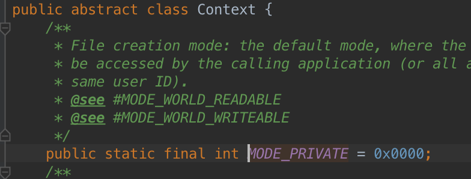
图16：Context类

此处还要强调的是SharedPreferences的对象并不能直接调用putString方法，而是要通过Editor获取一个编辑器对象，通过此对象来调用put方法。

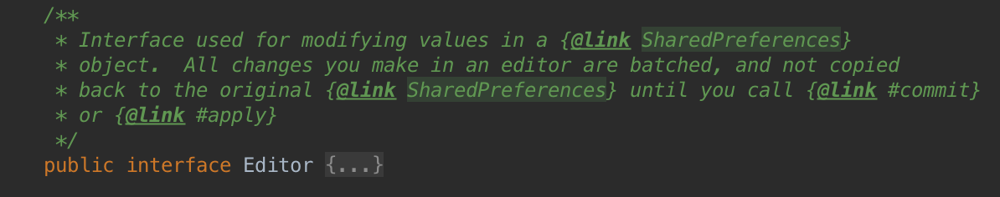
图17：SharedPreferences介绍

用Editor编辑sharedPreference对象，修改一下原程序，如图所示：

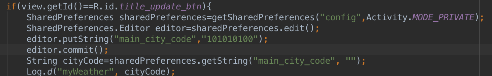
图18：SharedPreferences应用

除了以上数据的存储方式外，当要存储量比较多的数据时就要使用数据库来进行数据管理。安卓使用的是开源的SQL数据库，它是轻量级的数据库不同于C/S数据库，是只在进程内的数据库，不存在传统的客户端和服务器端。使用SQL数据库不需要安装，只需要调用相关的类就可以使用。在安卓中，我们需要自己新近一个数据库文件，然后把数据导入进去，数据库文件目录为/data/data/package_name/databases，Android提供了SQLiteOpenHelper类来帮助我们创建一个新的数据库并添加内容和创建索引。子天气预报的程序中，我们没有自己创建一个表，而是使用一个外部已经存在的数据库文件，这个时候就牵涉到应该怎样使用它的问题。在上文中已经提到Android里的数据库文件都集中存放在一个指定的目录下，那么我们在使用外部的数据库文件时就需要在此目录下新建一个文件，然后将数据库文件入到那个目录下，用到的方法分别是InputStream和FileOutputStream，如下图所示：

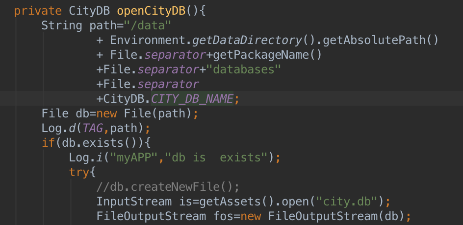
图19：新建数据库文件

程序首先定义了新的数据库文件存放路径，放在path变量里方便以后调用，其中CITY_DB_NAME为city2.db区别于外部的数据库文件city.db，此处的db与下文要提到的db不是同一个概念，db为文件File类的一个对象，文件存储是Android中另一个重要的存储方式。File类是创建一个文件的主要方式，之后可以使用输入输出流对文件进行读写操作，下面的程序中首先使用InputStream创建了一个流对象is然后打开存放在assets文件夹下的city.db，利用输入流将文件数据读入新建的city2.db中，输入输出流可以读取和写入文件中的数据而不用在乎文件中的内容和数据格式。在while循环中使用read方法以字节为单位度取数据到buffer里，buffer作为一个中转站，存储暂时数据，之后将这些数据利用write方法写入db中，如下图所示：

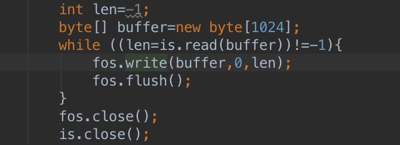
图20：复制数据库

len用来标志是否到文件流的末尾，如果已经取到末尾则返回-1，buffer被规定为1个字节。在将文件存到指定的目录之后，SQLiteDatabase对他进行读取了，为此首先定义SQLiteDatabase的对象db，使用openOrCreateDatabase方法打开数据库文件city2.db

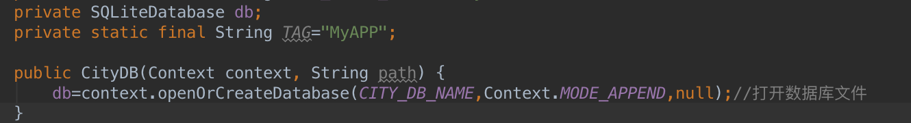
图21：打开数据库文件

db是SQLiteDatabase类的对象，提供了操作数据库的一些基本方法例如：openOrCreateDatabase打开会创建新数据库，insert添加一条记录，query查询一条记录等等。SQLiteDatabase类及支持java语言也支持sql语言。

在读取数据库之后就要查询获取数据库里的内容，索引数据库的方法我们使用Cursor游标，我们可以把Cursor想象成一个指针，它指向的是表中的每一条数据，使用query方法就可以获得一个Cursor对象，只要用命令给它赋值就可以获得数据，如图所示：

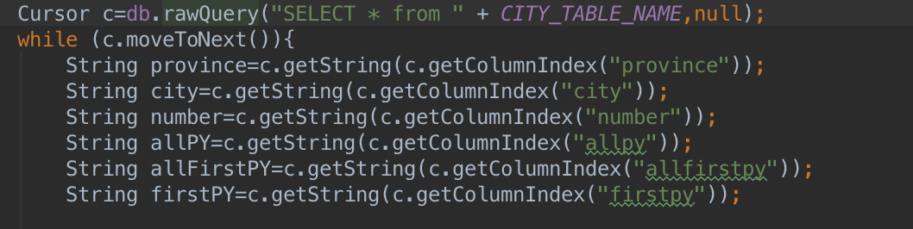
图22：读取数据库

此处使用的是rawQuery方法，他与通常的query方法不同之处在于，前者是使用sql语言来进行查询的，进一步查看SQLiteDatabase类下的声明可以发现如下：

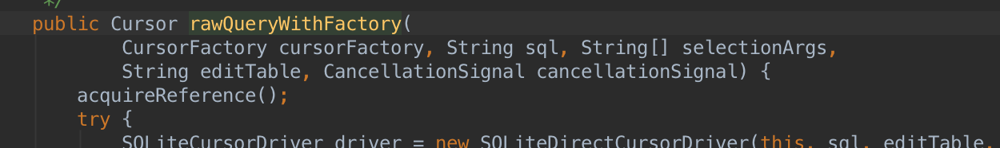

图23：游标

使用sql语言并且返回一个游标。游标对象c被初始化之后就可以使用moveToNext方法不停的指向下一条记录，并在移动到最低端时返回错误信息。Cursor的getString方法会返回本行中被指定列的类容，在这里我们可以看到sql语言中已经制定了city这
列，即返回每一行的城市名。将他们作为City对象的构造函数，创建多个City对象item并将它们保存到List中去，供ListView使用。
到这里天气预报中的数据存储和使用已经基本介绍完了，我借天气预报课堂项目来浅析了List接口以及对它的若干实现在程序中的作用，后半部分简单介绍了文件存储、SharedPreference、和数据库存储数据的用法，分析了他们在天气预报项目中的作用，因受限于个人水平，只希望本文能起到抛砖引玉的作用，而不求对大家能有多深的启发。
