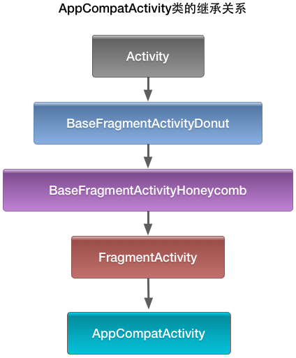
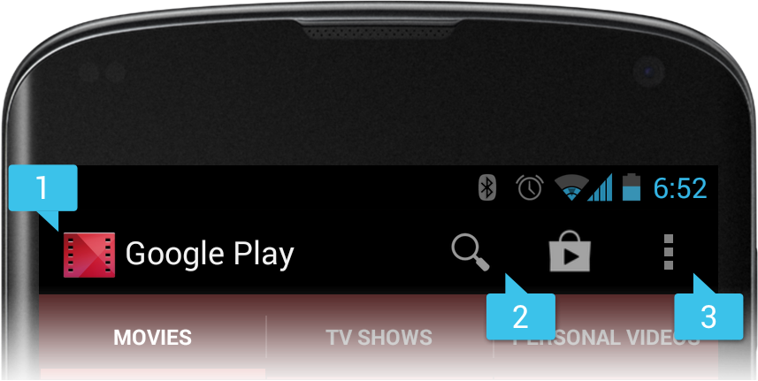

# AppcompatActivity源码浅析（1501210404杨成郎杰）

在AndroidStudio中，新建一个工程的时候，AndroidStudio会自动地为你创建一个MainActivity，并使之继承自AppCompatActivity类，本文的目的就是从Android的源代码入手，分析AppCompatActivity类及其父类的一些性质与用法。

首先，AppCompatActivity类是Activity类的四阶子类（AppCompatActivity类继承自FragmentActivity类，FragmentActivity类继承自BaseFragmentActivityHoneycomb类，BaseFragmentActivityHoneycomb类继承自BaseFragmentActivityDonut类，最后BaseFragmentActivityDonut类继承自Activity类），它们的继承关系如下图所示：



AppCompatActivity类除了直接继承了FragmentActivity类之外，还implements了AppCompatCallback接口，TaskStackBuilder.SupportParentable接口，和ActionBarDrawerToggle.DelegateProvider接口。

Activity 发展到3.0左右，就可以使用fragment了，但是support v4 提供了1.6~3.0的fragment兼容，所以如果需要用兼容版的fragment，则需要继承support v4提供的FragmentActivity。而后一点点时间之后，ActionBar也被向前支持了，这次是出现在support v7里，如果需要使用兼容版的ActionBar，则继承support v7提供的ActionBarActivity（它是继承FragmentActivity的）。再然后也就是去年年底到今年，5.0提供了很多很多新东西，于是support v7也更新了，出现了AppCompatActivity。

AppCompatActivity类是对于使Activity能够使用ActionBar的基础类。ActionBar位于Activity的顶部，可用来显示activity的标题、Icon、Actions和一些用于交互的View。它也可被用于应用的导航。ActionBar 是在Android 3.0(API 11）中加入到SK中的，想在低版本中使用ActionBar有两种选择：使用http://actionbarsherlock.com 或者使用Support Library v7。

下面是一张使用ActionBar的界面截图：

    
    其中，[1]是ActionBar的图标，[2]是两个action按钮，[3]是overflow按钮
    
Action bar提供以下几种关键的功能：

a.提供专门的空间，以使你的应用能够确定并指示用户在本应用中的当前位置。

b.以容易理解的方式执行一些重要的操作（例如搜索）。

c.支持在应用中跳转的过程中，依然保持持续的导航和视图（以标签或下拉列表的方式）。

	注意：在创建action bar之前必须要确认自己将要支持的API版本号，并选用合适的package。
	如果支持的API版本号低于11，则应该import android.support.v7.app.ActionBar包。
	如果支持的API版本号高于等于11，则应该import android.app.ActionBar包。
	


## 添加ActionBar：
当然，在正式开始使用添加ActionBar之前，我们首先必须在工程中安装好appcompat v7 support library。

接着，我们创建一个继承自AppCompatActivity类的activity。

然后为这个activity使用或继承一个Theme.AppCompat中的主题，例如：
   
   ``` <activity android:theme="@style/Theme.AppCompat.Light" ... >```

现在，你的activity中就已经包括了一个ActionBar。

事实上，在API level 11或更高的版本号中，所有的activity都默认添加了主题为Theme.Holo的ActionBar。

## 删除ActionBar：
我们可以在应用运行时通过调用hide()函数来隐藏ActionBar，例如：

```ActionBar actionBar = getSupportActionBar();
actionBar.hide();```

当ActionBar被隐藏之后，调节我们的应用的layout来填满整个可用的屏幕空间。我们还可以通过调用show()函数来使ActionBar显示回来。

这里我们必须要意识到隐藏或者删除ActionBar会造成我们的activity重启相应的layout，并计算ActionBar所占用的空间大小（指占用的实际屏幕上的尺寸大小，而不是指运行内存的大小）。如果我们的activity需要经常重复地隐藏、显示ActionBar，我们就应该使用overlay mode。overlay mode可以使我们的ActionBar覆盖在我们的layout上，这样当我们隐藏或显示ActionBar时，我们的layout就不会重新启动了。我们可以通过将windowActionBarOverlay设置为true来实现overlay mode的功能。更多这部分的信息需要查阅Google给出的文档：Android/sdk/docs/guide/topics/ui/actionbar.html#Style

## 添加Action Item
ActionBar为我们提供了两种action item，一种是与当前页面联系紧密且较为重要的action，Google建议我们把它放在按钮中；另一种则是下拉列表，用于放入一些不适于直接放置在ActionBar中或者不那么重要的action。具体如下图所示：


    
    上图显示的ActionBar包含了三个按钮和一个下拉列表。
    
当我们的activity启动的时候，系统会通过调用我们activity中的onCreateOptionsMenu()函数来获取action item。我们可以在这个函数中inflate一个定义了所有action item的菜单资源。例子代码如下：

.xml文件中的代码：

    文件路径：res/menu/main_activity_actions.xml
```
<menu xmlns:android="http://schemas.android.com/apk/res/android" >
    <item android:id="@+id/action_search"
          android:icon="@drawable/ic_action_search"
          android:title="@string/action_search"/>
    <item android:id="@+id/action_compose"
          android:icon="@drawable/ic_action_compose"
          android:title="@string/action_compose" />
</menu>
```
activity中的代码：
```
@Override
public boolean onCreateOptionsMenu(Menu menu) {
    // Inflate the menu items for use in the action bar
    MenuInflater inflater = getMenuInflater();
    inflater.inflate(R.menu.main_activity_actions, menu);
    return super.onCreateOptionsMenu(menu);
}
```

要使item直接作为按钮显示在ActionBar中，就要在```<item>```标签中包含showAsAction = “ifRoom”。例如：
```
<menu xmlns:android="http://schemas.android.com/apk/res/android"
      xmlns:yourapp="http://schemas.android.com/apk/res-auto" >
    <item android:id="@+id/action_search"
          android:icon="@drawable/ic_action_search"
          android:title="@string/action_search"
          yourapp:showAsAction="ifRoom"  />
    ...
</menu>
```
如果在ActionBar中没有足够的位置放置按钮，则按钮就会显示在action overflow中。

我们应该为每一个item定义title，即使我们不需要我们的按item显示title，因为：

a.如果在ActionBar中没有足够的位置放置图标，则该item就会仅以title的形式显示在overflow中。
	
b.为视力障碍的用户服务的屏幕阅读应用会朗读menu item的title。
	
c.如果action item只显示图标，用户也能够通过长按图标的方式来显示title。
	
action item的图标不是必须使用的，但Google建议我们都使用图标。并提供了一份文档和一些标准的action bar图标供开发者使用。

我们还可以通过使用”always”来使一个item能够总是显示在action bar中。然而Google并不建议我们这样做，因为这会造成layout在窄屏设备上出现问题，所以我们最好还是使用”ifRoom”来使item显示在action bar中。

## 为item设置点击事件
当用户点击一个action的时候，系统会自动调用我们的activity中的onOptionsItemSelected()函数。我们可以通过调用getItemID()函数来分辨用户具体点击的是哪个action，该函数会返回一个与<item>标签唯一对应的id，这样我们就可以执行相应的操作。例如:
```
@Override
public boolean onOptionsItemSelected(MenuItem item) {
    // Handle presses on the action bar items
    switch (item.getItemId()) {
        case R.id.action_search:
            openSearch();
            return true;
        case R.id.action_compose:
            composeMessage();
            return true;
        default:
            return super.onOptionsItemSelected(item);
    }
}
```

## 使用split action bar
split action bar为那些运行在窄屏的activity中的难以显示的action item提供了一块底部区域用于显示它们。


    带标签（tab）的action bar（左）；split action bar（中）；去除导航栏的split action bar（右）

用这种方式将action item分离开来可以确保在窄屏设备上为显示我们所有的action item提供合理可用的空间。同时为导航和标题元素留下应有的空间。
	
当使用相应的支持库来使能split action bar时，我们必须要做如下两件事：

1.为每一个```<activity>```元素或```<application>```元素添加下列语句：
 ```uiOptions=“splitActionBarWhenNarrow”``` 这条属性只能被API 14或以上版本所理解（更老的API版本会忽略该语句）。

2.为了支持更老的版本，我们可以添加```<meta-data>```元素作为每一个```<activity>```元素的子元素，这些```<activity>```元素中需要声明```"android.support.UI_OPTIONS"```。

例如：
```
<manifest ...>
    <activity uiOptions="splitActionBarWhenNarrow" ... >
        <meta-data android:name="android.support.UI_OPTIONS"
                   android:value="splitActionBarWhenNarrow" />
    </activity>
</manifest>
```

使用split action bar还可以允许我们把导航栏标签折叠进主action bar中，当然我们最好在去除了导航栏标签中的图标和标题之后这么做，就像上面一个图的右图一样。要想实现这样的效果，我们必须要通过
```setDisplayShowHomeEnabled(false)``` 和 ```setDisplayShowTitleEnabled(false)``` 两条指令来使action bar的图标和标题失效。

## 应用图标进行导航返回(Navigating up)
将应用图标作为返回按钮，来使用户能够在基于等级关系间的页面中顺利地找准位置。比如说：如果屏幕A显示了一列项目，而我们选择了某一项而来到了屏幕B，那么这时屏幕B就应该包含一个返回按钮来使用户返回屏幕A。

**Note:**返回（up navigation）是与系统所提供的后退（back）按钮并不一样。系统提供的后退（back）按钮用于做逆时的界面后退，也就是说返回到除了本页面之外的我们最近打开的一个页面。而返回（up navigation）是基于页面之间的等级结构的返回。例如现在有两个应用，A和B。我们先打开应用A的页面a，在页面a中进入应用A的页面b，这时候我们打开另一个应用B，再重新打开页面b。此时按下返回（up navigation）按钮会返回应用A的页面a，而按下后退（back）按钮则会返回应用B。（关于up与back的更详细信息请查阅Android/sdk/docs/design/patterns/navigation.html）

下图为Gmail中的返回按钮：


我们要想使一个应用图标成为导航返回按钮，就需要调用setDisplayHomeAsUpEnabled()函数，例如：
```
@Override
protected void onCreate(Bundle savedInstanceState) {
    super.onCreate(savedInstanceState);
    setContentView(R.layout.activity_details);

    ActionBar actionBar = getSupportActionBar();
    actionBar.setDisplayHomeAsUpEnabled(true);
    ...
}
```

现在，我们的action bar中的图标就会带有一个返回标志（像上面那个Gmail的返回按钮一样），但它在默认情况下并不会做任何事情。要想让用户在点击返回按钮的时候，activity能执行一些居图操作，我们有以下两个选择：

1.在父activity的manifest文件中实现功能

当父activity总是相同的情况下，这是最佳的实现方式。代码如下：
```
<application ... >
    ...
    <!-- The main/home activity (has no parent activity) -->
    <activity
        android:name="com.example.myfirstapp.MainActivity" ...>
        ...
    </activity>
    <!-- A child of the main activity -->
    <activity
        android:name="com.example.myfirstapp.DisplayMessageActivity"
        android:label="@string/title_activity_display_message"
        android:parentActivityName="com.example.myfirstapp.MainActivity" >
        <!-- Parent activity meta-data to support API level 7+ -->
        <meta-data
            android:name="android.support.PARENT_ACTIVITY"
            android:value="com.example.myfirstapp.MainActivity" />
    </activity>
</application>
```
只要父activity像这样在manifest中说明，并且用setDisplayHomeAsUpEnabled()函数使返回按钮有效。我们的任务就完成了，action bar会自动进行返回操作。

2.我们还可以重写activity中的getSupportParentActivityIntent()函数和onCreateSupportNavigateUpTaskStack()函数。

这种方法适用于本activity可能会通过不同activity不同方式到达，此时我们应该准确识别用户到达本页面的路径，并返回到正确的上级页面。

用户点击返回按钮时，系统会调用getSupportParentActivityIntent()函数，如果我们需要判断到本页面的路径，就需要重写该函数来返回Intent打开合适的父activity。这个函数适用于我们的应用内的页面跳转。

当activity运行在不是我们自己的应用中时，用户点击返回按钮就会调用onCreateSupportNavigateUpTaskStack()函数。因此我们必须使用TaskStackBuilder传递给这个方法，在用户返回的时候能够建立正确地返回栈。

如果我们是通过Fragment而不是Activity来建立应用体系的话，上述的两种方法都不能使用。我们需要重写onSupportNavigateUp()来实现fragment transaction，通常通过调用函数popBackStack()函数的方式从后退栈中弹出当前Fragment。

    更多关于实现导航返回（up navigation）的详细信息
    请查阅Android/sdk/docs/training/implementing-navigation/ancestral.html。
    


---

###更多关于action bar的资料请参阅Google给的官方文档。


---


参考文献：
* Android/sdk/docs/guide/topics/ui/actionbar.html
* appCompatActivity源代码
* http://blog.csdn.net/bigconvience/article/details/28886241

