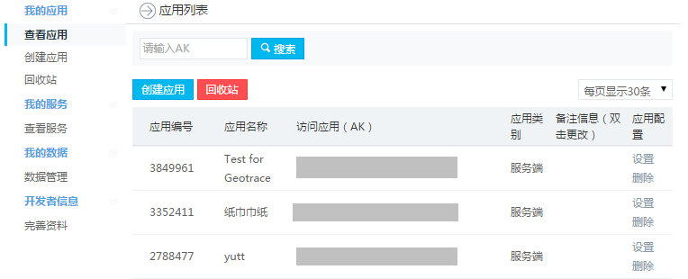

# 百度地图API在Android开发中的应用分析(章伟1501211039)
**前言**：百度地图API是为开发者免费提供的一套基于百度地图服务的应用接口，包括JavaScript API、Web服务API、Android SDK、iOS SDK、定位SDK、车联网API、LBS云等多种开发工具与服务，提供基本地图展现、搜索、定位、逆/地理编码、路线规划、LBS云存储与检索等功能，适用于PC端、移动端、服务器等多种设备，多种操作系统下的地图应用开发。本文主要说明如何在Android开发中如何使用百度地图API。

1. 
**申请密钥**   
在使用百度地图SDK为您提供的各种LBS能力之前，您需要获取百度地图移动版的开发密钥，该密钥与您的百度账户相关联。因此，您必须先有百度帐户，才能获得开发密钥。并且，该密钥与您创建的过程名称有关，具体流程请参考如下介绍。   
Key的申请地址为：http://lbsyun.baidu.com/apiconsole/key    
**注意**：
    1. 为了给用户提供更安全的服务，Android SDK自v2.1.3版本开始采用了全新的Key验证体系。因此，当您选择使用v2.1.3及之后版本的SDK时，需要到新的Key申请页面进行全新Key的申请；（新旧key不可通用）   
    2. 新Key机制，每个Key仅且唯一对于1个应用验证有效，即对该Key配置环节中使用的包名匹配的应用有效。因此，多个应用【包括多个包名】需申请多个Key，或者对1个Key进行多次配置；   
    3. 在新key机制下，若你需要在同一个工程中同时使用百度地图、定位、导航SDK可以共用同一个key；
    4. 如果您在Android SDK开发过程中使用了LBS云服务则需要为该服务单独申请一个for server类型的密钥； 

    申请密钥主要步骤如下：   
    访问API控制台页面，若您未登录百度账号，将会进入百度账号登录页面，如下图：
    
    登陆API控制台
    登录会跳转到API控制台服务，具体如下图：
    
    创建应用
    点击"创建应用"，进入创建AK页面，输入应用名称，将应用类型改为：“Android SDK”：
    key3.png
    key4.png
    配置应用
    在应用类型选为“Android SDK”后，需要配置应用的安全码，如下图所示：
    key5.png
    获取安全码
    安全码的组成规则为：Android签名证书的sha1值+packagename例如：
    SHA1：BB:0D:AC:74:D3:21:E1:43:67:71:9B:62:91:AF:A1:66:6E:44:5D:75
    包名：com.baidumap.demo
    Android签名证书的sha1值获取方式有两种：
    第一种方法：使用keytool
    第1步：运行进入控制台
    and_key6.png and_key7.png
    第2步：定位到.android文件夹下，输入cd .android
    and_key8.png
    第3步：输入keytool -list -v -keystore debug.keystore，会得到三种指纹证书，选取SHA1类型的证书（密钥口令是android），例如：
    其中keytool为jdk自带工具；keystorefile为Android 签名证书文件
    and_key9.png
    and_key10.png
    第二种方法：在adt 22中直接查看
    如果使用adt 22，可以在eclipse中直接查看：windows -> preferance -> android -> build。 如下图示：
    and_key11.png
    其中“SHA1 fingerprint”值即为Android签名证书的sha1值
    获取包名
    包名是Android应用程序本身在AndroidManifest.xml 中定义的名称，例如：
    and_key12.png
    成功创建KEY
    在输入安全码后，点击“确定”完成应用的配置工作，您将会得到一个创建的Key，请妥善保管您所申请的Key。到这您就可以使用新Key来完成您的开发工作了。
    