# 百度地图API在Android开发中的应用分析(章伟1501211039)
**前言**：百度地图API是为开发者免费提供的一套基于百度地图服务的应用接口，包括JavaScript API、Web服务API、Android SDK、iOS SDK、定位SDK、车联网API、LBS云等多种开发工具与服务，提供基本地图展现、搜索、定位、逆/地理编码、路线规划、LBS云存储与检索等功能，适用于PC端、移动端、服务器等多种设备，多种操作系统下的地图应用开发。本文主要说明如何在Android开发中如何使用百度地图API。

1. 
**申请密钥**   
在使用百度地图SDK为您提供的各种LBS能力之前，您需要获取百度地图移动版的开发密钥，该密钥与您的百度账户相关联。因此，您必须先有百度帐户，才能获得开发密钥。并且，该密钥与您创建的过程名称有关，具体流程请参考如下介绍。   
Key的申请地址为：http://lbsyun.baidu.com/apiconsole/key    
**注意**：
    1. 为了给用户提供更安全的服务，Android SDK自v2.1.3版本开始采用了全新的Key验证体系。因此，当您选择使用v2.1.3及之后版本的SDK时，需要到新的Key申请页面进行全新Key的申请；（新旧key不可通用）   
    2. 新Key机制，每个Key仅且唯一对于1个应用验证有效，即对该Key配置环节中使用的包名匹配的应用有效。因此，多个应用【包括多个包名】需申请多个Key，或者对1个Key进行多次配置；   
    3. 在新key机制下，若你需要在同一个工程中同时使用百度地图、定位、导航SDK可以共用同一个key；
    4. 如果您在Android SDK开发过程中使用了LBS云服务则需要为该服务单独申请一个for server类型的密钥； 

    申请密钥主要步骤如下：   
    访问API控制台页面，若您未登录百度账号，将会进入百度账号登录页面，如下图：
    
    登陆API控制台
    登录会跳转到API控制台服务，具体如下图：
    
    创建应用
    点击"创建应用"，进入创建AK页面，输入应用名称，将应用类型改为：“Android SDK”：
    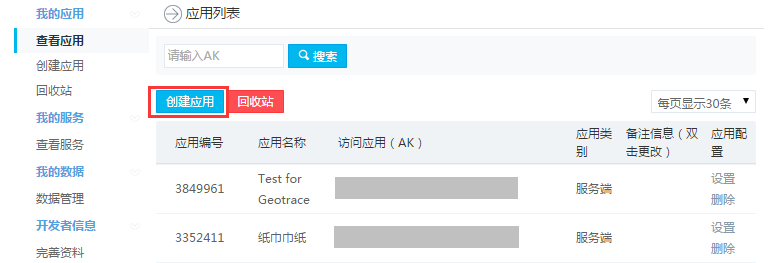
    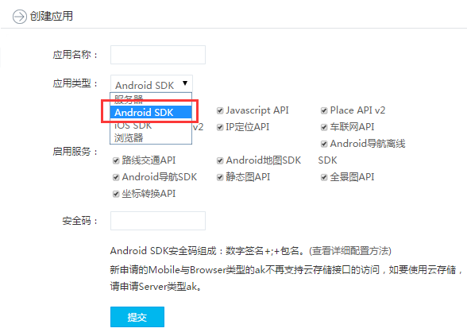
    配置应用
    在应用类型选为“Android SDK”后，需要配置应用的安全码，如下图所示：
    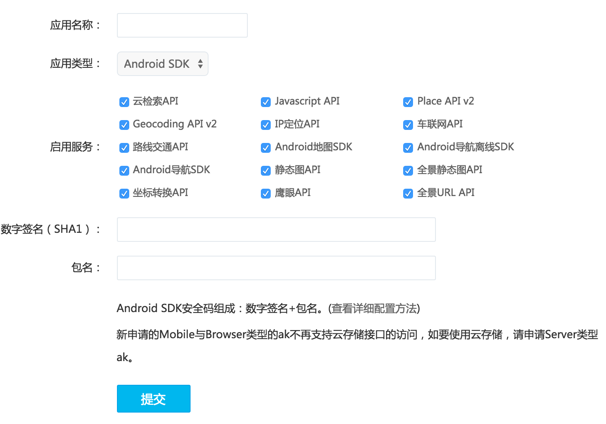
    获取安全码
    安全码的组成规则为：Android签名证书的sha1值+packagename例如：
    SHA1：BB:0D:AC:74:D3:21:E1:43:67:71:9B:62:91:AF:A1:66:6E:44:5D:75
    包名：com.baidumap.demo
    Android签名证书的sha1值获取方式有两种：
    第一种方法：使用keytool
    第1步：运行进入控制台
    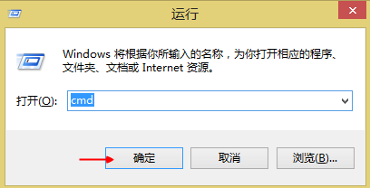 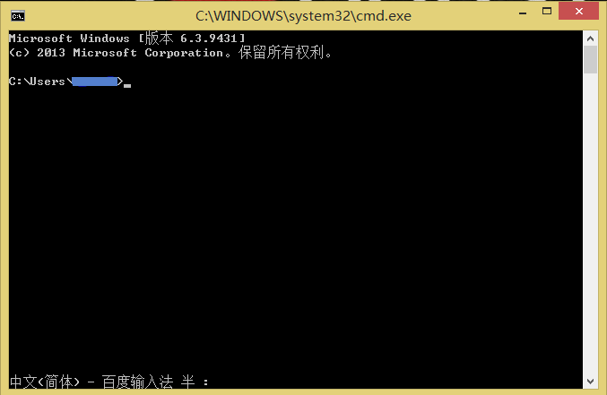
    第2步：定位到.android文件夹下，输入cd .android
    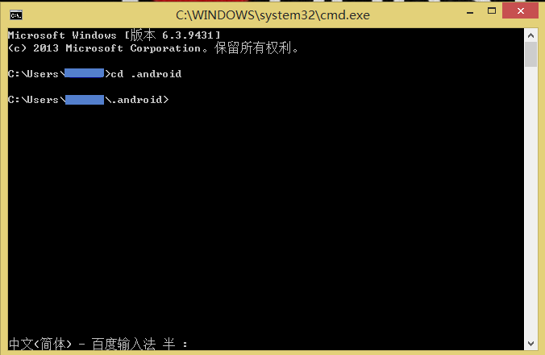
    第3步：输入keytool -list -v -keystore debug.keystore，会得到三种指纹证书，选取SHA1类型的证书（密钥口令是android），例如：
    其中keytool为jdk自带工具；keystorefile为Android 签名证书文件
    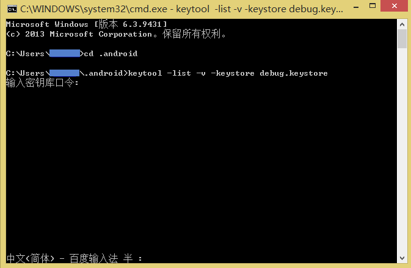
    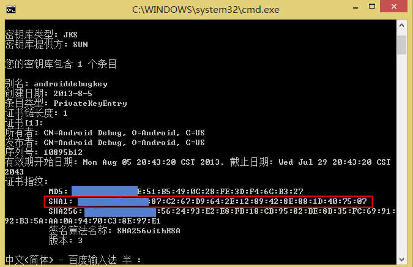
    第二种方法：在adt 22中直接查看
    如果使用adt 22，可以在eclipse中直接查看：windows -> preferance -> android -> build。 如下图示：
    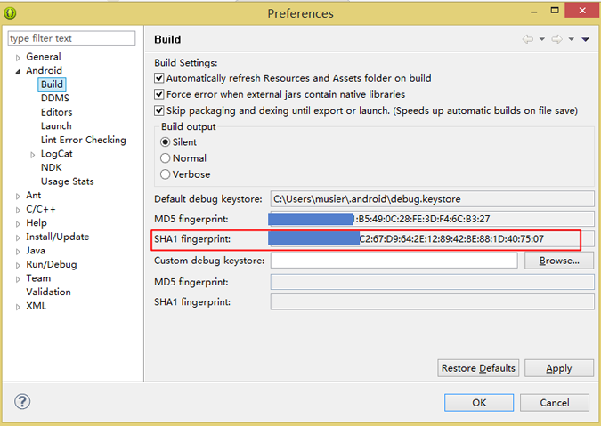
    其中“SHA1 fingerprint”值即为Android签名证书的sha1值
    获取包名
    包名是Android应用程序本身在AndroidManifest.xml 中定义的名称，例如：
    
    成功创建KEY
    在输入安全码后，点击“确定”完成应用的配置工作，您将会得到一个创建的Key，请妥善保管您所申请的Key。到这您就可以使用新Key来完成您的开发工作了。
2. **配置环境及发布**  
百度地图API的开发欢迎配置方法一般都一样，这里那百度地图API为例来进行说明。Android开发工具很多，在这我们推荐各位开发者使用Eclipse和Android Studio作为自己的开发工具。下面我们将分别针对Eclipse和Android Studio介绍一下地图SDK的工程配置方法。  
**Eclipse工程配置方法**   
第一步：在工程里新建libs文件夹，将开发包里的baidumapapi_vX_X_X.jar拷贝到libs根目录下，将libBaiduMapSDK_vX_X_X.so拷贝到libs\armeabi目录下（官网demo里已有这两个文件，如果要集成到自己的工程里，就需要自己添加），拷贝完成后的工程目录如下图所示；  
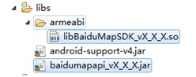  
第二步：在工程属性->Java Build Path->Libraries中选择“Add External JARs”，选定baidumapapi_vX_X_X.jar，确定后返回。
通过以上两步操作后，您就可以正常使用百度地图SDK为您提供的全部功能了。  
**Android Studio工程配置方法**  
第一步：在工程app/libs目录下放入baidumapapi_vX_X_X.jar包,在src/main/目录下新建jniLibs目录，放入libBaiduMapSDK_vX_X_X_X.so如下图所示，注意jar和so的前3位版本号必须一致，并且保证使用一次下载的文件夹中的两个文件，不能不同功能组件的jar或so交叉使用。   
第二步：导入jar包。菜单栏选择File->Project Structor->Modules->Dependencies,点击+号，选择File dependency，选择jar包导入。
通过以上两步操作后，您就可以正常使用百度地图SDK为您提供的全部功能了。
3. 
**百度地图API介绍**   
经过上述步骤之后我们就可以开始自己的Android开发了。百度地图为Android开发提供了Android地图SDK、Android定位SDK、Android鹰眼轨迹SDK、Android导航SDK和Android全景SDK等五种SDK。开发者使用其中一种或几种可以灵活开发出自己的地图应用。
首页地址：http://developer.baidu.com/map/index.php?title=%E9%A6%96%E9%A1%B5
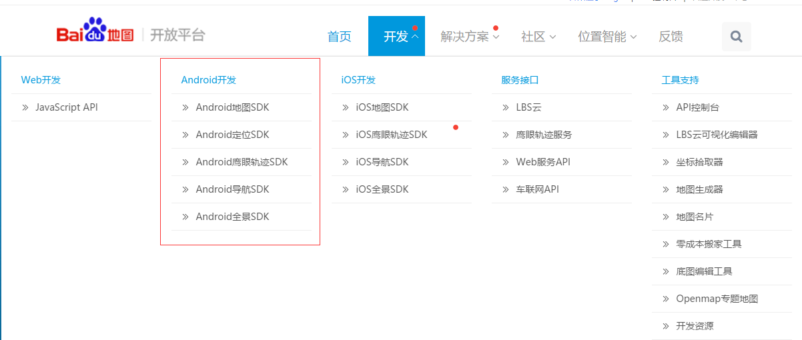   
应用开发详见每个SDK的开发指南
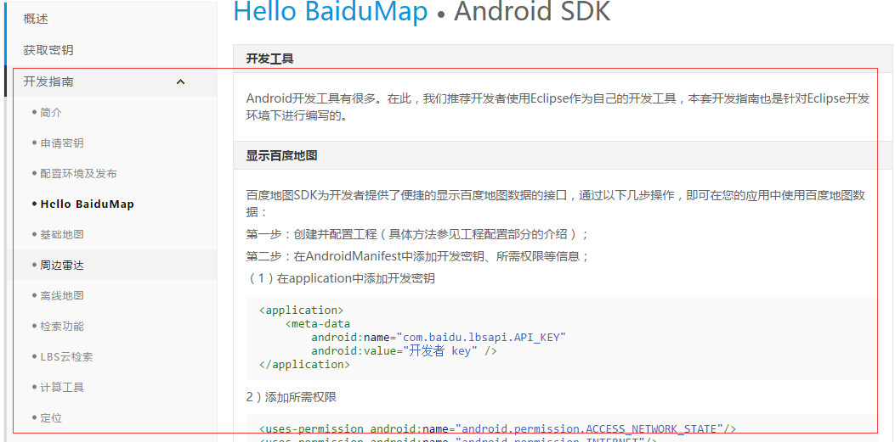
4. **百度地图ＡＰＩ的优与劣**  
**优势**  
1、“周边”资源丰富  
　　在大多数O2O开发者看来，地图的作用更多可以理解为对“定位”的需求，也就是满足产品中“周边”这一选项的需要。除了打车App这种靠位置而生的产品，大部分O2O产品对位置的精确程度要求其实并不高。而他们更关心的是定位后将得到怎样的结果，而不是位置本身。
　　目前，能够提供这样数据的首选API是大众点评，但是对此，开发者则更希望得到一站式服务，一位开发者对巴人表示，在他看来百度与其它家地图平台的最大区别就是它能够提供更加全面的O2O数据，运营较好的产品同时还能获得百度的流量，一举多得。
　　而除O2O数据外，百度地图还结合了不久前开放的百度语音平台，一位车联网开发者表示，其产品全线使用的百度地图原因正是在于其不必对接更多语音厂商，百度语音已可以满足他们的使用需求。  
2、产品迭代速度较快  
　　一开发者表示，相较于百度，其它家地图平台产品迭代速度相对较慢，他曾经接入过其它家产品，但由于产品迭代速度太慢，且造成闪退的问题迟迟得不到解决，最终选择转向百度。虽然百度同样保有大公司病，但相对开放的态度使开发者更易与其合作。   
3、开发者体系相对健全  
　　而更吸引开发者的是，百度正推出的开发者孵化计划，一位参与了该计划的开发者表示，一方面，孵化产品可以得到百度地图的更多的接口资源，同时，百度也会对部分开发者提供办公地点乃至资金的支持。而另一位开发者则更加直接的说，非常希望参与开发者计划，原因是参与计划的产品往往能够得到更多流量。
　　同时，在如何与平台沟通方面，一位开发者表示，其它平台往往使用QQ群、邮件、论坛等较老套的沟通方式与开发者对接，这往往造成信息回复速度很慢，问题得不到解决的情况，百度的体系开发者体系则相对健全，其一对一的服务方式，少有出现沟通不畅的情况。  
4、品牌优势  
　　一位正准备接入百度平台的开发者表示，其选择百度地图的原因是主要因为周围及他自己日常经常使用百度地图，在他看来，在二三线城市，百度的品牌价值要高于其它品牌，虽然百度可能在某些数据上并不占优，但“名字”叫得响相对给百度地图带来了不少开发者。

    