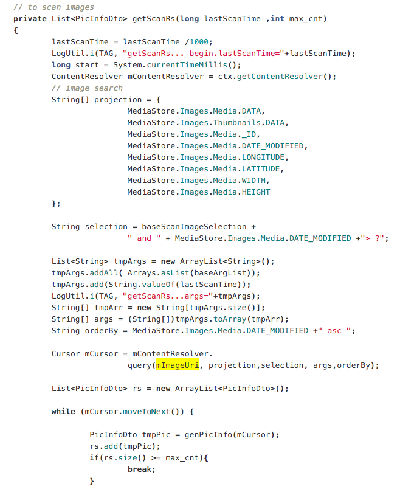

## 各类图片按时刻、旅行、故事归类的研究与实现(1501210922 黄志达)

### 姓名：黄志达
### 学号：1501210922

#### 研究背景：由于系统自带的相册除了按时间归集之外，就没有其它类型的归集；但用户也想看到其他类型的归集，如旅行相册或故事相册等，或者是使用机器学习来识别图片是属于什么类型的相片。

###  1.sqlite数据库设计
#### 主要四个表设计：
album_info 相册信息表

| 名称 | 类型 | 描述
| -- | -- |
| album_id | string    | pimary key |
| album_name | string  | 相册名称|
| album_status | int    | 相册状态 |
| album_type | int |  相册类型
| album_address | string | 相册地址描述
| album_time_str | string | 相册时间描述
| start_time | string |  相册开始时间
| end_time | string |    相册结束时间
| album_desc | string |  相册描述

photo_info 相片信息表

| 名称 | 类型 | 描述
| -- | -- | -- |
| photo_id | string | primary key |
| photo_url | string | 相片存储路径 |
| create_time | long | 相片拍摄时间 |
| photo_desc | string | 相片描述 |
| longitude | string | 经度 |
| latitude | string | 纬度 |
| country | string | 国家 |
| province | string | 省 |
| city | string | 城市 |
| district | string | 区县 |
| street | string | 街道 |
| spot | string | 附近景点 |

album_pic_ref 相册与相片的关系表

| 名称 | 类型 |
| -- | -- |
| album_id | string |
| photo_id | string |

pic_album_ref 相片属于哪个相册的关系表

| 名称 | 类型 |
| -- | -- |
| photo_id | string |
| album_id | string |

###  2.获取安卓系统的所有图片

    android系统有自带的多媒体数据库MediaStore.
    MediaStore包括了多媒体数据库的所有信息，
    包括音频，视频和图像，android对所有的多媒体数据库接口进行了封装；下面关于这些接口的用法：
    要想得到一个ContentResolver实例， 利用Activity或者Service的Context.
    
    ContentResolver mResolver = ctx.getContentResolver();
    
    ctx就是一个context, Activity.this就是那个Context，
    利用它就可以调用getContentResolver接口获取ContentResolver实例
    
    之后通过调用如下代码进行查询：
    
    Cursor cursor = mresolver.query(uri, prjs, selections, selectArgs, order);
    
    ContentResolver的query方法接受几个参数：
    
    uri: 代表要查询的数据库名称加上表的名称；如获取图片MediaStore.Images.Media.EXTERNAL_CONTENT_URI;
    prjs: 要从表中选择的列，用一个String数组来表示
    selections: 查询条件，相当于sql的where语句
    selectArgs: 
    Order: 说明查询结果按什么来排序
    

    

###  3.Android调用C++库

###  4.底层C++归集算法

