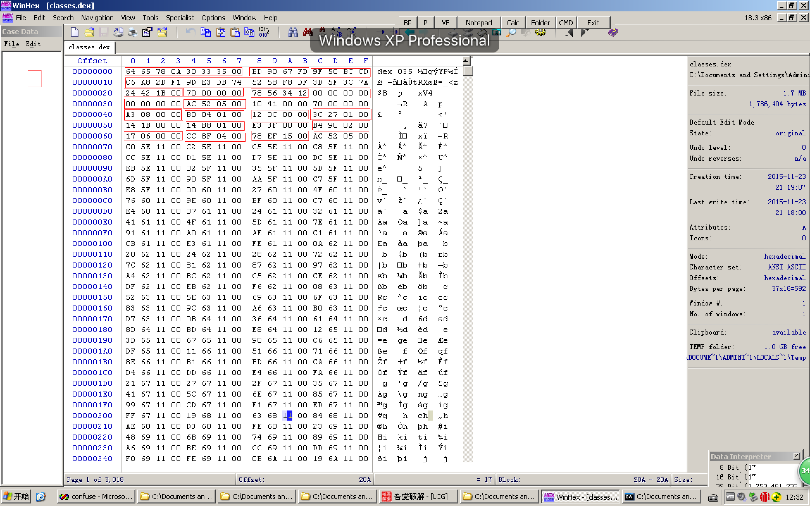
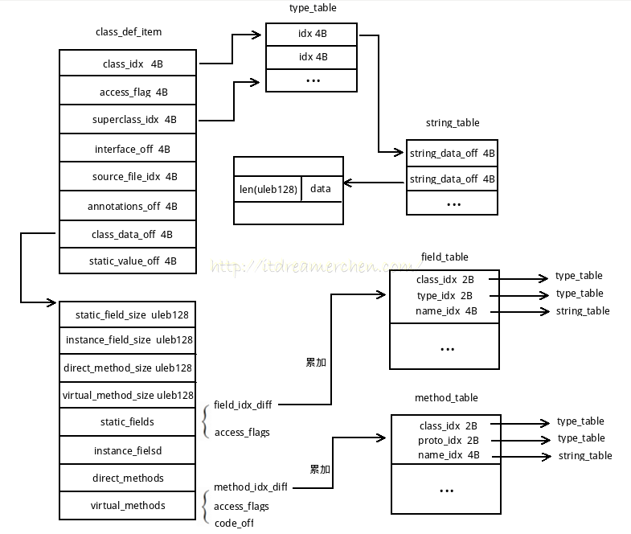
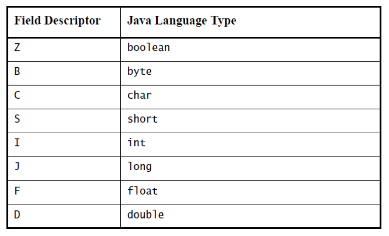
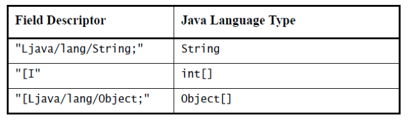
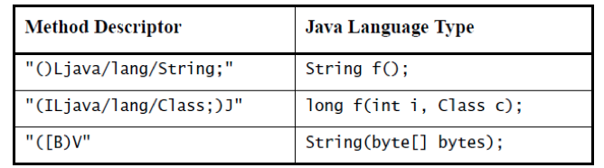

# DEX文件混淆原理(1501210988 汤炀)
## 引言
DEX文件是安卓系统中JAVA虚拟机的可执行文件。在安卓中，APK是
实际上并不能够直接的被虚拟机执行，其中包含的不仅仅有DEX文件，同时好包括了其他资源文件，例如图片、数据库等。当一个安卓程序呗运行时，JAVA虚拟机将会打开APK文件，并从中读取DEX，最用在虚拟机中运行的是DEX文件在虚拟机内存中的一个副本。

由于DEX文件是由JAVA中的CLASS文件经过编译产生的，而且保留了一些CLASS文件的特性，因此可以轻易的被反编译成可读性极强的JAVA代码。一旦程序被反编译，源码将会被暴露在外，因此如何保护DEX文件不被反编译成为了保护源代码的重要一环。现今，保护DEX文件的方式有很多，其中对DEX文件中的类名、方法名和变量名进行混淆是一种比较有效的方式。因为在原来的DEX文件中保存着源代码中的类名、方法名和变量名，这样方便了使用JAVA的反射机制编写程序。但是这样也使得通过反编译得到的代码更具有可读性，在反编译之后可以轻易的去解读源码的设计思想、算法等。因此，通过混淆DEX文件中的字符串，增加反编译代码的阅读成本，可以有效的防止自己的程序被破解。

## DEX文件格式

DEX文件的格式的定义保存在安卓源代码中的platform/dalvik文件夹中，属于dalvik虚拟机的一部分。

1.1  DEX文件头

类似于Windows平台下的PE程序，DEX文件拥有自己的文件头，并以文件头为线索，向下索引DEX文件的各个部分，每个部分都有相应的作用。

```
struct DexHeader {
    u1  magic[8];          
    u4  checksum;       
    u1  signature[kSHA1DigestLen]; 
    u4  fileSize;       
    u4  headerSize;       
    u4  endianTag;
    u4  linkSize;
    u4  linkOff;
    u4  mapOff;
    u4  stringIdsSize;
    u4  stringIdsOff保存;
    u4  typeIdsSize;
    u4  typeIdsOff;
    u4  protoIdsSize;
    u4  protoIdsOff;
    u4  fieldIdsSize;
    u4  fieldIdsOff;
    u4  methodIdsSize;
    u4  methodIdsOff;
    u4  classDefsSize;
    u4  classDefsOff;
    u4  dataSize;
    u4  dataOff;
};

```


magic字段中显示的是DEX文件的魔数以及版本号，前三个字符为dex，后续还存放着版本号035。

checksum字段中存放着DEX文件的较验和，一旦我们修改了DEX文件，这个字段中的数值必须要重新进行计算，否则虚拟机在载入DEX文件时将会报错。

signature[kSHA1DigestLen]字段的长度是20字节，用来保存签名，在文件修改后，这个字段同样也需要被重新计算。

fileSize字段保存着整个DEX文件的大小，如果我们在修改的过程中增加了文件的长度，就应当修改此项数值。

headerSize字段保存着DEX文件头部的大小，此项数值一般为0x70，因为在DEX文件的头部中，所有上述字段都是必须的。因此，此字段的数值并不会改变。但是，DEX文件存在着一个优化版本，在优化版本中，这个数值可能会改变。

endianTag字段可以显示出该DEX文件是针对大端机器编译的还是针对小端机器。图中显示的是小端存储。

linkSize和linkOff字段中储存着链接的大小和链接的偏移量。

mapOff字段所存放的偏移量是数据类型DexMapList的偏移量，这个数据类型在整个文件中只出现一次，用来存放DEX文件中每一个数据块的类型、大小和偏移量。其中type为枚举类型。每一个数据块都存放着不同的数据，有着不同的含义。

```
enum {
    kDexTypeHeaderItem               = 0x0000,
    kDexTypeStringIdItem             = 0x0001,
    kDexTypeTypeIdItem               = 0x0002,
    kDexTypeProtoIdItem              = 0x0003,
    kDexTypeFieldIdItem              = 0x0004,
    kDexTypeMethodIdItem             = 0x0005,
    kDexTypeClassDefItem             = 0x0006,
    kDexTypeMapList                  = 0x1000,
    kDexTypeTypeList                 = 0x1001,
    kDexTypeAnnotationSetRefList     = 0x1002,
    kDexTypeAnnotationSetItem        = 0x1003,
    kDexTypeClassDataItem            = 0x2000,
    kDexTypeCodeItem                 = 0x2001,
    kDexTypeStringDataItem           = 0x2002,
    kDexTypeDebugInfoItem            = 0x2003,
    kDexTypeAnnotationItem           = 0x2004,
    kDexTypeEncodedArrayItem         = 0x2005,
    kDexTypeAnnotationsDirectoryItem = 0x2006,
};

struct DexMapItem {
    u2 type;            
    u2 unused;
    u4 size;            
    u4 offset;         
};

struct DexMapList {
    u4  size;             
    DexMapItem list[1];  
};
```


stringIdsSize和stringIdsOff保存着DEX文件中所有字符串的数量和其列举的偏移量。这里的偏移量并不是DEX文件中字符串的直接偏移量，而是另一个指向真正字符串的数据类型。在这个数据类型中存放着字符串真正的偏移量。同时，这里的字符串也并不是我们日常所见到的UTF-8或ASCII编码，而是另一种数据结构，这种数据结构由字符串长度和字符串数据组成。字符串长度使用的是LEB128编码表示。这种编码是不定长的，能够使用最短一位、最长五位来表示一个32位整数。在DEX文件中广泛采用了这种编码，其原因是这种不定长编码能够减少一点的文件长度，对于缺少内存的移动平台来说，这无疑是一个巨大的优点。此外，DEX文件中，字符串使用的是UTF-16编码，不仅仅能够表示英文，还可以表示中文。而在此处，一个中文字符也表示一个字符。在本文中，最重要的就是修改该处的stringdata。修改stringdata后，如果DEX文件被反编译，那么得到的JAVA文件中的类名、方法名和变量名都将会改变，失去原先的可读性，达到混淆的目的，增加反编译的成本。

```
struct DexStringId {
    u4 stringDataOff;    
};
struct DexStringData {
    u1 lens[1];
    u1 stringdata[1];
}

```

typeIdsSize和typeIdsOff字段中存放的是DEX中所有使用到的类型，其中包括了一些类。而经过typeIds索引得到的数据类型中保存着一个字符串索引号，该索引用来简要的描述这个数据类型。

```
struct DexTypeId {
    u4  descriptorIdx;     
};
```

protoIdsSize和protoIdsOff字段中存放的是方法原型，其数据结构中也包含着一些类型列表和字符串索引号。

```
struct DexProtoId {
    u4  shortyIdx;       
    u4  returnTypeIdx;   
    u4  parametersOff;    
};
```

fieldIdsSize和fieldIdsOff以及methodIdsSize和methodIdsOff都与protoIdsSize和protoIdsOff类似，存放着变量和方法相关的索引。

```
struct DexFieldId {
    u2  classIdx;        
    u2  typeIdx;        
    u4  nameIdx;       
};

struct DexMethodId {
    u2  classIdx;          
    u2  protoIdx;        
    u4  nameIdx;       
};
```

classDefsSize和classDefsOff字段中保存着类相关的数据结构的数量和偏移量，该数据结构中又向外索引出多个结构。

```
struct DexClassDef {
    u4  classIdx;           
    u4  accessFlags;
    u4  superclassIdx;    
    u4  interfacesOff;    
    u4  sourceFileIdx;      
    u4  annotationsOff;   
    u4  classDataOff;  
    u4  staticValuesOff;   
};
```

## 混淆原理
在DEX文件中，类是最核心的数据。所有的方法最终都要归属于类，所有的变量最终也要归属于类，而所有类中使用的数据类型又构成了类型列表和类型名列表。

要对DEX文件进行混淆，实际上就是要对DEX文件中类名、方法名和变量名进行混淆，通过查找到相应的字符串，对字符串进行修改。DEX文件中的类数据之间的关系，如图所示：



每个类中都有结构体class_def_item。在结构体中，class_idx存放类名,superclass_idx存放该类的父类，class_data_off字段最为重要，存放有该类所拥有的字段和方法。在混淆时，先对类名进行混淆。先对类进行混淆的原因是，由于安卓程序的特性，某些类名是不能够进行混淆的，一旦进行混淆，原先的外部调用或者反射机制将会失效，使得程序出错。因为选择先对类名进行过滤和混淆，倘若类可以进行混淆，那么方法名和变量名同样可以进行混淆。

##  过滤规则
在对DEX文件进行混淆时，应当注意，有些类名是不能够进行混淆的，笔者总结如下：

1.基于安卓程序框架的类不能混淆。

所谓基于安卓程序框架指的是继承自安卓框架中的类的类，原因在于，在安卓程序运行时并不是从一开始就对DEX文件中的类进行调用的。在使用DEX文件中的类之前，虚拟机将会对整个程序进行初始化，这样才能够运行平时我们所编写的安卓程序。为了在完成初始化后把控制权交给我们编写的代码，就需要在外部的manifest.xml中进行声明。例如一个拥有activity的安卓程序中，需要将所有的activity在manifest.xml中进行声明，如果不进行生命，那么就无法调用。这样的类是不能够对类名进行混淆的。

2.可能会进行外部调用的类不能混淆。

在安卓中，一个类可能不仅仅是自身的应用程序可以使用，别的应用也可能会对其进行调用。在调用时，由于之前混淆的结果是不可预知的，那么就会造成想要对齐进行外部调用的程序没有办法正常的调用类，造成程序出错。

3.使用反射机制的类不能混淆。

在JAVA中，反射机制可以通过类名找到相应的类然后进行调用。由于使用了类名，因此如果对类名进行混淆，那么反射机制将无法找到所需要的类，从而使程序出错。

## 混淆过程
1.通过枚举每一个类来对类进行遍历。遍历时首先应当检查类是否满足过滤规则，如果不满足过滤规则，则类名本身不能够进行混淆。如果一个类满足过滤规则，则可以对类名进行混淆。混淆的方法是保持原有的类名长度不变，使用随机字符串重写stringdata中的字符串。
2.一个类的类名不能被混淆这并不代表着类中的方法名和变量不能够进行混淆，在一个本身不能混淆的类中，可能存在着某些不能够混淆的方法，例如activity中的onCreate方法，而另一些并不会被系统调用的方法是可以进行混淆的，那么也就是说，除了要对类名进行过滤外，还需要对方法名进行过滤。
3.在完成了类名、方法名和变量名的混淆后，并不能够直接的保存。因为在虚拟机载入DEX文件后会对DEX文件进行校验。首先，所有的字符串需要被按照升序排列，如果不进行排序，将会出现INSTALL_FAILED_DEXOPT错误。其次，在完成文件的重写后，要对文件的校验和进行重新计算，写回checksum字段中。再者，还需要重新对文件进行前面，写回signature字段中。

## 混淆软件
现有的混淆软件主要是安卓源代码中自带的ProGuard，是一个SourceForge上非常知名的开源项目。该软件可以在生成DEX文件时自动进行混淆，并且有着完善的过滤器，保证混淆之后的代码不会出错。官网网址是：http://proguard.sourceforge.net/ 

## 附录

### LEB128


### 字段和方法描述符

(1) 变量描述符
八种原始类型描述如下：

引用类型使用L开头，如下：

(2) 方法描述符
方法描述符形式为括号内所有参数类型的描述符，后加上返回类型的字段描述符。V表示void方法返回类型，构造函数的返回类型也为V，名字为<init>。例如：

