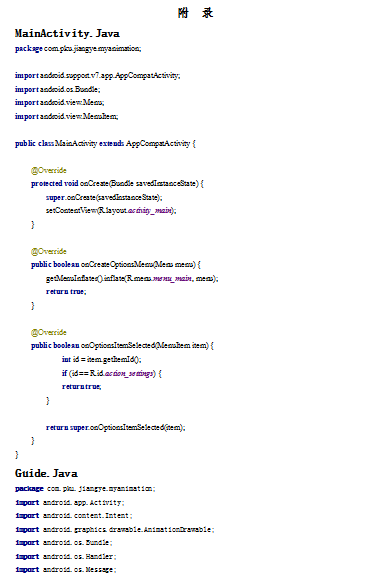

# 

**ListView的定制界面和优化**

## 
作者：
学号：1501210412

说起移动开发中的特色开发技术，许多人的第一反应便是基于gps的位置服务，实际上，基于传感器的编程也是当前移动开发中极具特色的一环。所谓传感器，指的是，手机中的一种微型硬件设备，例如：光照传感器、加速度传感器、地磁传感器、压力传感器、温度传感器等。不同的传感器往往具有不同的规格与功能，但是，通过android系统提供的抽象接口，我们可以轻松的读取传感器提供的信息，在许多手机游戏中使用的重力感应技术、微信中的摇一摇等诸多有趣的应用都是基于传感器完成的。

# 

引导界面的二维动画应用

## 
作者：蒋也
学号：1501210425
 

 
 
 
 
 
 
 
 
 
 
 
 
 
 
 
 
 
 
 
 

