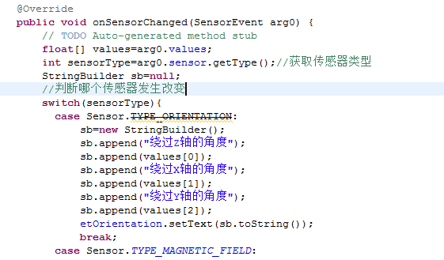
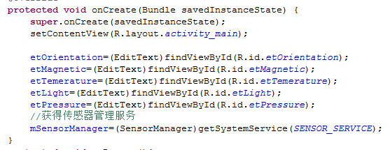
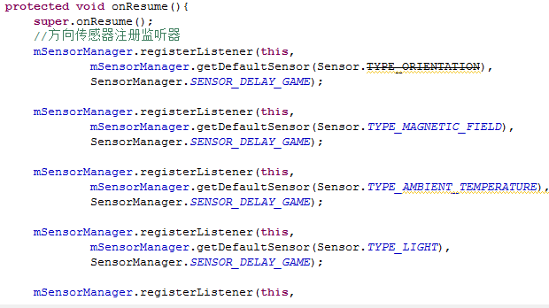
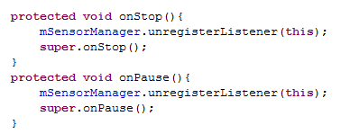
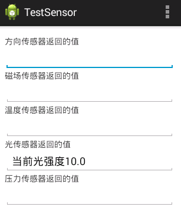

# 解析Android传感器应用开发

作者：谢峰
学号：1501211009

简介：Android系统提供对传感器的支持。只要手机设备的硬件提供这些传感器，Android应用可通过传感器获取设备的外界条件，像设备的运行状态，摆放方向，甚至是温度，压力还有磁场等。开发者只要为指定的传感器注册一个监听器即可。外部环境变化时，Android系统通过传感器获得外部环境的数据，并将数据传给监听器的监听方法。

开发传感器应用的步骤如下：

1.调用Context的getSystemService（Context.SENSOR_SERVICE）方法获取SensorManager对象，SensorManager对象代表系统的传感器服务管理。

2.调用SensorManager的getDefaultSensor(int type)方法获得指定类型的传感器。

3.在Activity的onResume()方法中调用SensorManager的registerListener()为指定传感器注册监听即可。应用程序通过实现监听器即可获得传感器传回的数据。

下面程序代码是关于是几种常用传感器的用法：

1.Activity实现SensorEventListener接口并实现onSensorChanged(Sensor arg0)方法。

2.在onCreate方法内获取传感器管理服务对象。

3.onResume()中注册相关传感器的监听器。

4.onStop()和onPause()中取消注册传感器监听器。

5.效果图.

