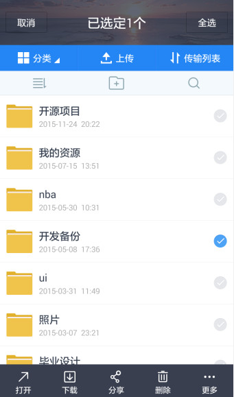

# ListView与RecyclerView实战详解（1501210885陈俊文）


##第一部分 ListView详解


### 1.1简介


&#160;&#160;&#160;&#160;说到ListView，大家脑海里可能首先想到的是一个简单的列表形式的控件，还有几个adapter的使用。但事实上，ListView在实际的开发中几乎是随处可见，从简单的联系人，到复杂的信息展示，ListView的身影随处可见。比如说下面这些常用的app：
  
  
&#160;&#160;&#160;&#160;以上分别来自腾讯QQ、携程、淘宝、微信。可以看到ListView出现在比较重要的内容展示界面。ListView如此常用的一大原因在于客户端从后台获得的数据，往往是同样格式的不同内容的多条记录，每条记录用一个List Item展示，可以做到列表项的布局的复用。
因此，一句话总结ListView的重要性：得ListView者，得Android半壁江山~~。

### 1.2 Adapter介绍与简单使用


&#160;&#160;&#160;&#160;想要使用基本的ListView功能，必须先理解Adapter。Adapter也就是我们常常听到的“适配器”，是一种很常见的设计模式。Adapter将数据源的数据按照用户指定的方式和ListView绑定。原理图如下：
 
&#160;&#160;&#160;&#160;我们在Android Studio中选中Adapter，按下Ctrl+H就可以看到如下的Adapter继承关系：
 
&#160;&#160;&#160;&#160;可以看到主要的Adapter是BaseAdapter，其中有很多实现类，常用的有SimpleCursorAdapter、ArrayAdapter、SimpleAdapter。它们分别对应着不同类型的数据源。
&#160;&#160;&#160;&#160;当我们的数据是从本地的SQLite中查询获得时，我们通常返回一个Cursor，此时应该使用CursorAdapter，因为CursorAdapter的数据源的类型是Cursor。再参照下图的参数介绍，我们可以定义一个CursorAdapter：
 
&#160;&#160;&#160;&#160;更多的时候，我们的数据是从后台查询获得，此时当我们解析完Json或者XML后，通常将一个记录的数据保存在一个Map中或者一个信息类中。如果是以键值对保存在Map中，那我们应该使用SimpleAdapter，它接收的数据源的类型是：List<? extends Map< String,?>>。SimpleAdapter构造器的参数如下图：

 
&#160;&#160;&#160;&#160;如果我们将一个记录的数据保存在一个信息类中，这个时候应该使用ArrayAdapter：
 
&#160;&#160;&#160;&#160;介绍完Adapter，ListView的使用方法其实很简单。
1.	像其他控件一样，先在布局文件写好ListView。
2.	获取ListView的实例（findViewById）。
3.	构造一个Adapter。
4.	调用ListView的setAdapter方法将adapter与ListView绑定。

### 1.3 实战演练


&#160;&#160;&#160;&#160;下面通过一个模仿实战，展示基本的ListView的使用方法。我们选取的模仿对象是淘宝app中展示查询宝贝的ListView。
第一步，编写列表项的布局文件。
首先要仿照淘宝app的界面，编写一个布局文件。在项目的layout里面创建一个taobao_listitem.xml文件。源代码如下：
```
<?xml version="1.0" encoding="utf-8"?>
<LinearLayout xmlns:android="http://schemas.android.com/apk/res/android"
              android:orientation="vertical"
              android:layout_width="match_parent"
              android:layout_height="120dp">
    <RelativeLayout
        android:layout_width="match_parent"
        android:layout_height="match_parent">
        <!--商品照片-->
        <RelativeLayout
            android:id="@+id/goods_pic"
            android:layout_width="120dp"
            android:layout_height="match_parent"
            android:layout_alignParentLeft="true">
            <ImageView
                android:layout_width="120dp"
                android:layout_height="120dp"
                android:src="@drawable/goods"/>
            <ImageView
                android:layout_width="20dp"
                android:layout_height="20dp"/>

        </RelativeLayout>
        <!--商品信息-->
        <RelativeLayout
            android:layout_width="match_parent"
            android:layout_height="match_parent"
            android:layout_toRightOf="@id/goods_pic"
            android:paddingTop="10dp"
            android:paddingLeft="10dp"
            android:paddingRight="10dp">
            <ImageView
                android:id="@+id/goods_tmall_img"
                android:layout_width="wrap_content"
                android:layout_height="wrap_content"
                android:background="@drawable/tmall"
                android:layout_alignParentLeft="true"
                android:layout_marginRight="2dp"/>
            <TextView
                android:id="@+id/goods_name"
                android:layout_width="match_parent"
                android:layout_height="wrap_content"
                android:text="@string/goods_name"
                android:textSize="13sp"
                android:layout_toRightOf="@id/goods_tmall_img"/>
            <LinearLayout
                android:id="@+id/goods_from"
                android:layout_width="match_parent"
                android:layout_height="wrap_content"
                android:layout_below="@id/goods_name">
                <TextView
                    android:id="@+id/goods_from_tv"
                    android:layout_width="wrap_content"
                    android:layout_height="wrap_content"
                    android:text="@string/goods_from"
                    android:textSize="13sp"
                    android:layout_marginTop="2dp"/>

            </LinearLayout>
            <LinearLayout
                android:id="@+id/goods_save"
                android:layout_width="match_parent"
                android:layout_height="wrap_content"
                android:layout_below="@id/goods_from"
                android:orientation="horizontal">
                <TextView

                    android:layout_width="wrap_content"
                    android:layout_height="wrap_content"
                    android:textSize="10sp"
                    android:text="@string/goods_save"
                    android:layout_marginTop="3dp"
                    android:background="@color/text_bgc_save"
                    android:textColor="@color/white"/>

            </LinearLayout>
            <LinearLayout
                android:id="@+id/goods_price"
                android:layout_width="match_parent"
                android:layout_height="wrap_content"
                android:orientation="horizontal"
                android:layout_below="@id/goods_save"
                android:layout_alignParentBottom="true"
                android:layout_marginTop="3dp"
                android:layout_marginBottom="3dp">
                <TextView
                    android:layout_width="wrap_content"
                    android:layout_height="wrap_content"
                    android:text="@string/rmb"
                    android:textColor="@color/text_font_money"
                    android:textSize="12sp"/>/>
                <TextView
                    android:layout_width="wrap_content"
                    android:layout_height="wrap_content"
                    android:text="@string/goods_yuan"
                    android:textColor="@color/text_font_money"
                    android:textSize="17sp"/>
                <TextView
                    android:layout_width="wrap_content"
                    android:layout_height="wrap_content"
                    android:text="@string/goods_jiao"
                    android:textColor="@color/text_font_money"
                    android:textSize="12sp"/>
                <TextView
                    android:layout_width="wrap_content"
                    android:layout_height="wrap_content"
                    android:text="@string/goods_paynum"
                    android:layout_marginLeft="20dp"
                    android:textSize="12sp"/>

            </LinearLayout>
            <ImageView
                android:layout_width="wrap_content"
                android:layout_height="wrap_content"
                android:background="@drawable/more_btn"
                android:layout_alignParentRight="true"
                android:layout_alignParentBottom="true"
                android:layout_marginBottom="2dp"/>
            <!--<View-->
                <!--android:layout_width="match_parent"-->
                <!--android:layout_height="2dp"-->
                <!--android:layout_alignParentBottom="true"-->
                <!--android:background="@color/divide_line"/>-->
        </RelativeLayout>
    </RelativeLayout>
</LinearLayout>
```

&#160;&#160;&#160;&#160;展示效果：
 
&#160;&#160;&#160;&#160;可以看到，单个列表项的还原度还是很高的。
第二步，编写信息类文件。这个信息类文件是用来描述一条记录里的信息。新建类GoodsInfo，源代码如下：

```
/**
 * Created by cer on 2015/12/3.
 */
public class GoodsInfo
{
    private String name;
    private String from;
    private boolean isTmall;

    public GoodsInfo(String name, boolean isTmall, String from)
    {
        this.from = from;
        this.isTmall = isTmall;
        this.name = name;
    }

    public String getFrom()
    {
        return from;
    }

    public void setFrom(String from)
    {
        this.from = from;
    }

    public boolean isTmall()
    {
        return isTmall;
    }

    public void setIsTmall(boolean isTmall)
    {
        this.isTmall = isTmall;
    }

    public String getName()
    {
        return name;
    }

    public void setName(String name)
    {
        this.name = name;
    }
}
```
&#160;&#160;&#160;&#160;第三步，编写自定义Adapter。这一步是重头戏。首先我们创建类GoodsAdapter，继承于ArrayAdapter。然后我们添加构造方法：
```
public GoodsAdapter(Context context, int resource, List objects)
{
    super(context, resource, objects);
}
接下来是最重要的一步，就是重写getView()方法。先看源代码：
@Override
    public View getView(int position, View convertView, ViewGroup parent)
    {
        GoodsInfo info = getItem(position);
        View view;
        ViewHolder viewHolder;
        //使用旧视图
        if(convertView == null)
        {
            view = LayoutInflater.from(getContext()).inflate(R.layout.taobao_listitem,null);
            viewHolder = new ViewHolder();
            viewHolder.from = (TextView)view.findViewById(R.id.goods_from_tv);
            viewHolder.name = (TextView)view.findViewById(R.id.goods_name);
            viewHolder.tmall = (ImageView)view.findViewById(R.id.goods_tmall_img);
            view.setTag(viewHolder);// 将ViewHolder存储在View中
        }
        else
        {
            view = convertView;
            viewHolder = (ViewHolder) view.getTag(); // 重新获取ViewHolder
        }
        viewHolder.from.setText(info.getFrom());
        viewHolder.name.setText(info.getName());
        viewHolder.tmall.setVisibility(info.isTmall()?View.VISIBLE:View.GONE);
        return view;
    }
```
&#160;&#160;&#160;&#160;这里讲解一下这段代码。首先是参数convertView，文档里的解释是The old view to reuses, if possible。这里使用convertView是为了优化ListView。如果有旧的视图就直接使用旧的。下面还使用了另外一种优化方法，那就是ViewHolder。ViewHolder盛放需要去绑定数据的控件信息。我们用一个ViewHolder把这些控件全部放进去，再用view.setTag(viewHolder);这句代码，将ViewHolder存储在View中。再可重用的情况下通过viewHolder = (ViewHolder) view.getTag();来重新获取ViewHolder，从而重新获取相应的控件，而不用再去实例化新的控件。下面是ViewHolder的代码：
```
class ViewHolder
{
    ImageView tmall;
    TextView name;
    TextView from;
}
第三步，在Activity中初始化列表信息。
void initGoodsInfo()
{
    GoodsInfo g1 = new GoodsInfo("特厚塑料整理箱收纳箱储物箱周转箱全国包邮",true,"包邮   上海");
    goodsInfoList.add(g1);
    GoodsInfo g2 = new GoodsInfo("就是一个箱子而已",false,"包邮   北京");
    goodsInfoList.add(g2);
    GoodsInfo g3 = new GoodsInfo("特厚塑料整理箱收纳箱储物箱周转箱全国包邮",true,"包邮   浙江");
    goodsInfoList.add(g3);
    GoodsInfo g4 = new GoodsInfo("特厚塑料整理箱收纳箱储物箱周转箱全国包邮",false,"包邮   大连");
    goodsInfoList.add(g4);
    GoodsInfo g5 = new GoodsInfo("特厚塑料整理箱收纳箱储物箱周转箱全国包邮",true,"包邮   东京");
    goodsInfoList.add(g5);
    GoodsInfo g6 = new GoodsInfo("特厚塑料整理箱收纳箱储物箱周转箱全国包邮",true,"包邮   温州");
    goodsInfoList.add(g6);
    GoodsInfo g7 = new GoodsInfo("特厚塑料整理箱收纳箱储物箱周转箱全国包邮",false,"包邮   铁岭");
    goodsInfoList.add(g7);
    GoodsInfo g8 = new GoodsInfo("特厚塑料整理箱收纳箱储物箱周转箱全国包邮",true,"包邮   沈阳");
    goodsInfoList.add(g8);
    GoodsInfo g9 = new GoodsInfo("特厚塑料整理箱收纳箱储物箱周转箱全国包邮",false,"包邮   广州");
    goodsInfoList.add(g9);
}
```
最后一步，初始化ListView和Adapter，再将Adapter与ListView绑定：
```
initGoodsInfo();
GoodsAdapter ga = new GoodsAdapter(this,R.layout.taobao_listitem,goodsInfoList);
ListView goodsLv = (ListView)findViewById(R.id.good_lv);
goodsLv.setAdapter(ga);
```
显示的效果如下：

 

### 1.4 ListView的进一步深入


&#160;&#160;&#160;&#160;当我们做出来一个这样的ListView以后，虽然美观程度已经不错，但是却是死的，还不会和用户进行交互。那么关于动态的交互，我们应该怎么做呢？再来学习一下典型的APP，看看它们是怎么做的：
             
&#160;&#160;&#160;&#160;上面第一个例子是百度云的ListView，它的交互功能是：长按列表项，会出现打钩的图标，并在屏幕上方和下方显示工具栏，用来对文件夹进行操作。这个功能在实际使用过程中是很常见并且很实用的。第二个例子还是来自淘宝，当我们将列表项往左滑动时，会出现用户对该宝贝的评分还有搜索相似等功能，用起来十分方便，并且显得更加美观。
<p>&#160;&#160;&#160;&#160;下面我们就在刚才的基础上，继续实现仿淘宝的ListView的滑动功能。
<p>&#160;&#160;&#160;&#160;这里我们需要自定义一个SwipeListView继承于ListView，捕捉它的滑动事件，并进行处理。在实际动手演练之前，需要先介绍一下View的屏幕事件传递机制。最重要的两个方法，就是onInterceptTouchEvent()和onTouchEvent()。安卓的屏幕事件，先由最外层的父容器接收，一层层往下传，处理的时候相反，由最底层的子视图处理，一层层往上传。在往下传的过程中，如果父容器想要自己处理事件，不想传给子视图，就可以拦截事件；同样在上传的过程中，子视图可以自己把事件处理完，继而父容器便不需要再去处理。
<p>&#160;&#160;&#160;&#160;具体实现起来，就是当你在屏幕上按下以后，首先第一个会调用最外层父容器的onInterceptTouchEvent()方法。如果一个父容器想自己处理，不想让子视图插手，他可以返回true，即拦截了这个事件。如果返回false，事件会继续传递给子视图。当事件传递结束开始执行时，会调用最底层的子视图的onTouchEvent()方法来处理事件。如果子视图认为自己已经完全处理好了这个事件，不希望父容器再插手，则可以返回true，即已经处理完了。如果返回false，还需继续调用父容器的onTouchEvent()方法。
原理图如下：
 
&#160;&#160;&#160;&#160;介绍完补充知识，我们开始实现我们的自定义ListView。
<p>&#160;&#160;&#160;&#160;第一步，先定义一些要用到的变量。相应的解释见注解：
```
//记录是否是水平滑动
private Boolean mIsHorizontal;
//上一次的列表项视图
private View mPreItemView;
//当前的列表项视图
private View mCurrentItemView;
//手指按下时的坐标，X
private float mFirstX;
//手指按下时的坐标，Y
private float mFirstY;
//右边视图的宽度
private int mRightViewWidth = 400;
//整体动画的间隔时间
private final int mDuration = 100;
//每帧动画的间隔时间
private final int mDurationStep = 10;
//记录右边视图是否已经展示出来
private boolean mIsShown;
第二步，重写onInterceptTouchEvent()方法。重写之前，我们先分析一下交互机制：
一方面，如果视图处在右视图无显示状态，那么左划距离超过右视图宽度的一半，就可以显示滑动动画，将右视图展现。
另一方面，当右视图已经处于显示状态，却有很多情况我们需要将右视图隐藏。
情况一：击任意一个item, 那么那个右视图显示的item隐藏其右视图。
情况二：左右划一个另一个item，隐藏右视图。
情况三：上下滚动listView，隐藏右视图。
情况四：左右划当前item，隐藏右视图。
情况五：假设此时右视图没有显示，如果左划距离过短，重新隐藏右视图。
onInterceptTouchEvent源代码：
 * 如果返回true，则将事件拦截，由listView自己处理；
如果返回false，则将事件继续传给listView的子视图。
 */
@Override
public boolean onInterceptTouchEvent(MotionEvent ev)
{
    float lastX = ev.getX();
    float lastY = ev.getY();
    switch (ev.getAction())
    {
        case MotionEvent.ACTION_DOWN:
            mIsHorizontal = null;
            mFirstX = lastX;
            mFirstY = lastY;
            int motionPosition = pointToPosition((int) mFirstX, (int) mFirstY);

            if (motionPosition >= 0)
            {
                View currentItemView = getChildAt(motionPosition - getFirstVisiblePosition());
                mPreItemView = mCurrentItemView;
                mCurrentItemView = currentItemView;
            }
            break;

        case MotionEvent.ACTION_MOVE:
            float dx = lastX - mFirstX;
            float dy = lastY - mFirstY;
            //判断有滑动，就把事件留给listView
            if (Math.abs(dx) >= 5 && Math.abs(dy) >= 5)
            {
                return true;
            }
            break;

        case MotionEvent.ACTION_UP:
        case MotionEvent.ACTION_CANCEL:
            if (mIsShown && (mPreItemView != mCurrentItemView || isHitCurItemLeft(lastX)))
            {
                /**
                 * 情况一：
                 * <p>
                 * 一个Item的右边布局已经显示，
                 * <p>
                 * 这时候点击任意一个item, 那么那个右边布局显示的item隐藏其右边布局
                 */
                hiddenRight(mPreItemView);
            }
            break;
    }

    return super.onInterceptTouchEvent(ev);
}
```
<p>&#160;&#160;&#160;&#160;再解读一下这里的代码，首先是记录按下时的初始坐标和移动时的当前坐标。然后要判断滑动是否是误操作，再决定是否将事件拦截。
<p>&#160;&#160;&#160;&#160;第三步，重写onTouchEvent()方法。
```
/**
 * 返回false：不能移动任何方向
 * 返回true：只能移动水平方向
 * 返回super.onTouchEvent(ev),两个方向都能移动
 */
@Override
public boolean onTouchEvent(MotionEvent ev)
{
    float lastX = ev.getX();
    float lastY = ev.getY();
    switch (ev.getAction())
    {
        case MotionEvent.ACTION_DOWN:
            break;

        case MotionEvent.ACTION_MOVE:
            float dx = lastX - mFirstX;
            float dy = lastY - mFirstY;
            //确认滑动方向
            if (mIsHorizontal == null)
            {
                //微动，不算移动，则不动
                if (!judgeScrollDirection(dx, dy))
                {
                    break;
                }
            }
            //水平移动
            if (mIsHorizontal)
            {
                if (mIsShown && mPreItemView != mCurrentItemView)
                {
                    /**
                     * 情况二：
                     * <p>
                     * 一个Item的右边布局已经显示，
                     * <p>
                     * 这时候左右滑动另外一个item,那个右边布局显示的item隐藏其右边布局
                     * <p>
                     * 向左滑动只触发该情况，向右滑动还会触发情况五
                     */
                    hiddenRight(mPreItemView);
                }
                //如果已经处于展示右视图界面，则dx要减少mRightWidth
                if (mIsShown && mPreItemView == mCurrentItemView)
                {
                    dx = dx - mRightViewWidth;
                }
                /**
                 * dx<0:向左滑
                 * dx>-mRightViewWidth:不超过右视图的宽度
                 */
                if (dx < 0 && dx > -mRightViewWidth)
                {
                    mCurrentItemView.scrollTo((int) (-dx), 0);
                }

                return true;
            }
            //竖直方向
            else
            {
                if (mIsShown)
                {
                    /**
                     * 情况三：
                     * <p>
                     * 一个Item的右边布局已经显示，
                     * <p>
                     * 这时候上下滚动ListView,那么那个右边布局显示的item隐藏其右边布局
                     */
                    hiddenRight(mPreItemView);
                }
            }
            break;

        case MotionEvent.ACTION_UP:
        case MotionEvent.ACTION_CANCEL:
            clearPressedState();
            if (mIsShown)
            {
                /**
                 * 情况四：
                 * <p>
                 * 一个Item的右边布局已经显示，
                 * <p>
                 * 这时候左右滑动当前一个item,那个右边布局显示的item隐藏其右边布局
                 */
                hiddenRight(mPreItemView);
            }

            if (mIsHorizontal != null && mIsHorizontal)
            {
                if (mFirstX - lastX > mRightViewWidth / 2)
                {
                    //向左滑动一个item,且滑动的距离超过了右边View的宽度的一半，显示之。
                    showRight(mCurrentItemView);
                } else
                {
                    /**
                     * 情况五：
                     * <p>
                     * 向左滑动距离不够，再隐藏
                     */
                    hiddenRight(mCurrentItemView);
                }
                MotionEvent obtain = MotionEvent.obtain(ev);
                obtain.setAction(MotionEvent.ACTION_CANCEL);
                super.onTouchEvent(obtain);
                return true;
            }
            break;
    }
    return super.onTouchEvent(ev);
}
```
<p>&#160;&#160;&#160;&#160;这段代码主要是判断了之前所说的可能出现的多种情况，再决定是隐藏右视图还是显示右视图。
<p>&#160;&#160;&#160;&#160;第四步，同样非常重要。编写实现隐藏右视图的hiddenRight()和显示右视图的showRight()，以及它们调用的实际实现滑动动画内容的Handler。
```
/**
 * 显示右视图
 * @param view
 */
private void showRight(View view)
{
    Message msg = new MoveHandler().obtainMessage();
    msg.obj = view;
    msg.arg1 = view.getScrollX();
    msg.arg2 = mRightViewWidth;
    msg.sendToTarget();

    mIsShown = true;
}

/**
 * 隐藏右视图
 * @param view
 */
private void hiddenRight(View view)
{
    if (mCurrentItemView == null)
    {
        return;
    }
    Message msg = new MoveHandler().obtainMessage();
    msg.obj = view;
    msg.arg1 = view.getScrollX();
    msg.arg2 = 0;

    msg.sendToTarget();

    mIsShown = false;
}

/**
 * 处理显示右视图或者隐藏右视图的Handler
 */
@SuppressLint("HandlerLeak")
class MoveHandler extends Handler
{
    int stepX = 0;

    int fromX;

    int toX;

    View view;

    private boolean mIsInAnimation = false;

    //拖动结束执行程序
    private void animationOver()
    {
        mIsInAnimation = false;
        stepX = 0;
    }

    @Override
    public void handleMessage(Message msg)
    {
        super.handleMessage(msg);
        //如果是第一步,需要进行对步数的初始化计算
        if (stepX == 0)
        {
            if (mIsInAnimation)
            {
                return;
            }
            mIsInAnimation = true;
            view = (View) msg.obj;
            //获得滑动的起点和终点坐标
            fromX = msg.arg1;
            toX = msg.arg2;
            //计算获得步数，相当于滑动动画的帧数
            stepX = (int) ((toX - fromX) * mDurationStep * 1.0 / mDuration);
            if (stepX < 0 && stepX > -1)
            {
                stepX = -1;
            } else if (stepX > 0 && stepX < 1)
            {
                stepX = 1;
            }
            if (Math.abs(toX - fromX) < 10)
            {
                view.scrollTo(toX, 0);
                animationOver();
                return;
            }
        }

        fromX += stepX;
        boolean isLastStep = (stepX > 0 && fromX > toX) || (stepX < 0 && fromX < toX);
        if (isLastStep)
        {
            fromX = toX;
        }

        view.scrollTo(fromX, 0);
        invalidate();

        if (!isLastStep)
        {
            //每隔一段时间重发，即再次执行handleMessage()方法
            this.sendEmptyMessageDelayed(0, mDurationStep);
        } else
        {
            animationOver();
        }
    }
}
```
<p>&#160;&#160;&#160;&#160;Handler接收的信息中，包含滑动的起始坐标和中点坐标。并计算显示的帧数。每次通过view.scrollTo()方法实现一帧的移动，移动完一帧后，又会调用sendEmptyMessageDelayed(0, mDurationStep)方法，间隔一小段时间再移动下一帧。如此反复，实现拖动的动画。
第五步，编写其他需要的函数。
```
public int getRightViewWidth()
{
    return mRightViewWidth;
}

public void setRightViewWidth(int mRightViewWidth)
{
    this.mRightViewWidth = mRightViewWidth;
}
private void clearPressedState()
{
    // TODO current item is still has background, issue
    mCurrentItemView.setPressed(false);
    setPressed(false);
    refreshDrawableState();
}
/**
 * @param dx
 * @param dy
 * @return 判断滑动方向以及能否滑动
 */
private boolean judgeScrollDirection(float dx, float dy)
{
    boolean canJudge = true;

    if (Math.abs(dx) > 30 && Math.abs(dx) > 2 * Math.abs(dy))
    {
        mIsHorizontal = true;
    } else if (Math.abs(dy) > 30 && Math.abs(dy) > 2 * Math.abs(dx))
    {
        mIsHorizontal = false;
    } else
    {
        canJudge = false;
    }

    return canJudge;
}
经过上面的五步操作，我们就写好了一个自定义的ListView。接下来，需要在原来的布局文件中，加入右边视图的代码：
<!--右侧滑动时出现的图像-->
<LinearLayout
    android:layout_width="wrap_content"
    android:layout_height="match_parent"
    android:id="@+id/item_right"
    android:orientation="horizontal">
    <LinearLayout
        android:layout_width="0dp"
        android:layout_height="match_parent"
        android:orientation="vertical"
        android:padding="10dp"
        android:layout_weight="3">
        <TextView
            android:layout_width="wrap_content"
            android:layout_height="wrap_content"
            android:text="那澜多好旗舰店"
            android:textSize="13sp"
            android:layout_marginBottom="10dp"/>
        <LinearLayout
            android:layout_width="match_parent"
            android:layout_height="wrap_content"
            android:orientation="horizontal"
            android:layout_marginBottom="10dp">
            <TextView
                android:layout_width="wrap_content"
                android:layout_height="match_parent"
                android:textSize="10sp"
                android:text="描述相符"
                android:layout_marginRight="5dp"/>
            <TextView
                android:layout_width="wrap_content"
                android:layout_height="match_parent"
                android:textSize="10sp"
                android:text="4.90"
                android:textColor="@color/text_font_money"
                android:layout_marginRight="3dp"/>
            <TextView
                android:layout_width="wrap_content"
                android:layout_height="wrap_content"
                android:textSize="10sp"
                android:text="高"
                android:textColor="@color/white"
                android:background="@color/text_font_money"
                android:layout_marginRight="3dp"/>

        </LinearLayout>
        <LinearLayout
            android:layout_width="match_parent"
            android:layout_height="wrap_content"
            android:orientation="horizontal"
            android:layout_marginBottom="10dp">
            <TextView
                android:layout_width="wrap_content"
                android:layout_height="match_parent"
                android:textSize="10sp"
                android:text="服务态度"
                android:layout_marginRight="5dp"/>
            <TextView
                android:layout_width="wrap_content"
                android:layout_height="match_parent"
                android:textSize="10sp"
                android:text="4.87"
                android:textColor="@color/text_font_money"
                android:layout_marginRight="3dp"/>
            <TextView
                android:layout_width="wrap_content"
                android:layout_height="wrap_content"
                android:textSize="10sp"
                android:text="高"
                android:textColor="@color/white"
                android:background="@color/text_font_money"
                android:layout_marginRight="3dp"/>
        </LinearLayout>
        <LinearLayout
            android:layout_width="match_parent"
            android:layout_height="wrap_content"
            android:orientation="horizontal"
            android:layout_marginBottom="5dp">
            <TextView
                android:layout_width="wrap_content"
                android:layout_height="match_parent"
                android:textSize="10sp"
                android:text="物流服务"
                android:layout_marginRight="5dp"/>
            <TextView
                android:layout_width="wrap_content"
                android:layout_height="match_parent"
                android:textSize="10sp"
                android:text="4.82"
                android:textColor="@color/text_font_money"
                android:layout_marginRight="3dp"/>
            <TextView
                android:layout_width="wrap_content"
                android:layout_height="wrap_content"
                android:textSize="10sp"
                android:text="高"
                android:textColor="@color/white"
                android:background="@color/text_font_money"
                android:layout_marginRight="3dp"/>

        </LinearLayout>
    </LinearLayout>
    <LinearLayout
        android:layout_width="0dp"
        android:layout_height="match_parent"
        android:orientation="vertical"
        android:layout_weight="2">
        <TextView
            android:id="@+id/item_right_txt_similar"
            android:layout_width="match_parent"
            android:layout_height="0dp"
            android:layout_weight="1"
            android:layout_centerInParent="true"
            android:gravity="center"
            android:textColor="#FFFFFF"
            android:background="@color/text_bgc_similar"
            android:text="搜相似"/>
        <TextView
            android:id="@+id/item_right_txt_same"
            android:layout_width="match_parent"
            android:layout_height="0dp"
            android:layout_weight="1"
            android:layout_centerInParent="true"
            android:gravity="center"
            android:textColor="#FFFFFF"
            android:background="@color/text_bgc_same"
            android:text="无同款"/>
    </LinearLayout>

</LinearLayout>
```
<p>&#160;&#160;&#160;&#160;下面还需改写Adapter。加入：
```
viewHolder.item_right = (View) view.findViewById(R.id.item_right);

LinearLayout.LayoutParams lp2 = new LinearLayout.LayoutParams(mRightWidth, LinearLayout.LayoutParams.MATCH_PARENT);
viewHolder.item_right.setLayoutParams(lp2);
```
<p>&#160;&#160;&#160;&#160;在VieHolder中加入：View item_right;
最后还要修改MainActivity：
```
GoodsAdapter ga = new GoodsAdapter(this,R.layout.taobao_listitem,goodsInfoList);
SwipeListView goodsLv = (SwipeListView)findViewById(R.id.good_lv);
ga.setmRightWidth(goodsLv.getRightViewWidth());
goodsLv.setAdapter(ga);
```
<p>&#160;&#160;&#160;&#160;运行效果如下：
 
<p>&#160;&#160;&#160;&#160;最后，我们考虑为listView加上点击事件。这里的事件应该在adapter中的getView()方法里加上。代码如下：
```
viewHolder.similar.setOnClickListener(new View.OnClickListener()
{
    @Override
    public void onClick(View v)
    {

        Toast.makeText(getContext(),"搜索与第" + itemPosition + "号相似的商品",  Toast.LENGTH_LONG).show();
    }
});
viewHolder.same.setOnClickListener(new View.OnClickListener()
{
    @Override
    public void onClick(View v)
    {
        Toast.makeText(getContext(),"搜索与第" + itemPosition + "号同款的商品", Toast.LENGTH_LONG).show();
    }
});
```
<p>&#160;&#160;&#160;&#160;当然，之前要在ViewHolder里面加上这两个TextView，这里代码不赘述。注意一点，这里是在getView()方法中调用的。这个方法提供了当前的item的号码，但是getView()中绑定监听器的时候，由于是匿名类，不可以直接使用position这个参数。所以需要自定义一个final修饰的itemPosition保存position的值来使用。效果如下：
                
<p>&#160;&#160;&#160;&#160;至此ListView的实战就介绍到这里，但是称霸了多年的ListView拥有丰富的扩展，依然等着大家去实际动手演练。

## 第二部分 RecyclerView详解


### 2.1简介


<p>&#160;&#160;&#160;&#160;RecyclerView是android推出的“当红炸子鸡”。Android对它的期望是可以全面代替ListView和GridView。低于5.0版本的系统，可以下载support-v7的扩展包，来支持RecyclerView。RecyclerView之所以叫这个名字，是因为它的可重用性远比ListView要强，并且操作简单。具体区别如下：
<p>&#160;&#160;&#160;&#160;1.RecyclerView强制需要ViewHolder。在上面讲解ListView时，曾经提到可以使用ViewHolder的技巧来提高ListView的旧视图的回收利用率，但是这里只是推荐使用，并不是强制的。
<p>&#160;&#160;&#160;&#160;2.可以自定义的Item布局。ListView只能将Item布局在一个线性的竖直方向上；但是RecyclerView有一个RecyclerView.LayoutManager，它可以让Item的布局还可以是横向的列表或者是格子样式。
<p>&#160;&#160;&#160;&#160;3.更简单的Item动画。ListView并没有为Item专门提供动画。相反，RecyclerView有RecyclerView.ItemAnimation类，专门用来处理Item的动画。
<p>&#160;&#160;&#160;&#160;4.手动的数据源。如上文所述，ListView的Adapter有针对不同类型的数据源，但是RecyclerView只能手动地去实现数据源的提供。
<p>&#160;&#160;&#160;&#160;5.手动的Item装饰。ListView有android:divider属性用来满足简单的divider装饰。但RecyclerView需要一个RecyclerView.ItemDecoration对象来建立这样的装饰。
<p>&#160;&#160;&#160;&#160;6.手动的点击事件。ListView实现了AdapterView.OnItemClickListener接口来绑定点击事件和Item。但是RecyclerView只支持RecyclerView.OnItemTouchListener。
<p>&#160;&#160;&#160;&#160;下面，我们用RecyclerView和CardView做一个小型计划表，来感受RecyclerView的魅力。

### 2.2 基本使用


<p>&#160;&#160;&#160;&#160;使用RecyclerView的基本步骤总结如下：
 
<p>&#160;&#160;&#160;&#160;第一步，在gradle中添加支持库。
```
compile 'com.android.support:recyclerview-v7:23.1.1'
compile 'com.android.support:cardview-v7:23.1.1'
```
<p>&#160;&#160;&#160;&#160;第二步，定义数据模型。
```
public class PlanItemInfo
{
    private String name;
    private String deadLine;
    private String planTime;

    public PlanItemInfo(String name, String deadLine, String planTime)
    {
        this.name = name;
        this.deadLine = deadLine;
        this.planTime = planTime;
    }

    public String getDeadLine()
    {
        return deadLine;
    }

    public String getName()
    {
        return name;
    }

    public String getPlanTime()
    {
        return planTime;
    }

    public void setDeadLine(String deadLine)
    {
        this.deadLine = deadLine;
    }

    public void setName(String name)
    {
        this.name = name;
    }

    public void setPlanTime(String planTime)
    {
        this.planTime = planTime;
    }
}
```
<p>&#160;&#160;&#160;&#160;第三步，定义RecyclerView的布局文件：
```
<android.support.v7.widget.RecyclerView
        android:id="@+id/list"
        android:layout_width="match_parent"
        android:layout_height="match_parent"
        tools:context=".MyActivity" />
```
<p>&#160;&#160;&#160;&#160;第四步，编写Item的布局，此处使用CardView：
```
	<android.support.v7.widget.CardView
    xmlns:android="http://schemas.android.com/apk/res/android"
    xmlns:card_view="http://schemas.android.com/apk/res-auto"
    android:layout_width="match_parent"
    android:layout_height="match_parent"
    android:layout_margin="5dp"
    android:orientation="horizontal"
    card_view:cardBackgroundColor="@color/border_grey"
    card_view:cardCornerRadius="0dp" >

    <LinearLayout
        android:layout_width="match_parent"
        android:layout_height="150dp"
        android:padding="5dp"
        android:orientation="horizontal">

        <LinearLayout
            android:layout_width="0dp"
            android:layout_height="match_parent"
            android:layout_weight="4"
            android:background="@color/light_orange"
            android:gravity="center">
            <TextView
                android:id="@+id/card_name"
                android:textSize="15sp"
                android:layout_width="wrap_content"
                android:layout_height="wrap_content"
                android:textColor="@android:color/white"/>
        </LinearLayout>

        <LinearLayout
            android:layout_width="0dp"
            android:layout_height="match_parent"
            android:layout_weight="6"
            android:orientation="vertical">
            <LinearLayout
                android:layout_width="match_parent"
                android:layout_height="match_parent"
                android:layout_weight="5"
                android:background="@color/light_pink"
                android:gravity="center">
                <TextView
                    android:id="@+id/card_deadline"
                    android:layout_width="wrap_content"
                    android:layout_height="wrap_content"
                    android:textSize="15sp"
                    android:textColor="@android:color/white"/>

            </LinearLayout>
            <LinearLayout
                android:layout_width="match_parent"
                android:layout_height="match_parent"
                android:layout_weight="5"
                android:background="@color/light_blue"
                android:gravity="center">
                <TextView
                    android:id="@+id/card_plantime"
                    android:layout_width="wrap_content"
                    android:layout_height="wrap_content"
                    android:textSize="15sp"
                    android:textColor="@android:color/white"/>

            </LinearLayout>
        </LinearLayout>
    </LinearLayout>
</android.support.v7.widget.CardView>
```
<p>&#160;&#160;&#160;&#160;第五步，编写RecyclerView.Adapter。
<p>&#160;&#160;&#160;&#160;RecyclerView.Adapter中需要重写的三个方法如下：
 
<p>&#160;&#160;&#160;&#160;具体实现代码：
```
public class MyAdapter extends RecyclerView.Adapter implements ItemTouchHelperAdapter
{
    private List plans;

    private Context mContext;

    public MyAdapter( Context context , List plans)
    {
        this.mContext = context;
        this.plans = plans;
    }

    @Override
    public ViewHolder onCreateViewHolder( ViewGroup viewGroup, int i )
    {
        // 给ViewHolder设置布局文件
        View v = LayoutInflater.from(viewGroup.getContext()).inflate(R.layout.card_view, viewGroup, false);
        return new ViewHolder(v);
    }

    @Override
    public void onBindViewHolder(RecyclerView.ViewHolder holder, int position)
    {
        // 给ViewHolder设置元素
        PlanItemInfo p = (PlanItemInfo) plans.get(position);
        ((ViewHolder)holder).mCardName.setText(p.getName());
        ((ViewHolder)holder).mDeadLine.setText(p.getDeadLine());
        ((ViewHolder)holder).mPlanTime.setText(p.getPlanTime());

    }

    @Override
    public int getItemCount()
    {
        // 返回数据总数
        return plans == null ? 0 : plans.size();
    }

    // 重写的自定义ViewHolder
    public static class ViewHolder
            extends RecyclerView.ViewHolder
    {
        public TextView mCardName;
        public TextView mDeadLine;
        public TextView mPlanTime;


        public ViewHolder( View v )
        {
            super(v);
            mCardName = (TextView) v.findViewById(R.id.card_name);
            mDeadLine = (TextView) v.findViewById(R.id.card_deadline);
            mPlanTime = (TextView) v.findViewById(R.id.card_plantime);
        }
    }
}
```
<p>&#160;&#160;&#160;&#160;最后一步，将Adapter绑定到RecyclerView。
```
        mRecyclerView = (RecyclerView) findViewById(R.id.list);
        // 设置LinearLayoutManager
        mRecyclerView.setLayoutManager(new LinearLayoutManager(this));
        // 设置ItemAnimator
       mRecyclerView.setItemAnimator(new DefaultItemAnimator());
        // 设置固定大小
        mRecyclerView.setHasFixedSize(true);
        // 初始化自定义的适配器
        myAdapter = new MyAdapter(this, plans);
        // 为mRecyclerView设置适配器
        mRecyclerView.setAdapter(myAdapter);
```
<p>&#160;&#160;&#160;&#160;至此，我们已经完成了RecyclerView的基本使用，结果图如下：


### 2.3 点击事件


<p>&#160;&#160;&#160;&#160;ReclerView并没有像ListView一样有自带的OnItemClickListener。想要实现类似的功能，我们需要借用监听者模式，手动添加。
<p>&#160;&#160;&#160;&#160;首先在Adapter中添加接口OnItemClickListener：
```
public interface OnItemClickListener
    {
        void onItemClick(View itemView, int position);
    }
并写好setter：
public void setOnItemClickListener(OnItemClickListener listener)
    {
        this.listener = listener;
    }
在ViewHolder中为视图绑定系统的OnClickListener：
itemView.setOnClickListener(new OnClickListener(){
	@Override
	public void OnClick(View v)
{
	if (listener != null)
    listener.onItemClick(v, getLayoutPosition());
}
});
通过上面的程序，将视图的点击事件交给接口中的方法去实现。而接口中具体的方法，则需要到主程序中去实现。让主Activity实现我们的接口，并实现：
@Override
    public void onItemClick(View itemView, int position)
    {
        Toast.makeText(this,"点击了："+((TextView)itemView.findViewById (R.id.card_name)).getText().toString(),Toast.LENGTH_LONG).show();
    }
完成，点击效果如下：
 
2.4 交互深入
像上面讲ListView一样，我们希望给Recycler加上丰富的交互。在这个实例中，我们需要实现的是左右滑动删除一个Item，上下拖动可以改变Item的位置。
Android为我们提供了便捷的操作方法，因此我们不用像修改ListView那样去重写onInterceptTouchEvent()和onTouchEvent()。Android为我们提供的类是ItemTouchHelper。接下来我们继续在刚才的实例上进行添加。
首先我们需要编写一个SimpleItemTouchHelperCallback继承自ItemTouchHelper.Callback。我们需要重写几个方法，以便ItemTouchHelper在处理滑动和拖动时进行回调。
isLongPressDragEnabled()：是否允许长按拖动。
isItemViewSwipeEnabled()：是否允许滑动Item。
int getMovementFlags()：设置可以操作的动作。
boolean onMove()：拖动时调用。
void onSwiped()：滑动时调用。
在重写这两个回调时，我们希望实际的操作应该在Adapter中进行。因此我们写一个接口，让Adapter实现这个接口，实现接口注入。
接口：
public interface ItemTouchHelperAdapter {
    boolean onItemMove(int fromPosition, int toPosition);
    void onItemDismiss(int position);
}
Adapter中的实现：
@Override
    public void onItemDismiss(int position) {
        plans.remove(position);
        notifyItemRemoved(position);
    }

    @Override
    public boolean onItemMove(int fromPosition, int toPosition) {
        Collections.swap(plans, fromPosition, toPosition);
        notifyItemMoved(fromPosition, toPosition);
        return true;
    }
再编写：
public class SimpleItemTouchHelperCallback extends ItemTouchHelper.Callback {

    public static final float ALPHA_FULL = 1.0f;

    private final ItemTouchHelperAdapter mAdapter;

    public SimpleItemTouchHelperCallback(ItemTouchHelperAdapter adapter) {
        mAdapter = adapter;
    }

    @Override
    public boolean isLongPressDragEnabled() {
        return true;
    }

    @Override
    public boolean isItemViewSwipeEnabled() {
        return true;
    }

    @Override
    public int getMovementFlags(RecyclerView recyclerView, RecyclerView.ViewHolder viewHolder) {
            final int dragFlags = ItemTouchHelper.UP | ItemTouchHelper.DOWN;
            final int swipeFlags = ItemTouchHelper.START | ItemTouchHelper.END;
            return makeMovementFlags(dragFlags, swipeFlags);
    }

    @Override
    public boolean onMove(RecyclerView recyclerView, RecyclerView.ViewHolder source, RecyclerView.ViewHolder target) {
        if (source.getItemViewType() != target.getItemViewType()) {
            return false;
        }

        // 通知Adapter执行拖动的程序
        mAdapter.onItemMove(source.getAdapterPosition(), target.getAdapterPosition());
        return true;
    }

    @Override
    public void onSwiped(RecyclerView.ViewHolder viewHolder, int i) {
        // 通知Adapter执行滑动的程序
        mAdapter.onItemDismiss(viewHolder.getAdapterPosition());
    }

    @Override
    public void onChildDraw(Canvas c, RecyclerView recyclerView, RecyclerView.ViewHolder viewHolder, float dX, float dY, int actionState, boolean isCurrentlyActive) {
        if (actionState == ItemTouchHelper.ACTION_STATE_SWIPE) {
            // Fade out the view as it is swiped out of the parent's bounds
            final float alpha = ALPHA_FULL - Math.abs(dX) / (float) viewHolder.itemView.getWidth();
            viewHolder.itemView.setAlpha(alpha);
            viewHolder.itemView.setTranslationX(dX);
        } else {
            super.onChildDraw(c, recyclerView, viewHolder, dX, dY, actionState, isCurrentlyActive);
        }
    }

    @Override
    public void onSelectedChanged(RecyclerView.ViewHolder viewHolder, int actionState){
        super.onSelectedChanged(viewHolder, actionState);
    }

    @Override
    public void clearView(RecyclerView recyclerView, RecyclerView.ViewHolder viewHolder) {
        super.clearView(recyclerView, viewHolder);
 }
}
最后一步，我们将ItemTouchHelper绑定到RecyclerView：
ItemTouchHelper.Callback callback = new SimpleItemTouchHelperCallback(myAdapter);
mItemTouchHelper = new ItemTouchHelper(callback);
mItemTouchHelper.attachToRecyclerView(mRecyclerView);
至此，我们的小型计划表可以实现左右滑动删除Item，上下拖动改变Item位置。
2.5 添加动画效果
RecyclerView的一大优点就是添加动画非常方便。我们使用一个开源的动画库：
compile 'jp.wasabeef:recyclerview-animators:2.1.0'
再将动画设置成新的动画即可：
mRecyclerView.setItemAnimator(new SlideInLeftAnimator());
最终效果显示如下：
 
