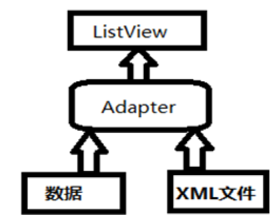

# ListView的定制使用与优化

【摘　要】Android系统开发是目前移动互联开发的主流系统，相对于计算机开发，其内存小、屏幕小，所以，对应用程序的性能有特别高的要求。ListView是android开发中最重要的控件之一，使用频率特别高，几乎每个项目中都需要使用ListView控件实现列表显示，因此，提高ListView控件的性能对整个项目的质量及用户体验至关重要，本文分析了ListView控件的实现原理，定制ListView的方法，并着重对其性能进行优化。

**一、ListView原理与分析**

LsitView显示的基本原理

List控件如果要显示数据需要具备以下元素：ListView列表控件，数据适配器，布局文件，数据。四者的关系如下图所示。其中，L i s t V i e w是基本的显示控件，以列表的形式显示数据信息，X M L布局文件定义了L i s t V i e w控件中每个i t e m项包含的控件及布局格式，数据可以是数组、L i s t集合等，存放要显示的TextView、ImageView等控件的数据信息，Adapter为适配器将数据按照xml布局文件的格式显示在List控件之中。
 
 
** 二、定制ListView界面**

只能显示一段文本的ListView 实在是太单调了，我们现在就来对ListView 的界面进行定制，让它可以显示更加丰富的内容。
首先需要准备好一组图片，分别对应上面提供的每一种水果，待会我们要让这些水果名称的旁边都有一个图样。接着定义一个实体类，作为ListView 适配器的适配类型。新建类Fruit，代码如下所示：

Fruit 类中只有两个字段，name 表示水果的名字，imageId 表示水果对应图片的资源id。然后需要为ListView 的子项指定一个我们自定义的布局， 在layout 目录新建fruit_item.xml，代码如下所示：

在这个布局中，我们定义了一个ImageView 用于显示水果的图片，又定义了一个TextView 用于显示水果的名称。
接下来需要创建一个自定义的适配器，这个适配器继承自ArrayAdapter，并将泛型指定为Fruit 类。新建类FruitAdapter，代码如下所示：

FruitAdapter 重写了父类的一组构造函数，用于将上下文、ListView 子项布局的id 和数据都传递进来。另外又重写了getView()方法，这个方法在每个子项被滚动到屏幕内的时候会被调用。在getView 方法中，首先通过getItem()方法得到当前项的Fruit 实例，然后使用LayoutInflater 来为这个子项加载我们传入的布局，接着调用View 的findViewById()方法分别获取到ImageView 和TextView 的实例，并分别调用它们的setImageResource()和setText()方法来设置显示的图片和文字，最后将布局返回，这样我们自定义的适配器就完成了。
下面修改MainActivity 中的代码，如下所示：

对数据进行初始化：

运行结果如下：

**三、ListView的优化**

目前我们ListView 的运行效率是很低的，因为在FruitAdapter 的getView()
方法中每次都将布局重新加载了一遍，当ListView 快速滚动的时候这就会成为性能的瓶颈。
仔细观察，getView()方法中还有一个convertView 参数，这个参数用于将之前加载好的布局进行缓存，以便之后可以进行重用。修改FruitAdapter 中的代码，如下所示：

可以看到，现在我们在getView()方法中进行了判断，如果convertView 为空，则使用LayoutInflater 去加载布局，如果不为空则直接对convertView 进行重用。这样就大大提高了ListView 的运行效率，在快速滚动的时候也可以表现出更好的性能。
不过，目前我们的这份代码还是可以继续优化的，虽然现在已经不会再重复去加载布局，但是每次在getView()方法中还是会调用View 的findViewById()方法来获取一次控件的实例。我们可以借助一个ViewHolder 来对这部分性能进行优化，修改FruitAdapter 中的代码，如下所示：

我们新增了一个内部类ViewHolder，用于对控件的实例进行缓存。当convertView 为空的时候，创建一个ViewHolder 对象，并将控件的实例都存放在ViewHolder 里，然后调用View的setTag()方法，将ViewHolder 对象存储在View 中。当convertView 不为空的时候则调用View 的getTag()方法，把ViewHolder 重新取出。这样所有控件的实例都缓存在了ViewHolder里，就没有必要每次都通过findViewById()方法来获取控件实例了。

**四、小结
**

通过对L i s t V i e w的优化，可以有效的提高显示效果及加载速度，同时提高用户体验效果。如果进行大量数据加载，可以对较大数据采取分页方式加载，如果对于加载网络资源，可以采取异步方式。