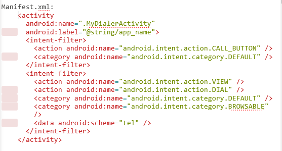

# 剖析Android平台上的电话服务功能

Android电话服务API使应用程序能够访问底层的电话硬件栈，从而允许创建自己的拨号程序——或者讲呼叫处理程序和电话状态监视的功能集成到自己的应用程序中。

下面将会集中研究如何在你的应用程序中监视并控制电话、服务以及蜂窝时间，从而增强并管理本机电话处理功能，也可以使用这一技术实现自己的拨号应用程序。

一、	启动电话呼叫

启动电话呼叫的最佳实践是使用一个Intent.ACTION_DIAL Intent，并通过使用tel：模式设置Intent数据来指定要拨打的号码：

Intent whoyougonnacall = new Intent(Intent.ACTION_DIAL,Uri.parse(“tel:555-2368”));
startActivity(whoyougonnacall);

这会启动一个拨号程序Activity，它应该已经预先填充了你所指定的号码。默认的拨号程序Activity允许用户在显式发起呼叫之前修改要拨打的号码。因此，使用ACTION_DIAL Intent动作并不需要任何特殊的权限。

通过使用一个Intent来说明想要拨号，可以使应用程序与用来启动呼叫的拨号程序的实现保持分离。例如，如果用户安装了一个支持IP电话的新拨号程序，那么在应用程序中使用Intent进行拨号就可以让用户使用这个新的拨号程序。

二、	替换本机拨号程序

替换本机拨号应用程序包括以下两个步骤：

（1）截获当前由本机拨号程序所服务的Intent

（2）启动并管理拨打电话

本机拨号应用程序响应与用户按下硬件呼叫按钮对应的Intent动作，它要求使用tel：模式查看数据，或者使用tel：模式发出一个ACTION_DIAL请求。

为了截获这些请求，需要在你的替换拨号程序Activity的manifest文件中包含Intent-filter标签来监听下列动作：

（1）	intent.action.CALL_BUTTON当按下设备的硬件呼叫按钮是该动作将被广播。创建一个监听该动作的Intent Filter作为默认动作。

（2）	intent.action.DIAL之前已描述过该Intent动作，它由想要启动电话呼叫的应用程序使用。用于捕获该动作的Intent
Filter应当是默认并且可浏览的（以支持来自浏览器的拨号请求），并且必须指定tel：模式以替换现有的拨号功能。

（3）	intent.action.VIEW该查看动作的有想要查看某条数据的应用程序使用。确保Intent Filter指定了tel：模式以允许新的Activity用于查看电话号码。

	
在你的Activity启动后，它应该提供一个UI，供用户用来输入或者修改要拨打的电话号码，以及启动传出呼叫。此时就需要使用现有的电话服务栈或者你的替换拨号程序来拨打电话了。

最简单的技术就是通过Intent.ACTION_CALL动作使用现有的电话服务栈，如：

Intent whoyougonnacall = new Intent(Intent.ACTION_DIAL,Uri.parse(“tel:555-2368”));
startActivity(whoyougonnacall);

这将使系统的in-call Activity来启动呼叫，并让系统管理拨号、连接以及语音处理。
要使用该动作，应用程序必须请求CALL_PHONE uses-permission

或者，还可以通过实现自己的拨号以及语音处理框架来完全替换传出的电话服务栈。如果你要实现一个VOIP应用程序，那么这是一种理想的替代方法。

还要注意，可以使用前面的技术来截获传出的呼叫Intent和修改拨打的号码，或者组织传出的呼叫，作为完全替换拨号程序的一种方法。

三、	访问电话服务的属性及状态

对电话服务API的访问是由Telephony Manager进行管理的，使用getSystemService方法可以访问Telephony Manager。

String srvcName = Context.TELEPHONE_SERVICE;
TelephonyMagager telephonyManager=(TelephonyMagager)getSystemService(srvcName);

	Telephony Magager提供了许多电话服务属性的直接访问，包括设备、网络、客户识别模块（SIM）以及数据状态的详细信息。
	
（1）	读取电话设备的详细信息

使用Telephony Manager可以获得电话类型（GSM、CDMA或SIP）、唯一ID（IMEI或者MEID）、软件版本和手机号码。

需要注意的是，除了电话类型之外，读取其余的每个属性都需要在应用程序的manifest文件包中包含READ_PHONE_STATE uses-permission。

你还可以确定手机连接到的网络的类型，以及SIM或所连接的运营商网络的名称和所在的国家。

（2）	读取网络的详细信息

当连接到网络时，可以分别使用Telephony Manager的getNetworkOperator、getNetworkCountryIso、getNetworkOperatorName和getNetworkType方法读取移动国家代码和移动网络代码（MCC+MNC）、国家ISO代码、网络运行时的名称和你连接的网络类型。

这些命令将仅仅在连接到一个移动网络时有效，并且如果该网络时一个CDMA网络，那么这些命令就可能不可靠。使用前面代码段中的getPhoneType方法确定所使用的手机类型。

（3）	读取SIM的详细信息

如果应用程序运行在GSM设备上，那么它通常有一个SIM。可以从Telephony Manager中查询SIM的详细信息以获得安装在当前设备中的SIM的ISO国家代码、运营商名称和运营商MCC以及MNC。如果需要为某个特定的运营商提供专门的功能，那么这些详细信息将非常有用。

如果在应用程序的manifest文件中包含了READ_PHONE_STATE uses-permission，那么当SIM处于就绪状态是，还可以使用getSimSerialNumber方法获得当前SIM的序列号。

在能够使用这些方法中的任何一种之前，必须确保SIM处于就绪状态。可以使用getSimState方法来确定这一点：

Int simState = telephonyManager.getSimState();
Switch(simState){
	Case(TelephonyManager.SIM_STATE_ABSENT):break;
	Case(TelephonyManager.SIM_STATE_NETWORK_LOCKED):break;
    Case(TelephonyManager.SIM_STATE_PIN_REQUIRED):break;
    Case(TelephonyManager.SIM_STATE_PUK_REQUIRED):break;
    Case(TelephonyManager.SIM_STATE_UNKNOWN):break;
    Case(TelephonyManager.SIM_STATE_READY):{
	//获得SIM的ISO国家代码
	String simCountry = telephonyManager.getSimCountryIso();
	//获得活动SIM的运营商代码
	String simOperatorCode = telephonyManager.getSimOperator();
	//获得SIM的运用商名称
	String simOperatorName = telephonyManager.getSimOperatorName();
	//获得SIM的序列号
	String simSerial = telephonyManager.getSimSerialNumber();
	Break;
}
Default:break;

四、	使用PhoneStateListener监视电话状态的变化
Android电话服务API可以用来监视电话状态和相关信息（如来电）的变化。
使用PhoneStateListener类来监视电话状态的变化。有一些状态的变化也作为Intent广播出去。
为了监视并管理电话状态，应用程必须READ_PHONE_STATE uses-permission
<uses-permission android:name="android.permission.READ_PHONE_STATE"/>
创建一个实现了PhoneStateListener的新类以监听并响应电话状态变化事件，包括呼叫状态（响铃、装机等）、蜂窝位置变化、语音邮件和呼叫转移状态、电话服务变化以及移动信号强度的变化。
在PhoneStateListener的实现中，重写想要响应的事件的事件处理程序。每个处理程序会接收指示新电话状态的参数，例如，当前的蜂窝位置，呼叫状态或者信号强度。
创建了自己的PhoneStateListener以后，将它注册到TelephonyManager中，使用位掩码指示想要监听的事件。
telephoneManager.listen(phoneStateListener, PhoneStateListener.LISTEN_CALL_FORWARDING_INDICATOR|PhoneStateListener.LISTEN_CALL_STATE|PhoneStateListener.LISTEN_CELL_LOCATION|PhoneStateListener.LISTEN_DATA_ACTIVITY| PhoneStateListener.LISTEN_DATA_CONNECTION_STATE| PhoneStateListener.LISTEN_MESSAGE_WAITING_INDICATOR| PhoneStateListener.LISTEN_SERVICE_STATE| PhoneStateListener.LISTEN_SIGNAL_STRENGTHS);
为了注销一个监听器，需要调用listen方法并将PhoneStateListener.LISTEN_NONE作为掩码参数传入，如下所示：
telephoneManager.listen(phoneStateListener, PhoneStateListener.LISTEN_NONE);
1.	监视传入的电话呼叫
如果你的应用程序只应该在运行的时候响应传入的电话呼叫，就应该在PhoneStateListener的实现中重写onCallStateChanged方法并进行注册，以便在呼叫状态发生变化时接收通知。
CallStateListener callStateListener = new CallStateListener ();{
Public void onCallStateChanged(int state,String incomingNumber){
		String callStateStr = “unknown”;
		Switch (state){
			Case TelephonyManager.CALL_STATE_IDLE:
			callStateStr = “idle”;break;
Case TelephonyManager.CALL_STATE_OFFHOOK:
			callStateStr = “offhook”;break;
Case TelephonyManager.CALL_STATE_RINGING:
			callStateStr = “ring.incoming number is:”+ incomingNumber;
break;
					default:break;
				}
				Toast.makeText(MyActivity.this,callStateStr,Toast.LENGTH_LONG).show();
			}
telephoneManager.listen(callStateListener, CallStateListener.LISTEN_CALL_STATE);
onCallStateChanged处理程序接收与传入的呼叫相关的电话号码，而state参数则使用以下三个值之一代表当前呼叫状态：
TelephonyManager.CALL_STATE_IDLE当电话既不响铃也不在通话中时
TelephonyManager.CALL_STATE_RINGING当电话响铃时
TelephonyManager.CALL_STATE_OFFHOOK当电话正在通话中时
注意，一旦状态变为TelephonyManager.CALL_STATE_RINGING，系统会显示来电屏幕，询问用户是否要接听电话。
应用程序必须处于运行状态才能接收这个回调。如果每当电话状态变化时，就应该启动应用程序，那么可以注册一个IntentReceiver，用于监听表示电话状态发生变化的Broadcast Intent。
2.	跟踪蜂窝位置变化
通过重写PhoneStateListener实现的onCellLocationChanged方法，每当当前的蜂窝位置发生变化时，可以得到通知。在可以注册以便监听蜂窝位置变化之前，需要将ACCESS_COARSE_LOCATION权限添加到应用程序的manifest文件中。
<uses-permission android:name="android.permission.ACCESS_COARSE_LOCATION"/>
onCellLocationChanged处理程序接收一个CellLocation对象，其中包含了基于电话网络类型提取不同的位置信息的方法。对于GSM网络，可以获得蜂窝ID（getCid）和当前位置区域代码（getLac）。对于CDMS网络，可以获得当前基站的ID（getBaseStationId）以及该基站的纬度（getBaseStationLatitude）和经度（getBaseStationLongitude）。
下面的代码段显示了如何实现PhoneStateListener以监视蜂窝位置的变化，其中显示了一个包含收到的网络位置详细信息的Toast。
CellLocationListener cellLocationListener = new CellLocationListener ();{
Public void onCellLocationChanged（Celllocation location）{
		If（location instanceof GsmCellLocation）{
			Toast.makeText(getApplicationContext(),String.valueOf(gsmLocation.getCid()),Toast.LENGTH_LONG).show();
		}
		Else if（location instanceof CdmaCellLocation）{
			CdmaCellLocation cdmaLocation = (CdmaCellLocation)location;
			StringBuilder sb = new StringBuilder();
			Sb.append(cdmaLocation.getBaseStationId());
			Sb.append(“\n@”);
			Sb.append(cdmaLocation. getBaseStationLatitude ());
			Sb.append(cdmaLocation. getBaseStationLongitude ());
			Toast.makeText(getApplicationContext(),sb.toString() ,Toast.LENGTH_LONG).show();
		}
		telephoneManager.listen(cellLocationListener, CellLocationListener.LISTEN_CELL_LOCATION);
3.	跟踪服务变化
onServiceStateChanged处理程序跟踪设备的蜂窝服务的详细信息。使用ServiceState参数可查找当前服务状态的详细信息。
Service State对象的getState方法将当前的服务状态作为下列任意一种ServiceState常量返回：
STATE_IN_SERVICE正常电话服务是可用的
STATE_EMERGENCY_ONLY电话服务仅能用于紧急呼叫
STATE_OUT_OF_SERVICE当前没有电话服务可用
STATE_POWER_OFF电话无线传输功能被关闭（通常是启用了飞行模式时）
一系列getOperator*方法可用于检索提供了移动电话服务的运营商的详细信息，而getRoaming则告诉我们设备当前是否使用了一种漫游模式。
PhoneStateListener serviceStateListener = new PhoneStateListener(){
Public void onServiceStateChanged(ServiceState serviceState){
		If(serviceState.getState()==ServiceState. STATE_IN_SERVICE){
			String toastText = “Operator:”+ serviceState.getOperatorAlphaLong();
		Toast.makeText(MyActivity.this,toastText,Toast.LENGTH_SHORT);
		}
}
telephoneManager.listen(serviceStateListener, PhoneStateListener.LISTEN_CELL_LOCATION);
