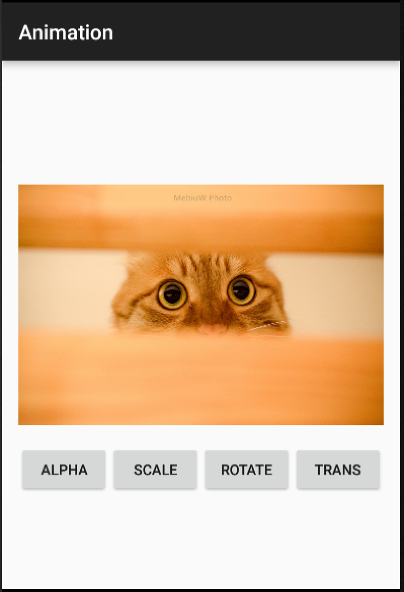
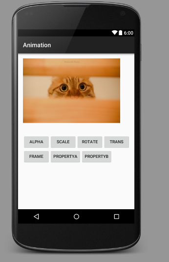

# 浅析Android Animation与实战

作者：巫思杏 1501211005

Demo地址：https://github.com/MebiuW/Mobile100
# 1 概述


## 1.1 背景
Animation，如果从单词的词义上解释，我们可以得到其意思是“、活波、动画片”，可以看到这是一个能够让人感觉到富有生气的单词，因而 Android Animation作为Android 过渡动画类的一个总称也是十分贴切的。Android Animation 是Android系统当中，用来做View动画的一个方法，通过Animation和View的结合和设计，我们可以让我们开发的APP变得绚丽多姿。

Android是由Google收购过来的一款产品，事实证明Google的这一举措是十分成功的，然而在Android发展的初期，对比起最大的竞争对手iOS，Android存在着界面简陋、GUI设计差等一系列问题。iOS上每一个操作都有着富有美感的转场动画，每个操作之间过渡的行云流水，极大的提升了使用上的感受，而Android则多是点一下，等待一下，直接跳出下一个界面，十分突兀。随着Google对Android系统自身的规范、对设计的加强以及开发者的更近，近年来Android在包含转场动画在内的各种界面设计规范都有了进一步的提升，基于Android开发的APP也能够拥有丰富的交互动画，拉近了与iOS的差距。
Android 

Animation就是这里面的最大功臣，开发者可以通过Animation，为自己APP的交互切换设计绚丽的交互动画，提升人机的交互。本文的主要目的就是介绍Android Animation的基本信息，包含内容，基本模块，以及部分进阶使用等方法，帮助大家在开发APP时能拥有一个漂亮的动画。

## 1.2 基本情况


Android Animation在较新的安卓版本当中有一定的变革，在3.0以前，Android支持两种动画模式，Tween Animation,Frame Animation，在Android3.0中又引入了一个新的动画系统：Property animation，这三种动画模式在SDK中被称为property animation,view animation,drawable animation。 可通过NineOldAndroids项目在3.0之前的系统中使用Property Animation。

# 2 Animation 基本介绍


## 2.1 基本情况

本章内容主要将会针对Android基本的三种动画模式，Tween Animation,Frame Animation，Property animation做一个介绍，主要的目的是阐述这三种动画模式的运行模式和基本的使用情况。

## 2.2 Tween Animation

Tween Animation又称为View Animation，即补间动画，补间动画的原理在于针对给定的两个关键帧，通过算法计算两个关键帧之间的过渡，最终实现两个关键帧之间的一个过渡。Tween Animation被称作View Animation的一个原因在于，它只能应用于View对象，并且支持的属性也较为有限。

View Animation支持一系列View形状的变换，如大小的缩放，透明度的改变，位置的改变，动画的定义既可以用代码定义也可以用XML定义，因此更加推荐采用XML的方式进行定义。一般需要自定义XML动画的时候，可以将动画元素放在/res/anim/文件当中，XML的根元素可以是alpha,scale,translate,rotate,interpolator元素或set(表示以上几个动画的集合，set可以嵌套)。默认情况下，所有动画是同时进行的，可以通过startOffset属性设置各个动画的开始偏移（开始时间）来达到动画顺序播放的效果。可以通过设置interpolator属性改变动画渐变的方式。

## 2.3 Frame Animation

Frame Animation又称作Drawable Animation，顾名思义，其就是一帧一帧的动画，通过一系列的Drawable来模拟动画的效果，和电影的播放一样，按每一个Frame展现。通常需要在XML中进行定义，XML文件要放在/res/drawable/目录下。在设计Animation XML动画时，必须以nimation-list为根元素，以item表示要轮换显示的图片，duration属性表示各项显示的时间。

## 2.4 Property Animation

Property Animation 属性动画，是在Android 3.0中才带来的动画属性，因此其要求有较高的API Level，而在老旧的API上只能通过Google提供的一些兼容方式实现。为什么会称作属性动画呢？因为Property Animation在绘制效果是真实地属性值，而在之前的View Animation的过度绘制当中，属性值是保持原值的。正因为如此Property Animation可以应用于任何对象，Property Animation本身只是表示一段时间内的改变，当发生改变时需要做什么则由我们自定义。

Property Animation包含着较多的内容，也是当前Android开发最为重要的一部分，因此将在之后花较多的篇幅去介绍Property Animation。

# 3 ViewAnimation 实战

## 3.1 ViewAnimation种类介绍

之前在第二章当中已经介绍了ViewAnimation的一些基本知识，那么这章将开始针对如何应用ViewAnimation做一个深入的实战，首先我们需要了解的是ViewAnimation的种类，具体来说Tween的四个主要实现如下：
* AlphaAnimation：透明渐变动画，一般采用如下的构造方法进行构造

        AlphaAnimation(float fromAlpha, float toAlpha)
    	fromAlpha：动画开始时的透明度（取值范围为0.0到1.0）；
        toAlpha：动画结束时的透明度；
    	或者是在XML当中，采用alpha标签进行描述。
* ScaleAnimation：缩放渐变动画，一般采用如下的构造方法：


        ScaleAnimation(float fromX, float toX, float fromY, float toY, int pivotXType, float pivotXValue, int pivotYType, float pivotYValue)来构造；
        fromX：动画开始X坐标上的伸缩尺度；
        toX：动画结束X坐标上的伸缩尺度；
        fromY：动画开始Y坐标上的伸缩尺度；
        toY：动画结束Y坐标上的伸缩尺度；
        pivotXType：X坐标上的伸缩模式，取值有：Animation.ABSOLUTE, Animation.RELATIVE_TO_SELF, Animation.RELATIVE_TO_PARENT；
        pivotXValue：X坐标上的伸缩值；
        pivotYType：Y坐标上的伸缩模式，取值有：Animation.ABSOLUTE, Animation.RELATIVE_TO_SELF, Animation.RELATIVE_TO_PARENT；
        pivotYValue：Y坐标上的伸缩值；


* TranslateAnimation：实现位置变换的实现类，常使用如下的方法构造
 
        TranslateAnimation(float fromXDelta, float toXDelta, float fromYDelta, float toYDelta)
        fromXDelta：动画开始的X坐标；
        toXDelta：动画结束的X坐标；
        fromYDelta：动画开始的Y坐标；
        toYDelta：动画结束的Y坐标；
* RotateAnimation：主要控制旋转的动画实现类，常使用如下构造方法

        RotateAnimation(float fromDegrees, float toDegrees, int pivotXType, float pivotXValue, int pivotYType, float pivotYValue)来构造；
        fromDegrees：旋转开始角度；
        toDegrees：旋转结束角度；
        pivotXType, pivotXValue, pivotYType, pivotYValue与尺度变化动画ScaleAnimation类似；
        fromXDelta：动画开始的X坐标；
        toXDelta：动画结束的X坐标；
        fromYDelta：动画开始的Y坐标；
        toYDelta：动画结束的Y坐标；

## 3.2 ViewAnimation实战

在这一节当中，将介绍如何在Anroid项目中，使用ViewAnimation效果，步骤如下：

* 创建一个空白的应用程序，新建一个Activity，找到res里的anima文件夹，如果是Android Studio当中没有的话可以通过AndroidStudio自带的工具建立一个文件夹即可。


* 分别为四种不同的动画建立对应的xml文件，具体可以参考如下代码合并显示了：

```
例如新建一个Alpha动画的XML（mebiuw_anima_alpha.xml)文件，就如下的形式，以Set标签做维ROOT，按照我们给定的参数填写参数
<?xml version="1.0" encoding="utf-8"?>
<set xmlns:android="http://schemas.android.com/apk/res/android">
    <!--从0.1的透明度过渡到1.0的透明度，同AlphaAnimation(float fromAlpha, float toAlpha)一致,这里多加了一个持续时间-->
    <alpha
        android:fromAlpha="1.0"
        android:toAlpha="0.1"
        android:duration="5000">
    </alpha>

</set>

同理对不同的动画，具有相同的基础结构，这里仅贴出<Set>以内有改变的地方，如果需要查看所有代码，可以到Github上查看源代码
Rotate：
<!--旋转配置，同上文介绍的构造方法相对应，旋转1周，持续1000ms们同事定义伸缩值-->
<rotate android:fromDegrees="0"
        android:toDegrees="360"
        android:pivotX="50%"
        android:pivotY="50%"
        android:duration="1000" />

Scale:
<!--伸缩配置，具体的动画信息，同上文介绍的参数介绍一致-->
    <scale android:fromXScale="0.0"
        android:toXScale="1.0"
        android:fromYScale="0.0"
        android:toYScale="1.0"
        android:pivotX="50%"
        android:pivotY="50%"
        android:duration="5000" />

Translate:
<!--转换配置，具体的动画信息，同上文介绍的参数介绍一致-->
<translate android:fromXDelta="10"
        android:toXDelta="100"
        android:fromYDelta="10"
        android:toYDelta="100" />     

```
* 在Activity当中，新建一个图片（ImageView）和四个按钮（Button），后文的事例将通过让每个按钮分别触发一种功能，使得图片产生相应地变化，布局结束后如下图所示。
* 在Activity当中，新建一个图片（ImageView）和四个按钮（Button），后文的事例将通过让每个按钮分别触发一种功能，使得图片产生相应地变化，布局结束后如下图所示。

* 此后，在Activity当中用代码让ImageView和Button与控件绑定，注意实现如下的两个核心方法，其他方法比较简单，就不在这里赘述，需要的可以自行查看源代码

```
/**
     * 加载并启动动画，执行动画的关键
     * @param view 动画执行的对象，在这里全部都是应用到img，注意看onClick部分
     * @param type  动画的种类
     */
    private void  doAnimation(View view,int type){
        Animation animation = AnimationUtils.loadAnimation(this, type);
        view.startAnimation(animation);
    }

    /**
     * 根据不同的按钮，选择执行不同的方法作为一个参数，交由doAnimation执行
     * @param v
     */
    @Override
    public void onClick(View v) {
        if(v.getId()==R.id.button_alpha){
            this.doAnimation(img,R.anim.mebiuw_anima_alpha);
        }
        else if(v.getId()==R.id.button_scale){
            this.doAnimation(img,R.anim.mebiuw_anima_scale);
        }
        else if(v.getId()==R.id.button_rotate){
            this.doAnimation(img,R.anim.mebiuw_anima_rotate);
        }
        else if(v.getId()==R.id.button_translate){
            this.doAnimation(img,R.anim.mebiuw_anima_translate);
        }
    }
```

* 由此，完成了ViewAnimation的实战，ViewAnimation简单易懂，操作方便，大家不妨在自己的项目中多多使用。


# 4 FrameAnimation 实战

## 4.1 FrameAnimation 基础
Frame动画是按照一系列的帧顺序播放展示出来的动画效果，而这些帧都是一系列的图片。为此我们可以将Frame动画的展示过程定义在XML文件当中，如果是采用代码编写，则是使用到AnimationDrawable对象。Drawable Animation可以加载Drawable资源实现帧动画，而AnimationDrawable是实现Drawable Animations的基本类，但是因为Frame Animation的特殊性，通常的做法都是采用XML的方式实现，不推荐使用代码的方式实现这个动画，所以在这里也就不做介绍了。


当我们需要使用FrameAnimation的时候可以采用如下的方式定义XML文件：
```
<?xml version="1.0" encoding="utf-8"?>  
<animation-list xmlns:android="http://schemas.android.com/apk/res/android"  
    android:oneshot=["true" | "false"] >  
    <item  
        android:drawable="@[package:]drawable/drawable_resource_name"  
        android:duration="integer" />  
</animation-list>  
<animation-list>元素是必须的，并且必须要作为根元素，可以包含一或多个<item元素；android:onshot如果定义为true的话，此动画只会执行一次，如果为false则一直循环。
<item>元素代表一帧动画，android:drawable指定此帧动画所对应的图片资源，android:druation代表此帧持续的时间，整数，单位为毫秒。
```

## 4.2 FrameAnimation 实战

在这一部分，我们将继续3中的那一个工程，在原有的基础上增加代码，直接展示FrameAnimation的效果

* 首先在准备好你的过度动画，放在drawable文件夹下，接着在drawable(请注意这次的动画是放在drawable中，而不是anima中)文件当中新建一个XML文件，内容包含你需要过渡的帧，在这里我准备了5张从正常亮度渐变到黑色的图像，XML（我的这里为mebiuw_drawable_frame）大致形式如下


```

<?xml version="1.0" encoding="utf-8"?>
<animation-list xmlns:android="http://schemas.android.com/apk/res/android"
    android:oneshot="true">
    <!-- 一下图片请按照顺序自行替换，这里是我对原图做了后期，依次变暗的图片 -->
    <item android:drawable="@drawable/psb" android:duration="200" />
    <item android:drawable="@drawable/psb1" android:duration="200" />
    <item android:drawable="@drawable/psb2" android:duration="200" />
    <item android:drawable="@drawable/psb3" android:duration="200" />
    <item android:drawable="@drawable/psb4" android:duration="200" />
    <item android:drawable="@drawable/psb5" android:duration="200" />
</animation-list>

```
* 完成上述的代码后，就代表我们已经写完了一个动画的XML文件，随后我们需要对其调用。根据材料，他有两种调用方式，因为FrameAnimation本身就是Drawable资源，所以可以直接设置为某个View的背景。当然，更为常见的是在Java中编写代码，调用这个XML文件所描述的动画。这里将演示在Java下的方式，所以我们在原有的Activity上新增加一个Button，命名为Frame，编写该按钮的事件，用作Frame动画的处罚，关键代码如下：

```
 //首先设置背景为我们设置的XML
                this.img=(ImageView) this.findViewById(R.id.testImg);
                this.img.setBackgroundResource(R.drawable.mebiuw_drawable_frame);
                //获得AnimationDrawable对象，并且开始触发
                AnimationDrawable animationDrawable = (AnimationDrawable) this.img.getBackground();
                animationDrawable.start();
```
* 由此，完成了FrameAnimation的实战，FrameAnimation可以理解为一个定制的GIF动画，一般使用频度不高，同时需要注意的是FrameAnimation在不同的API Level时运行结果可能不一致。
* 

# 5 PropertyAnimation 基础

## 5.1 FrameAnimation 基础

前文介绍的ViewAnimation和FrameAnimation都属于比较简单的那一类动画，他们能够实现的效果有限，当我们需要设计复杂绚丽的动画效果时，前两者就会表现出很大的局限性。ViewAnimation并不能应用于非View的子类，也就是说，对一个Button、TextView、甚至是LinearLayout、或者其它任何继承自View的组件都能进行动画操作，但是如果我们想要对一个非View的对象进行动画操作，ViewAnimation就不能使用了。

当然，还有一个问题，ViewAnimation本身只是对动画的绘制，对View的一个绘制而已，并不会去改变真正的View属性，如果我们希望通过动画绘制一些控件的移动，并呈现动画效果，那么ViewAnimation就不太管用了。

为了解决这个问题，从Android 3.0后，Google提出了Property Animation，通过动画的方式改变对象的属性，其本质也是不间断的对值进行操作，可以是任意对象的任意属性，我们只需要指定一些属性就好了，从而实现了动画效果。比如以下的属性就是一些比较常见的可以更改的属性或类别：


```
Duration：动画的持续时间
Time interpolation：时间差值，定义了间隔多少时间执行下一个动画操作，比如线性时间，加速时间等，通过这个时间差值的定义可以让我们的动画呈现不同的变化速率，更加符合我们肉眼的直觉。
Repeat count and behavior：动画的重复次数和方式
Animator sets:可以定义一系列的动画的集合
Frame refresh delay：刷新延迟

```

以上属性请认真地对待，之后的动画属性的设置，会和这个挂钩很多。


同时，需要注意注意的是，本部分出现的参考代码，均来自网络，和后文实战部分的代码并不相同（也不放在Github上），我的工作在于代码整理和注释，仅供学习。


## 5.2 ValueAnimator 基础

ValueAnimator是整个属性动画机制当中最核心的一个类，从前文的介绍，我们已经知道属性动画的运作机制，其实就是不断的改变属性的值，而ValueAnimator的作用就是负责我们设定对象初始的值和最终的值之间的过度，ValueAnimator会根据我们提供的动画持续时间（Duration）和时间差值变化方式（Time interpolation），播放模式（Repeat count and behavior）等关键参数，那么ValueAnimation就会帮我们自动设定值得变化。可以看得出来的是，ValueAnimator的作用确实十分大。同时我们也可以在动画变化的时候设定一个动画监听器，帮助我们实现更多的动画-动作写作操作。

说了那么多，可能有人会认为ValueAnimator的操作会很复杂，但其实ValueAnimator的操作是十分简单的，下面给出一个动画的实例代码，恩可以看到其实非常简单的：


```
//设定一个从0到1的过度，ofFloat可以传入多个参数，他会自动实现过度，类似的还有ofInt等
ValueAnimator anim = ValueAnimator.ofFloat(0f, 1f);
//设定我们的动画播放时间
anim.setDuration(500);
//可以增加一个监听器，当每次值发生变动的时候，可以打印出来，帮助验证到底有变化没
anim.addUpdateListener(new ValueAnimator.AnimatorUpdateListener() {
    @Override
    public void onAnimationUpdate(ValueAnimator animation) {
        float currentValue = (float) animation.getAnimatedValue();
        Log.d("TAG", "cuurent value is " + currentValue);
    }
});
anim.start();


```

在这里面需要特别讲解的就是ofFloat，注释里提到了可以传入过个参数，比如ofFloat（0f,1f,0f,5f)那么就会自动在这些区间内变化，总之你可以自由的设定。而同时如果只需要在整数之间变化，那么使用ofInt就可以，只要注意传入的参数的时候注意传入整数的值就可以了。

初次以外，我们还有如下常用的方法，可以去设定ValueAnimator对象的功能：


```
setStartDelay()：设置动画延迟播放的时间
setRepeatCount()：设置重复次数
setRepeatMode()：设置循环播放的模式，包括重复和反向模式

```

## 5.3 ObjectAnimator 基础

ValueAnimator允许我们通过一个值，从而实现动画的过度，但是功能相对简单，仅仅是实现一个过度的值得效果而已，就只是比之前提到的ValueAnimation多了那么一点自主性而已。

而ObjectAnimator则可以直接对任意对象的任意属性进行操作了，其本身是继承与ValueAnimator的，底层的实现也是通过他实现的。在使用方式上，他们二者也十分近似，但是也略有不同。例如对于ofFloat来说，其创建如下：


```

ObjectAnimator.ofFloat(view,type,value...)
view：操作的对象，比起ValueAnimator多的一个参数
type：动画执行操作的属性的名称，比起ValueAnimator多的一个参数，可以选择aplha，rorate，scaleY等一系列对象所具有的属性名，因此，你需要改变什么属性，就写在这里就好，这点非常重要！！！！！
value...：可以传入一系列的参数，和ValueAnimator的一样

例如我们要对一个TextView做一个360的旋转，可以使用如下的代码：

//定义一个旋转操作，针对textView，设定时间维5S
ObjectAnimator animator = ObjectAnimator.ofFloat(textview, "rotation", 0f, 360f);  
animator.setDuration(5000);  
animator.start();  

```

这里有个特别需要注意的地方，关于type的传递，其使用的对应的get和set方法，只要有这一对方法，就能操作变更属性，但如果没有这一对方法，就不能操作，能传递的type的种类和对象有没有这个属性关系不大。


## 5.4 动画组合基础

之前我们已经介绍了实现动画的两个基本的类，但是其能够实现的不过只是单个动画，而实际的应用中，显然不可能那么简单，更多的情况下是需要多个动画组合出现的。

实现组合动画功能主要需要借助AnimatorSet这个类，这个类提供了一个play()方法，如果我们向这个方法中传入一个Animator对象(ValueAnimator或ObjectAnimator)将会返回一个AnimatorSet.Builder的实例，AnimatorSet.Builder中包括以下四个方法：


```
after(Animator anim)   将现有动画插入到传入的动画之后执行
after(long delay)   将现有动画延迟指定毫秒后执行
before(Animator anim)   将现有动画插入到传入的动画之前执行
with(Animator anim)   将现有动画和传入的动画同时执行

```

通过这几个逻辑，我们就能组合出来自己的动画执行顺序了，例如：


```
//首先创建三个动画
ObjectAnimator moveIn = ObjectAnimator.ofFloat(textview, "translationX", -500f, 0f);
ObjectAnimator rotate = ObjectAnimator.ofFloat(textview, "rotation", 0f, 360f);
ObjectAnimator fadeInOut = ObjectAnimator.ofFloat(textview, "alpha", 1f, 0f, 1f);
//设定一个集合，并且设定各个动画的执行顺序
AnimatorSet animSet = new AnimatorSet();
animSet.play(rotate).with(fadeInOut).after(moveIn);
animSet.setDuration(5000);
animSet.start();

```

## 5.5 Animation监听器基础

在ValueAnimation当中，我们已经定义过了一次监听器，在这里将正式介绍一下。无论是ValueAnimation还是ObjectAnimation都能够添加监听器，使得我们能够在动画执行的不同时间段，完成不同的操作。其包含如下的方法：


```

//动画开始的时候
    public void onAnimationStart(Animator animation) {  
    }  
  
 //动画重复的时候
    public void onAnimationRepeat(Animator animation) {  
    }  
 //动画结束的时候 

    public void onAnimationEnd(Animator animation) {  
    }  
  
 //动画被取消的时候
    public void onAnimationCancel(Animator animation) {  


```

其具体的使用方式，和其他类的监听器没有太多区别，这段的意思就是告知有这么一个存在。


## 5.6 XML编写动画

到目前为止，本文所介绍的属性动画都是基于代码的，其实他也可以使用XML的方式编写，首先他允许三种标签，分别对应我们之前介绍过的两种动画类和几何

```

<animator>  对应代码中的ValueAnimator
<objectAnimator>  对应代码中的ObjectAnimator
<set>  对应代码中的AnimatorSet


```

这里直接给出一个复杂的动画示例：


```
<!-- 设定一个集合 -->
<set xmlns:android="http://schemas.android.com/apk/res/android"
    android:ordering="sequentially" >
    <!-- 定义一个动画 -->
    <objectAnimator
        android:duration="2000"
        android:propertyName="translationX"
        android:valueFrom="-500"
        android:valueTo="0"
        android:valueType="floatType" >
    </objectAnimator>
    <!-- 嵌套一个动画集合，和上一个动画一同执行-->
    <set android:ordering="together" >
        <objectAnimator
            android:duration="3000"
            android:propertyName="rotation"
            android:valueFrom="0"
            android:valueTo="360"
            android:valueType="floatType" >
        </objectAnimator>
	<!-- 嵌套一个动画集合，在上一个动画之后执行-->
        <set android:ordering="sequentially" >
            <objectAnimator
                android:duration="1500"
                android:propertyName="alpha"
                android:valueFrom="1"
                android:valueTo="0"
                android:valueType="floatType" >
            </objectAnimator>
            <objectAnimator
                android:duration="1500"
                android:propertyName="alpha"
                android:valueFrom="0"
                android:valueTo="1"
                android:valueType="floatType" >
            </objectAnimator>
        </set>
    </set>

</set>


随后使用如下代码既可以调用了：
Animator animator = AnimatorInflater.loadAnimator(context, R.animator.anim_file);  
animator.setTarget(view);  
animator.start();  


```

## 5.6 Animator 进阶用法-TypeEvaluator

在这一章节中，我们主要解决两个问题，上面我们提到了能够实现int和float的平滑过渡，但是如何实现过渡的呢？还有针对任意对象呢？

* 自定义过渡

为了知道怎么从stratvalue过渡到endvalue，我们需要知道TypeEvaluator的通途，TypeEvaluator的作用就是告诉系统值怎么变换，其是一个接口，下面我们将通过一个例子实际体验一下：


```

//自定一个TypeEvaluator，需要实现evaluate方法
public class FloatEvaluator implements TypeEvaluator {
	//自定义值得输出
    public Object evaluate(float fraction, Object startValue, Object endValue) {
        float startFloat = ((Number) startValue).floatValue();
        return startFloat + fraction * (((Number) endValue).floatValue() - startFloat);
    }
}

在例子上FloatEvaluator实现了TypeEvaluator接口，然后重写evaluate()方法。
evaluate()方法当中传入了三个参数：
fraction：用于表示动画的完成度的，我们应该根据它来计算当前动画的值应该是多少
第二第三个参数分别表示动画的初始值和结束值。那么上述代码的逻辑就比较清晰了，用结束值减去初始值，算出它们之间的差值，然后乘以fraction这个系数，再加上初始值，那么就得到当前动画的值了

```


* 自定义类的变换

之前我们只提到过了ofInt和ofValue的，但其实还有一个ofObject的方法，但是要实现对自定义类的，首先需要针对这个类编写一个TypeEvaluator，方式就是上边的，而操作的时候采用如下的方式进行：


```
ValueAnimator anim = ValueAnimator.ofObject(new MyEvaluator(), ValueA，ValueB);  

```

## 5.7 Animator 进阶用法-Interpolator

Interpolator直译过来的话是补间器的意思，它的主要作用是可以控制动画的变化速率，比如去实现一种非线性运动的动画效果。那么什么叫做非线性运动的动画效果呢？就是说动画改变的速率不是一成不变的，像加速运动以及减速运动都属于非线性运动。

不过Interpolator并不是属性动画中新增的技术，实际上从Android 1.0版本开始就一直存在Interpolator接口了，而之前的补间动画当然也是支持这个功能的。只不过在属性动画中新增了一个TimeInterpolator接口，这个接口是用于兼容之前的Interpolator的，这使得所有过去的Interpolator实现类都可以直接拿过来放到属性动画当中使用，那么我们来看一下现在TimeInterpolator接口的所有实现类

TimeInterpolator接口已经有非常多的实现类了，这些都是Android系统内置好的并且我们可以直接使用的Interpolator。每个Interpolator都有它各自的实现效果，比如说AccelerateInterpolator就是一个加速运动的Interpolator，而DecelerateInterpolator就是一个减速运动的Interpolator。


具体使用方式，可以通过如下的方式：

```
anim.setInterpolator(自定义的Interpolator)

```

最后为大家整理了一下Interpolator的常见种类：

AccelerateDecelerateInterpolator 在动画开始与结束的地方速率改变比较慢，在中间的时候加速

  AccelerateInterpolator  在动画开始的地方速率改变比较慢，然后开始加速

  AnticipateInterpolator 开始的时候向后然后向前甩

  AnticipateOvershootInterpolator 开始的时候向后然后向前甩一定值后返回最后的值

  BounceInterpolator   动画结束的时候弹起

  CycleInterpolator 动画循环播放特定的次数，速率改变沿着正弦曲线

  DecelerateInterpolator 在动画开始的地方快然后慢

  LinearInterpolator   以常量速率改变

  OvershootInterpolator    向前甩一定值后再回到原来位置


如果android定义的interpolators不符合你的效果也可以自定义interpolators


# 6 属性动画实战

之前关于属性动画讲了很多理论内容，下面我们就来实践一下，和之前一样的，在原有的项目上增加按钮，为每个按钮执行不同的动画。按钮增加的操作就不给出了，直接上关键代码：




* 动画A

动画A主要为了演示基本的操作，这里为绑定的按钮事件执行如下代码，单机执行后就可以观察到一系列变化，这些代码都可以在Github上找到

```

  			//首先创建三个动画
            ObjectAnimator moveIn = ObjectAnimator.ofFloat(this.img, "translationX", -500f, 0f);
            //重复操作，设定不同的模式
            moveIn.setRepeatCount(2);
            moveIn.setRepeatMode(ObjectAnimator.REVERSE);
            //合并两个曹总一同执行
            ObjectAnimator rotate = ObjectAnimator.ofFloat(this.img, "rotation", 0f, 360f);
            ObjectAnimator fadeInOut = ObjectAnimator.ofFloat(this.img, "alpha", 1f, 0f, 1f);
            //设定一个集合，并且设定各个动画的执行顺序
            AnimatorSet animSet = new AnimatorSet();
            animSet.play(rotate).with(fadeInOut).after(moveIn);
            animSet.setDuration(5000);
            animSet.start();

```


* 动画B

动画A主要为了演示自定义的Interpolator，这里将选用一个Movein，然后来观察不同的方式进入效果如何。

```

  			//设定了不同的速率的方式，可以自由组合查看
                ObjectAnimator moveInDefault = ObjectAnimator.ofFloat(this.img, "translationX", -500f, 0f);
                ObjectAnimator moveInAccDec = ObjectAnimator.ofFloat(this.img, "translationX", -500f, 0f);
                moveInAccDec.setInterpolator(new AccelerateDecelerateInterpolator());
                ObjectAnimator moveInAcc = ObjectAnimator.ofFloat(this.img, "translationX", -500f, 0f);
                moveInAcc.setInterpolator(new AccelerateInterpolator());
                ObjectAnimator moveInAos = ObjectAnimator.ofFloat(this.img, "translationX", -500f, 0f);
                moveInAos.setInterpolator(new AnticipateOvershootInterpolator());
                ObjectAnimator moveInB = ObjectAnimator.ofFloat(this.img, "translationX", -500f, 0f);
                moveInB.setInterpolator(new BounceInterpolator());
                ObjectAnimator moveInC = ObjectAnimator.ofFloat(this.img, "translationX", -500f, 0f);
                moveInC.setInterpolator(new CycleInterpolator(1));
                ObjectAnimator moveInL = ObjectAnimator.ofFloat(this.img, "translationX", -500f, 0f);
                moveInL.setInterpolator(new LinearInterpolator());

                //设定一个集合，并且设定各个动画的执行顺序
                AnimatorSet animSet = new AnimatorSet();
                animSet.play(moveInDefault).after(moveInAccDec).after(moveInAcc).after(moveInAos).after(moveInB).after(moveInC).after(moveInL);
                animSet.setDuration(1000);
                animSet.start();

```

# 7 总结

本文的工作仅仅只展示出了Animation很小一部分的特性，还有更多的使用技巧，参数有待去发掘。不过，相信的目的就是让大家都能了解，原来Animation 那么容易实现，原来安卓自定义动画的过程那么容易，让大家了解当需要自定义动画时，需要从什么方向下手。本文的不少材料都来自于网络，更多内容，请参详参考文献。


# 8 参考文献

```

1、Android动画学习笔记-Android Animation http://www.cnblogs.com/angeldevil/archive/2011/12/02/2271096.html
2、Android动画之Tween动画实战 http://www.cnblogs.com/obullxl/archive/2011/06/13/android-animation-tween-lady.html
3、 详解Android动画之Frame Animation http://blog.csdn.net/liuhe688/article/details/6657776
4、Android_AnimationDrawable介绍及使用 http://blog.csdn.net/zqiang_55/article/details/8142785
5、Android 属性动画（Property Animation） 完全解析 （上） http://blog.csdn.net/lmj623565791/article/details/38067475
6、Android属性动画完全解析(上)，初识属性动画的基本用法 http://blog.csdn.net/guolin_blog/article/details/43536355
7、android之interpolator的用法详解 http://blog.csdn.net/jason0539/article/details/16370405

```

