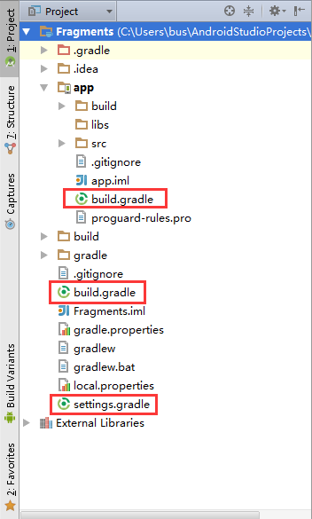

# 浅析Android打包

使用Android Studio的"build"选项下面的"Generate Signed APK..."选项，我们可以很轻松地打包出一个安装文件。但在现在的商业应用中，企业不会只打包出一个APK包，然后提供给大家下载。企业同时还需要要其他不同的渠道上发布APP，国内的主流渠道就有豌豆荚、应用宝、小米应用商店等等数十个渠道，通常每个渠道的APK包都会有一点差异，那么我们会每打包一个渠道的APK，就去改信息，然后执行一遍"Generate Signed APK..."吗？

Navie！当然不会。使用gradle打包apk已经成为当前主流趋势。

## 什么是Gradle？

Gradle是一种依赖管理工具，基于Groovy语言，面向Java应用为主，它抛弃了基于XML的各种繁琐配置，取而代之的是一种基于Groovy的内部领域特定（DSL）语言。

## Gradle基本概念

Fragments是一个项目，和Gradle相关的几个文件一般有如下几个：

**1.Fragments/app/build.gradle**  
这个文件是app文件夹下这个Module的gradle配置文件，也可以算是整个项目最主要的gradle配置文件，我们来看下这个文件的内容：
``` GRADLE
apply plugin: 'com.android.application'
android {
    compileSdkVersion 22
    buildToolsVersion "22.0.1"

    defaultConfig {
        applicationId "com.example.bus.fragments"
        minSdkVersion 15
        targetSdkVersion 22
        versionCode 1
        versionName "1.0"
    }
    buildTypes {
        release {
            minifyEnabled false
            proguardFiles getDefaultProguardFile('proguard-android.txt'), 'proguard-rules.pro'
        }
    }
}
dependencies {
    compile fileTree(dir: 'libs', include: ['*.jar'])
    compile 'com.android.support:appcompat-v7:22.1.1'
}
```
* 文件开头apply plugin是最新gradle版本的写法，以前的写法是apply plugin: ‘android’
* compileSdkVersion是安卓所用编译器的版本
* buildToolsVersion是Gradle工具的版本，第一次使用时会自动下载
* applicationId代表应用的包名，minSdkVersion代表最小支持的API，targetSdkVersion代表目标API，versionCode和versionName是自己定义的应用版本
* buildTypes代表生成APK时的类型，默认只有release版本
* minifyEnabled代表是否启用zip压缩，默认为true
* proguardFiles这部分有两段，前一部分代表系统默认的android程序的混淆文件，后一部分是我们项目里的自定义的混淆文件

**2.Fragments/build.gradle**  
这个文件是整个项目的gradle基础配置文件,我们来看看这里面的内容：
``` GRADLE
buildscript {
    repositories {
        jcenter()
    }
    dependencies {
        classpath 'com.android.tools.build:gradle:1.2.3'

        // NOTE: Do not place your application dependencies here; they belong
        // in the individual module build.gradle files
    }
}

allprojects {
    repositories {
        jcenter()
    }
}
```
内容主要包含了两个方面：一方面是声明仓库的源，这里可以看到是指明的jcenter()；另一方面是声明了android gradle plugin的版本。

**3.Fragments/settings.gradle**  
