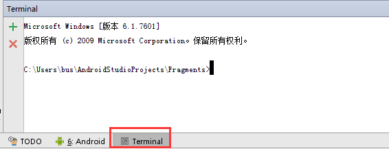

# <center>浅析Android打包</center>
<p style="text-align:right">1501210946 刘彬彬</p>

使用Android Studio的"build"选项下面的"Generate Signed APK..."选项，我们可以很轻松地打包出一个安装文件。但在现在的商业应用中，企业不会只打包出一个APK包，然后提供给大家下载。企业同时还需要要其他不同的渠道上发布APP，国内的主流渠道就有豌豆荚、应用宝、小米应用商店等等数十个渠道，通常每个渠道的APK包都会有一点差异，那么我们会每打包一个渠道的APK，就去改信息，然后执行一遍"Generate Signed APK..."吗？

当然不会。使用gradle打包apk已经成为当前主流趋势。配置好Gradle之后，只需敲几行命令，就可以安心地去喝一杯咖啡，等待程序把所有渠道的APK打包出来。

## 什么是Gradle

Gradle是一种依赖管理工具，基于Groovy语言，面向Java应用为主，它抛弃了基于XML的各种繁琐配置，取而代之的是一种基于Groovy的内部领域特定（DSL）语言。

## Gradle基本概念

Fragments是一个项目，和Gradle相关的几个文件一般有如下几个：


**1.Fragments/app/build.gradle**

这个文件是app文件夹下这个Module的gradle配置文件，也可以算是整个项目最主要的gradle配置文件，我们来看下这个文件的内容：
``` GRADLE
apply plugin: 'com.android.application'
android {
    compileSdkVersion 22
    buildToolsVersion "22.0.1"

    defaultConfig {
        applicationId "com.example.bus.fragments"
        minSdkVersion 15
        targetSdkVersion 22
        versionCode 1
        versionName "1.0"
    }
    buildTypes {
        release {
            minifyEnabled false
            proguardFiles getDefaultProguardFile('proguard-android.txt'), 'proguard-rules.pro'
        }
    }
}
dependencies {
    compile fileTree(dir: 'libs', include: ['*.jar'])
    compile 'com.android.support:appcompat-v7:22.1.1'
}
```
* 文件开头apply plugin是最新gradle版本的写法，以前的写法是apply plugin: ‘android’
* compileSdkVersion是安卓所用编译器的版本
* buildToolsVersion是Gradle工具的版本，第一次使用时会自动下载
* applicationId代表应用的包名，minSdkVersion代表最小支持的API，targetSdkVersion代表目标API，versionCode和versionName是自己定义的应用版本
* buildTypes代表生成APK时的类型，默认只有release版本
* minifyEnabled代表混淆处理
* proguardFiles这部分有两段，前一部分代表系统默认的android程序的混淆文件，后一部分是我们项目里的自定义的混淆文件

**2.Fragments/build.gradle**

这个文件是整个项目的gradle基础配置文件,我们来看看这里面的内容：
``` GRADLE
buildscript {
    repositories {
        jcenter()
    }
    dependencies {
        classpath 'com.android.tools.build:gradle:1.2.3'

        // NOTE: Do not place your application dependencies here; they belong
        // in the individual module build.gradle files
    }
}

allprojects {
    repositories {
        jcenter()
    }
}
```
内容主要包含了两个方面：一方面是声明仓库的源，这里可以看到是指明的jcenter()；另一方面是声明了android gradle plugin的版本。

**3.Fragments/settings.gradle**

这个文件是全局的项目配置文件，里面主要声明一些需要加入gradle的module，我们来看看该文件的内容：
``` GRADLE
include ':app'
```
app是项目的module，如果还有其他module，也要加上去。

## 如何使用Gradle

1.使用命令行终端，cd到要操作的项目根路径下。推荐使用Android Studio里面集成的Terminal，默认路径就是项目根路径。



2.执行 *gradlew -v* 来查看下项目所用的Gradle版本
如果你是第一次执行会去下载Gradle。执行成功后会看到如下信息：
``` GRADLE
------------------------------------------------------------
Gradle 2.2.1
------------------------------------------------------------

Build time:   2014-11-24 09:45:35 UTC
Build number: none
Revision:     6fcb59c06f43a4e6b1bcb401f7686a8601a1fb4a

Groovy:       2.3.6
Ant:          Apache Ant(TM) version 1.9.3 compiled on December 23 2013
JVM:          1.8.0_45 (Oracle Corporation 25.45-b02)
OS:           Windows 7 6.1 x86
```
3.接着执行 *gradlew clean*。执行这个命令会去下载Gradle的一些依赖，下载成功并编译通过时会看到如下信息：
``` GRADLE
:app:clean
BUILD SUCCESSFUL
```
4.最后执行 *gradlew build*。这个命令会直接编译并生成相应的apk文件，如果看到如下字样就代表build成功了：
``` GRADLE
BUILD SUCCESSFUL
Total time: 31.456 secs
```
## Gradle常用命令

* *gradlew -v* 版本号
* *gradlew clean* 清除Fragements/app目录下的build文件夹
* *gradlew build* 检查依赖并编译打包
* *gradlew assembleDebug* 编译并打Debug包
* *gradlew assembleRelease* 编译并打Release的包
* *gradlew installRelease* Release模式打包并安装
* *gradlew uninstallRelease* 卸载Release模式包

## 替换AndroidManifest中的占位符

把其中的*${app_label}*替换为字符串

AndroidManifest.xml中：
``` XML
<meta-data android:name="UMENG_APPKEY" android:value="${app_label}" />  
```
build.gradle中：
``` Gradle
android{
    defaultConfig{
        manifestPlaceholders = [app_label:"xixihaha"]
    }
}
```
上面是替换默认配置中的占位符，如果只需替换debug版本，则：
``` GRADLE
android{
    buildTypes {
        debug {
	          manifestPlaceholders = [app_label:"xixihaha"]
        }
        release {
        }
    }
}
```

## 独立配置签名信息

对于签名相关的信息,直接写在gradle当然不好,特别是一些开源项目，可以添加到gradle.properties：
``` GRADLE
RELEASE_KEY_PASSWORD=xxxx
RELEASE_KEY_ALIAS=xxx
RELEASE_STORE_PASSWORD=xxx
RELEASE_STORE_FILE=../.keystore/xxx.jks
```
然后在build.gradle中引用即可：
``` GRADLE
android {
    signingConfigs {
        release {
            storeFile file(RELEASE_STORE_FILE)
            storePassword RELEASE_STORE_PASSWORD
            keyAlias RELEASE_KEY_ALIAS
            keyPassword RELEASE_KEY_PASSWORD
        }
    }
}
```

## 多渠道打包

多渠道打包的关键之处在于，定义不同的product flavor, 并把AndroiManifest中的channel渠道编号替换为对应的flavor标识：

``` GRADLE
android {
    productFlavors {
        baidu {}
        alibaba {}
        tencent {}
        xiaomi {}
        jingdong {}
        renren {}
        sina {}
        netease{}
        youku {}
        facepp {}
    }
    productFlavors.all { flavor ->
        flavor.manifestPlaceholders = [channel_value: name]
    }
}
```
上面定义了baidu等这些渠道，用一个循环把channel_value的值设为渠道的名字。

## 自定义Build Type

现在有一种需求，增加一种build type，介于debug和release之间，就是和release版本一样，但是要保留debug状态，我们称为preview版本吧。
``` GRADLE
android {
    buildTypes {
        debug {}
        preview {}
        release {}
    }
}
```
使用buildtype还有好处就是，如果想生成所有渠道的release版本，使用assembleRelease命令即可，debug版本和preview版本同理。

## Build Type中的定制参数


``` GRADLE
android {
    buildTypes {
        debug {}
        preview {}
        release {
            manifestPlaceholders = [app_label:"Dabao_release"]
            minifyEnabled true
            shrinkResources true
            signingConfig signingConfigs.release
            proguardFiles getDefaultProguardFile('proguard-android.txt'), 'proguard-rules.pro'
            zipAlignEnabled false
        }
    }
}
```
``` GRADLE
//manifestPlaceholders 替换占位符
//minifyEnabled 混淆处理
//shrinkResources 去除无用资源
//signingConfig 签名信息
//proguardFiles 混淆配置
//zipAlignEnabled 压缩

```

## 基本的混淆方法


## 自定义导出APK的名称

在导出的文件足够多的时候，使用默认的命名不够清晰直观。这个时候，我们就需要自定义APK的名称，并且把不同版本的APK放到不同子文件夹下。
``` GRADLE
android {
    applicationVariants.all { variant ->
        variant.outputs.each { output ->
            output.outputFile = new File(
                    output.outputFile.parent + "/${variant.buildType.name}",
                    "${variant.buildType.name}-${variant.versionName}-${variant.productFlavors[0].name}.apk".toLowerCase())
        }
    }
}
```
用以上代码就可以生成形如*preview-v1.0-baidu.apk*的文件了。

## 一些额外信息

如果要把编译的时间、编译的机器添加到APK中，而又不方便直接在代码里面实现，那要怎么办呢？这时候也可以使用Gradle：
``` GRADLE
android {
    defaultConfig {
        resValue "string", "build_time", buildTime()
        resValue "string", "build_host", hostName()
    }
}

def buildTime() {
    return new Date().format("yyyy-MM-dd HH:mm:ss")
}
def hostName() {
    return System.getProperty("user.name") + "@" + InetAddress.localHost.hostName
}
```
以上代码动态地添加了build_time、build_host两个字符串资源，在其他地方可以像引用字符串一样使用：
``` GRADLE
getString(R.string.build_time)
getString(R.string.build_host)
```

## DEMO

最后做了一个可以用Gradle批量打包APK的demo，整个项目一起打包了，点击[下载](http://pan.baidu.com/s/1dEw5o1z)。导入项目后，如果Android Studio是默认安装路径应该就不用配置什么了，就可以用上述命令进行尝试。生成的APK文件位于*${project}\Dabao\app\build\outputs\apk*目录下（*Dabao*是项目名）。