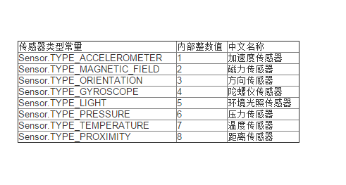

# 浅析Android中的传感器开发(黄汉煜    1501210915)


# 

浅析Android中的传感器开发


## 

作者：黄汉煜
学号：1501210915


### 

摘要：安卓中基于传感器的开发是安卓系统特有的开发形式，本文简要介绍了传感器开发的模式，列举了常用的传感器类型，并利用光照传感器、加速度传感器、地磁传感器实现了一个简易的指南针。

关键词：安卓、传感器、指南针、摇一摇

正文

说起移动开发中的特色开发技术，许多人的第一反应便是基于gps的位置服务，实际上，基于传感器的编程也是当前移动开发中极具特色的一环。所谓传感器，指的是，手机中的一种微型硬件设备，例如：光照传感器、加速度传感器、地磁传感器、压力传感器、温度传感器等。不同的传感器往往具有不同的规格与功能，但是，通过android系统提供的抽象接口，我们可以轻松的读取传感器提供的信息，在许多手机游戏中使用的重力感应技术、微信中的摇一摇等诸多有趣的应用都是基于传感器完成的。


一、	传感器编程的基本用法

Android中的传感器开发时用法大同小异，基本框架是相同的，可以分为以下几步：
首先，获取SensorManager的实例，这是所有传感器的管理器，有了它之后，我们就可以访问传感器类型：

 ```SensorManager sensorManager=(SensorManager)getSystemService(Context.SENSOR_SERVICE);```
 
然后，在该实例上通过调用getDefaultSensor()来获得任意的传感器类型，其参数为具体的传感器类型，我们一光照传感器为例：
 
 ```Sensor sensor=sensorManager.getDefaultSensor(Sensor.TYPE_LIGHT);```
 
接下来，对传感器的输出信号进行监听，借助接口SensorEventListener实现，该接口含两种方法，onSensorChanged()和 onAccuracyChanged()。当传感器的监测数值变化时，调用前者，前者的方法中含SensorEvent参数，该参数含一个values数组，记录了了输出的具体信息，其内容与监听的传感器类型有关。而当传感器精度发生变化时，我们调用后者。

```
SensorEventListener listener=new SensorEventListener()           {
            @Override
            public void onSensorChanged(SensorEvent event) {

            }

            @Override
            public void onAccuracyChanged(Sensor sensor, int accuracy) {

            }
        };
        ```
 
 
此后，我们需要调用SensorManager的 registerListener()方法来注册 SensorEventListener，
registerListener()方法接收三个参数，第一个参数就是 SensorEventListener的实例，第二个参数是Sensor的实例，第三个参数是用于表示传感器输出信息的更新速率， 共有SENSOR_DELAY_UI、 SENSOR_DELAY_NORMAL、SENSOR_DELAY_GAME 和 SENSOR_DELAY_FASTEST 这四种值可选， 它们的更新速率是依次递增的。


```
sensorManager.registerListener
(listener,sensor,SensorManager.SENSOR_DELAY_NORMAL)；
```
 
 
最后，当传感器使用完毕时，调用unregisterListener ()方法将使用的资源释放掉：
 
 ```
 sensorManager.unregisterListener(listener);
 ```
 

 
 二、	获取传感器类型
 
自android1.5开始，安卓便内置了八种传感器的支持，到了android4.4中，更是有多达20种的内置传感器，但是，并非所有的手机都支持如此多得独特硬件，我们列举常见的8种传感器，并通过一个简单的小程序来遍历当前手机中的传感器。




首先，我们在布局文件中加入textview以显示本机的情况：


```
<RelativeLayout xmlns:android="http://schemas.android.com/apk/res/android"
    xmlns:tools="http://schemas.android.com/tools" android:layout_width="match_parent"
    android:layout_height="match_parent" android:paddingLeft="@dimen/activity_horizontal_margin"
    android:paddingRight="@dimen/activity_horizontal_margin"
    android:paddingTop="@dimen/activity_vertical_margin"
    android:paddingBottom="@dimen/activity_vertical_margin" tools:context=".MainActivity">

    <TextView android:id="@+id/textview01" android:layout_width="wrap_content"
        android:layout_height="wrap_content" />

</RelativeLayout>
```

然后，我们在mainActivi中键入如下代码：

```
protected void onCreate(Bundle savedInstanceState) {
    super.onCreate(savedInstanceState);
    setContentView(R.layout.activity_main);
    final TextView textView=(TextView) findViewById(R.id.textview01);
    SensorManager sensorManager=(SensorManager) getSystemService(Context.SENSOR_SERVICE);
    List<Sensor> allSensors=sensorManager.getSensorList(Sensor.TYPE_ALL);
    textView.setText("经检测该手机有" + allSensors.size() + "个传感器，他们分别是：\n");
    for(Sensor s:allSensors)
    {
        String tempString = "\n" + "  设备名称：" + s.getName() + "\n" + "  设备版本：" + s.getVersion() + "\n" + "  供应商："
                +s.getVendor()+"\n";
        switch (s.getType())
        {
            case Sensor.TYPE_ACCELEROMETER:
                textView.setText(textView.getText().toString()+s.getType()+" 加速度传感器accelerometer" + tempString);
                break;
            case Sensor.TYPE_GYROSCOPE:
                textView.setText(textView.getText().toString()+s.getType()+" 陀螺仪传感器gyroscope" + tempString);
                break;
            case Sensor.TYPE_LIGHT:
                textView.setText(textView.getText().toString()+s.getType()+" 环境光线传感器light" + tempString);
                break;
            case Sensor.TYPE_MAGNETIC_FIELD:
                textView.setText(textView.getText().toString()+s.getType()+" 电磁场传感器magnetic field" + tempString);
                break;
            case Sensor.TYPE_PRESSURE:
                textView.setText(textView.getText().toString()+s.getType()+" 压力传感器pressure" + tempString);
                break;
            case Sensor.TYPE_PROXIMITY:
                textView.setText(textView.getText().toString()+s.getType()+" 距离传感器proximity" + tempString);
                break;

            default:
                textView.setText(textView.getText().toString() + s.getType() + " 未知传感器" + tempString);
                break;
        }
    }
}

```

在虚拟机上运行效果如下，在具体手机上运行的结果不同，例如在笔者的实体机上运行时，结果就明显不同：


三、	具体传感器实例

在前两个部分中，我们大致介绍了安卓传感器开发上的一些注意事项，现在我们决定着手开发一个简单的指南针，并在其中加入“摇一摇”的功能，以显示当前的光照强度，其中共需使用“方向传感器”、加速度传感器与光照传感器三种常见的传感器。

首先，光照传感器部分最为简单，只需注意光照改变时SensorEvent中values数组内仅含一个当前光照强度的数值，我们用一个变量存储该值，当环境变化时，修改之即可。

其次，加速度传感器稍微复杂一点，其values数组含三个值，分别代表手机在 X轴、 Y轴和 Z 轴方向上的加速度信息。X轴、Y轴、Z轴在空间坐标系上的含义如图所示。特别需要注意的是由于地心引力的作用，手机静止时某个轴必然受到9.8的加速度，我们为触发摇一摇，只需假定某个轴上出现超过预设值的加速度即可，不妨设预设值为15，若需调节敏感度，可自行设定：


最后，方向传感器有两种解决方案。可以沿用前两种传感器的模式，调用Sensor.TYPE_ORIENTATION 这种传感器类型，其values数组会记录手机在所有方向上的旋转角度，看似简单，并且实际上有效，但是，android现在已废弃Sensor.TYPE_ORIENTATION。因此，我们推荐使用加速度传感器和地磁传感器共同计算得出方向。由于方向传感器的精确度要求通常都比较高， 这里我们把传感器输出信息的更新速率提高了一些，使用的是 SENSOR_DELAY_GAME。

接下来在 onSensorChanged()方法中可以获取到 SensorEvent的 values数组，分别记录着加 速 度 传 感 器 和 地 磁 传 感 器 输 出 的 值 。 然 后 将 这 两 个 值 传 入 到 SensorManager 的getRotationMatrix()方法中就可以得到一个包含旋转矩阵的 R数组。

其中第一个参数 R 是一个长度为 9 的 float 数组，getRotationMatrix()方法计算出的旋转数据就会赋值到这个数组当中。 第二个参数是一个用于将地磁向量转换成重力坐标的旋转矩阵，通常指定为 null即可。第三和第四个参数则分别就是加速度传感器和地磁传感器输出的values值。
然后，调用SensorManager 的 getOrientation()方法来计算手机的旋转数据，values是一个长度为 3的 float数组， 手机在各个方向上的旋转数据都会被存放到这个数组当中。其中 values[0]记录着手机围绕着Z 轴的旋转弧度，values[1]记录着手机围绕 X轴的旋转弧度，values[2]记录着手机围绕 Y轴的旋转弧度。

最后，注意这里计算出的数据都是以弧度为单位的， 因此如果你想将它们转换成角度还需要调用如下方法：
