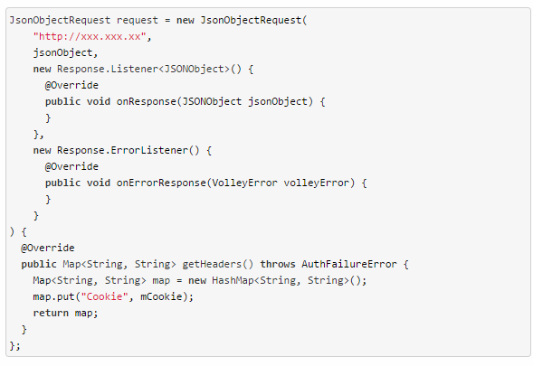
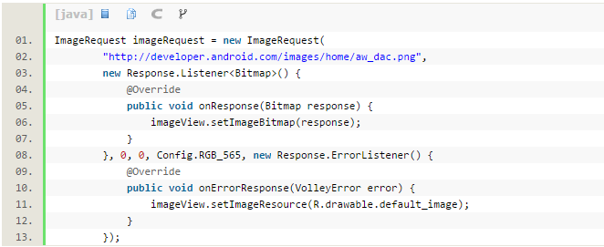
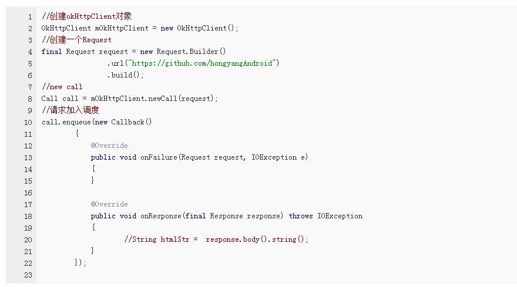
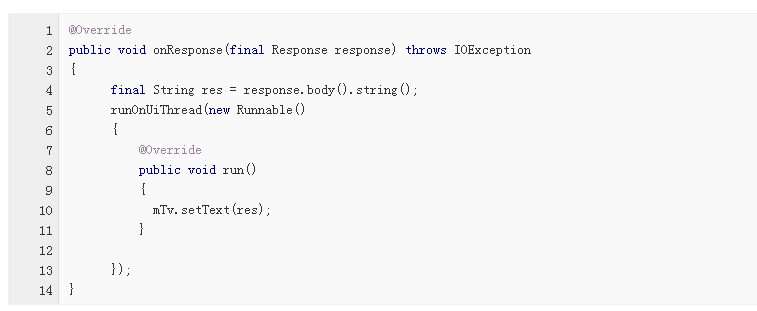
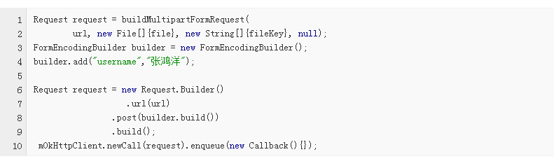

# Volley和okHttp网络库的使用

一、Volley简介以及使用
二、Okhttp的使用


                            Volley的简介和使用

一、	简介
1.由于Android中自带的HttPURLConnection用起来比较复杂，Google推出了Volley框架，以简化网络操作的复杂性。Volley可是说是把AsyncHttpClient和Universal-Image-Loader的优点集于了一身，既可以像AsyncHttpClient一样非常简单地进行HTTP通信，也可以像Universal-Image-Loader一样轻松加载网络上的图片。除了简单易用之外，Volley在性能方面也进行了大幅度的调整，它的设计目标就是非常适合去进行数据量不大，但通信频繁的网络操作，而对于大数据量的网络操作，比如说下载文件等，Volley的表现就会非常糟糕。以下是Volley的优点：
1）	默认Android2.3及以上基于HttpURLConnection，2.3以下使用基于HttpClient；
2）	符合Http 缓存语义 的缓存机制（提供了默认的磁盘和内存等缓存）；
3）	请求队列的优先级排序；
4）	提供多样的取消机制；
5）	提供简便的图片加载工具（其实图片的加载才是我们最为看重的功能）；
6）	 速度快。
Volley的缺点就是不适合像音频、视频等大数据的传输。

2. volley里面自带了很多的工具类，像JsonArrayRequest,JsonObjectRequest,ImageRequest
StringRequest这些都是我们平时经常使用的http请求，我们就可以直接把它们拿过来用。现在来一一说明这些类的用法吧。
requestQueue：所有的请求发出后，都是扔在这个队列里处理的。
RequestQueue mQueue = Volley.newRequestQueue（context.getApplicationContext());  
mQueue.add(request);//加入发起的请求
注意这里拿到的RequestQueue是一个请求队列对象，它可以缓存所有的HTTP请求，然后按照一定的算法并发地发出这些请求。RequestQueue内部的设计就是非常合适高并发的，因此我们不必为每一次HTTP请求都创建一个RequestQueue对象，这是非常浪费资源的，基本上在每一个需要和网络交互的Activity中创建一个RequestQueue对象就足够了。
二 、使用Volley发起常见的网络请求
2.1  StringRequest的用法
  StringRequest的网络请求返回的是一个字符串。它有两个构造函数，看他的类定义：
```
/**
  * Creates a new request with the given method.
  *
  * @param method the request {@link Method} to use
  * @param url URL to fetch the string at
  * @param listener Listener to receive the String response
  * @param errorListener Error listener, or null to ignore errors
  */
public StringRequest(int method, String url, Listener<String> listener, ErrorListener errorListener) {
     super(method, url, errorListener);
     mListener = listener;
    }
/**
  * Creates a new GET request.
  *
  * @param url URL to fetch the string at
  * @param listener Listener to receive the String response
  * @param errorListener Error listener, or null to ignore errors
  */
    public StringRequest(String url, Listener<String> listener, ErrorListener errorListener) {
     this(Method.GET, url, listener, errorListener);
    }
    ```
    第二个构造函数相比第一个少了个method的参数，所以它是默认使用get方法。第一个构造函数是可以让我们自己定义请求的方式，method的类型定义在Request类中 ：
    
    ```
    /**
   * Supported request methods.
   */
  public interface Method {
    int DEPRECATED_GET_OR_POST = -1;
    int GET = 0;
    int POST = 1;
    int PUT = 2;
    int DELETE = 3;
    int HEAD = 4;
    int OPTIONS = 5;
    int TRACE = 6;
    int PATCH = 7;
  }
************************************************************************
GET请求：
StringRequest request = new StringRequest(   
        "http://www.baidu.com/",  
        new Response.Listener<String>() {  
          @Override  
          public void onResponse(String arg0) {  
//收到成功应答后会触发这里  
//在这里处理收到的数据
  
          }  
        },  
        new Response.ErrorListener() {  
          @Override  
          public void onErrorResponse(VolleyError volleyError) {
 //出现连接错误会触发这里  
              //在这里处理出现错误的请求
          }  
        }  
);
mQueue.add(stringRequest);
******************************************************************
```
Post请求：
StringRequest request = new StringRequest(  
          Request.Method.POST,  
          "http://xxx.xxx.xxx",  
          new Response.Listener<String>() {  
            @Override  
            public void onResponse(String s) {  
             Log.d("TAG", response);  
            }  
          },  
          new Response.ErrorListener() {  
            @Override  
            public void onErrorResponse(VolleyError volleyError) {  
            Log.e("TAG", error.getMessage(), error);  
            }  
          }  
      ) {  
        @Override  
        public Map<String, String> getHeaders() throws AuthFailureError {  //设置头信息  
          Map<String, String> map = new HashMap<String, String>();  
          map.put("Content-Type", "application/x-www-form-urldecoded");  
          return map;  
        }  
        @Override  
        protected Map<String, String> getParams() throws AuthFailureError {  //设置参数  
          Map<String, String> map = new HashMap<String, String>();  
          map.put("name", "cpacm");  
          map.put("password", "12345");  
          return map;  
        }  
      };  
mQueue.add(stringRequest);
```

可以看到，这里new出了一个StringRequest对象，StringRequest的构造函数需要传入三个参数，第一个参数就是目标服务器的URL地址，第二个参数是服务器响应成功的回调，第三个参数是服务器响应失败的回调。其中，目标服务器地址我们填写的是百度的首页，然后在响应成功的回调里打印出服务器返回的内容，在响应失败的回调里打印出失败的详细信息。
StringRequest中并没有提供设置POST参数的方法，但是当发出POST请求的时候，Volley会尝试调用StringRequest的父类——Request中的getParams()方法来获取POST参数，那么解决方法自然也就有了，我们只需要在StringRequest的匿名类中重写getParams()方法，在这里设置POST参数就可以了，代码如下所示：

```
@Override  
        protected Map<String, String> getParams() throws AuthFailureError {  //设置参数  
          Map<String, String> map = new HashMap<String, String>();  
          map.put("name", "cpacm");  
          map.put("password", "12345");  
          return map;  
        }  

```
    

2.2使用JsonRequest 请求Json数据
类似于StringRequest，JsonRequest也是继承自Request类的，不过由于JsonRequest是一个抽象类，因此我们无法直接创建它的实例，那么只能从它的子类入手了。JsonRequest有两个直接的子类，JsonObjectRequest和JsonArrayRequest，从名字上你应该能就看出它们的区别了吧？一个是用于请求一段JSON数据的，一个是用于请求一段JSON数组的。
至于它们的用法也基本上没有什么特殊之处，先new出一个JsonObjectRequest对象，如下所示：




最后只要再把成功监听器里拿到的数据处理就能使用了。post传到服务器上时已经是json格式，接着在服务器里处理，返回的也要是json格式的数据，否则会导致数据错误（无法转化成JSONObject格式）。最后再将这个JsonObjectRequest对象添加到RequestQueue里就可以了，如下所示： mQueue.add(jsonObjectRequest);
2.3使用ImageRequest 加载网络图片
在Android开发中，常常会遇到请求网络图片，如用户头像获取。在Volley中使用ImaeRequest 获取网络图片：




以看到，ImageRequest的构造函数接收六个参数，第一个参数就是图片的URL地址，这个没什么需要解释的。第二个参数是图片请求成功的回调，这里我们把返回的Bitmap参数设置到ImageView中。第三第四个参数分别用于指定允许图片最大的宽度和高度，如果指定的网络图片的宽度或高度大于这里的最大值，则会对图片进行压缩，指定成0的话就表示不管图片有多大，都不会进行压缩。第五个参数用于指定图片的颜色属性，Bitmap.Config下的几个常量都可以在这里使用，其中ARGB_8888可以展示最好的颜色属性，每个图片像素占据4个字节的大小，而RGB_565则表示每个图片像素占据2个字节大小。第六个参数是图片请求失败的回调，这里我们当请求失败时在ImageView中显示一张默认图片。
最后将这个ImageRequest对象添加到RequestQueue里就可以了，如下所示：
mQueue.add(imageRequest);

OKHttp的使用

一、概述
最近在群里听到各种讨论okhttp的话题，可见okhttp的口碑相当好了。再加上Google貌似在6.0版本里面删除了HttpClient相关API，对于这个行为不做评价。为了更好的在应对网络访问，学习下okhttp还是蛮必要的，本篇博客首先介绍okhttp的简单使用，主要包含：
•	一般的get请求
•	一般的post请求
•	基于Http的文件上传
•	文件下载
•	加载图片
•	支持请求回调，直接返回对象、对象集合
•	支持session的保持
最后会对上述几个功能进行封装，完整的封装类的地址见：https://github.com/hongyangAndroid/okhttp-utils
二、使用教程
（一）Http Get
对了网络加载库，那么最常见的肯定就是http get请求了，比如获取一个网页的内容。




1.	以上就是发送一个get请求的步骤，首先构造一个Request对象，参数最起码有个url，当然你可以通过Request.Builder设置更多的参数比如：header、method等。
2.	然后通过request的对象去构造得到一个Call对象，类似于将你的请求封装成了任务，既然是任务，就会有execute()和cancel()等方法。
3.	最后，我们希望以异步的方式去执行请求，所以我们调用的是call.enqueue，将call加入调度队列，然后等待任务执行完成，我们在Callback中即可得到结果。
看到这，你会发现，整体的写法还是比较长的，所以封装肯定是要做的，不然每个请求这么写，得累死。
ok，需要注意几点：
•	onResponse回调的参数是response，一般情况下，比如我们希望获得返回的字符串，可以通过response.body().string()获取；如果希望获得返回的二进制字节数组，则调用response.body().bytes()；如果你想拿到返回的inputStream，则调用response.body().byteStream()
看到这，你可能会奇怪，竟然还能拿到返回的inputStream，看到这个最起码能意识到一点，这里支持大文件下载，有inputStream我们就可以通过IO的方式写文件。不过也说明一个问题，这个onResponse执行的线程并不是UI线程。的确是的，如果你希望操作控件，还是需要使用handler等，例如：




•	我们这里是异步的方式去执行，当然也支持阻塞的方式，上面我们也说了Call有一个execute()方法，你也可以直接调用call.execute()通过返回一个Response。
(二) Http Post 携带参数
看来上面的简单的get请求，基本上整个的用法也就掌握了，比如post携带参数，也仅仅是Request的构造的不同。




大家都清楚，post的时候，参数是包含在请求体中的；所以我们通过FormEncodingBuilder。添加多个String键值对，然后去构造RequestBody，最后完成我们Request的构造。
后面的就和上面一样了。
（三）基于Http的文件上传
接下来我们在介绍一个可以构造RequestBody的Builder，叫做MultipartBuilder。当我们需要做类似于表单上传的时候，就可以使用它来构造我们的requestBody。
File file = new File(Environment.getExternalStorageDirectory(), "balabala.mp4");

RequestBody fileBody = RequestBody.create(MediaType.parse("application/octet-stream"), file);

RequestBody requestBody = new MultipartBuilder()
     .type(MultipartBuilder.FORM)
     .addPart(Headers.of(
          "Content-Disposition", 
              "form-data; name=\"username\""), 
          RequestBody.create(null, "张鸿洋"))
     .addPart(Headers.of(
         "Content-Disposition", 
         "form-data; name=\"mFile\"; 
         filename=\"wjd.mp4\""), fileBody)
     .build();

Request request = new Request.Builder()
    .url("http://192.168.1.103:8080/okHttpServer/fileUpload")
    .post(requestBody)
    .build();

Call call = mOkHttpClient.newCall(request);
call.enqueue(new Callback()
{
    //...
});
上述代码向服务器传递了一个键值对username:张鸿洋和一个文件。我们通过MultipartBuilder的addPart方法可以添加键值对或者文件。
其实类似于我们拼接模拟浏览器行为的方式，如果你对这块不了解，可以参考：从原理角度解析Android （Java） http 文件上传
ok，对于我们最开始的目录还剩下图片下载，文件下载；这两个一个是通过回调的Response拿到byte[]然后decode成图片；文件下载，就是拿到inputStream做写文件操作，我们这里就不赘述了。
三、封装
由于按照上述的代码，写多个请求肯定包含大量的重复代码，所以我希望封装后的代码调用是这样的：
（一）使用
1.	一般的get请求
2.	OkHttpClientManager.getAsyn("https://www.baidu.com", new OkHttpClientManager.ResultCallback<String>()
3.	        {
4.	            @Override
5.	            public void onError(Request request, Exception e)
6.	            {
7.	                e.printStackTrace();
8.	            }
9.	
10.	            @Override
11.	            public void onResponse(String u)
12.	            {
13.	                mTv.setText(u);//注意这里是UI线程
14.	            }
15.	        });
对于一般的请求，我们希望给个url，然后CallBack里面直接操作控件。
2文件上传且携带参数
我们希望提供一个方法，传入url,params,file,callback即可。
  OkHttpClientManager.postAsyn("http://192.168.1.103:8080/okHttpServer/fileUpload",//
    new OkHttpClientManager.ResultCallback<String>()
    {
        @Override
        public void onError(Request request, IOException e)
        {
            e.printStackTrace();
        }

        @Override
        public void onResponse(String result)
        {

        }
    },//
    file,//
    "mFile",//
    new OkHttpClientManager.Param[]{
            new OkHttpClientManager.Param("username", "zhy"),
            new OkHttpClientManager.Param("password", "123")}
        );

键值对没什么说的，参数3为file，参数4为file对应的name，这个name不是文件的名字； 对应于http中的 <input type="file" name="mFile" >对应的是name后面的值，即mFile.
3. 文件下载
对于文件下载，提供url，目标dir，callback即可
OkHttpClientManager.downloadAsyn(
    "http://192.168.1.103:8080/okHttpServer/files/messenger_01.png",    
    Environment.getExternalStorageDirectory().getAbsolutePath(), 
new OkHttpClientManager.ResultCallback<String>()
    {
        @Override
        public void onError(Request request, IOException e)
        {

        }

        @Override
        public void onResponse(String response)
        {
            //文件下载成功，这里回调的reponse为文件的absolutePath
        }
});
好了，就到这里，需要说明的是，一般在项目中常常使用多种网络框架来满足不同的需求，充分了解各种不同框架的优缺点，合理选用，可以提高程序运行的效率。

