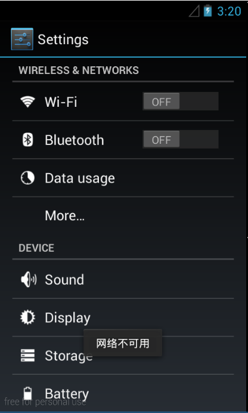
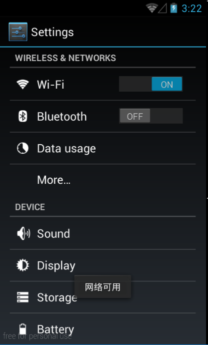
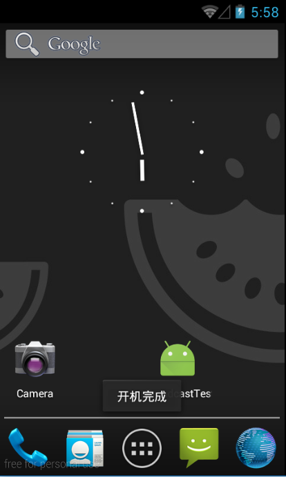
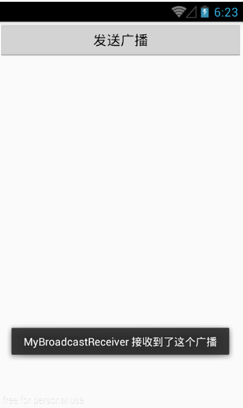
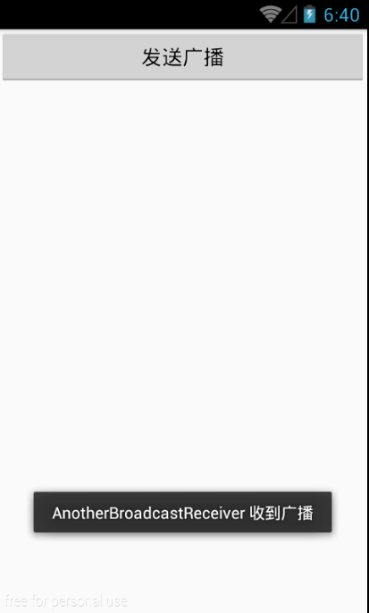
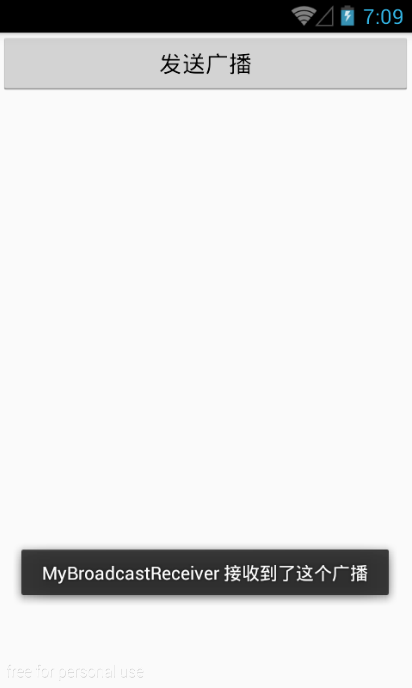

# 详解Android中的广播机制（1501210974 屈中山）
##**1. 广播机制简介**
为了方便进行系统级别的消息通知，Android引入了一套广播消息机制。Android中的广播机制非常灵活，每个应用程序都可以对自己感兴趣的广播进行注册，这样该程序就只会接收到自己所关心的广播内容，这些广播可能是来自系统的，也可能是来自其他应用程序的。Android提供了一套完整的API，允许应用程序自由地发送和接受广播。
##**2. 广播的类型**
Android中的广播可以分为两种类型，标准广播和有序广播。
标准广播（Normal broadcasts）是一种完全异步执行的广播，在广播发出之后，所有的广播接收器机会都会在同一时刻接收到这条广播消息，因此它们之间没有任何先后顺序可言。这种广播的效率会比较高，但同时也意味着它是无法被截断的。
有序广播（Ordered broadcasts）则是一种同步执行的广播，在广播发出之后，同一时刻只会有一个广播接收器能够收到这条广播消息，当这个广播接收器中的逻辑执行完毕后，广播才会继续传递。所以此时的广播接收器是有先后顺序的，优先级高的广播接收器就可以先接收到消息，而且前面的广播接收器还可以截断正在传递的广播，这样后面的广播接收器就无法收到广播消息了。
##**3. 接收系统广播**
Android中内置了很多系统级别的广播，开发者可以在应用程序中通过监听这些广播来得到各种系统的状态信息。比如手机开机完成后会发出一条广播，电池的电量发生变化会发出一条广播，时间和时区发生变化也会发出一条广播等等。如果想要接收到这些广播，就需要使用广播接收器。
###**3.1 广播注册方式**
注册广播的方式一般有两种，在代码中注册和在AndroidManifest.xml文件中注册，其中前者也称为动态注册，后者也称为静态注册。
###**3.2 动态注册监听网络变化**
① 新建一个名称为BroadcastTest的项目，在MainActivity中定义一个内部类NetworkChangeReceiver，使这个类继承BroadcastReceiver类，并重写父类的onReceive（）方法。这样当网络状态发生变化时，onReceive（）方法就会得到执行。在onReceive（）方法中，首先通过getSystemService（）方法得到了ConnectivityManager的实例，只是一个系统服务类，专门用于管理网络连接的。然后调用它的getActiveNetworkInfo（）方法可以得到NetworkInfo的实例，接着调用NetworkInfo的isAvailable（）方法，就可以判断出当前是否有网络了，最后通过Toast的方式对用户进行提示。具体代码如下：
    
    class NetworkChangeReceiver extends BroadcastReceiver {
        @Override
        public void onReceive(Context context, Intent intent) {
            ConnectivityManager connectionManager = (ConnectivityManager)getSystemService(Context.CONNECTIVITY_SERVICE);
            NetworkInfo networkInfo = connectionManager.getActiveNetworkInfo();
            if (networkInfo != null && networkInfo.isAvailable()) {
                Toast.makeText(context, "网络可用", Toast.LENGTH_SHORT).show();
            } else {
                Toast.makeText(context, "网络不可用", Toast.LENGTH_SHORT).show();
            }
        }
    } 
    
② 修改MainActivity中的代码，重写onCreate（）方法和onDestroy（）方法。在onCreate（）方法中，首先创建一个IntentFilter的实例，并且为它添加一个值为android.net.conn.CONNECITVITY_CHANGE的action。接下来创建一个NetworkChangeReceiver的实例，然后调用registerReceiver（）方法进行注册，将NetworkChangeReceiver的实例和IntentFilter的实例都传进去，这样NetworkChangeReceiver就会收到所有值为android.net.conn.CONNECTIVITY_CHANGE的广播，也就实现了监听网络变化的工能。注意，动态注册的广播接收器一定要取消注册才行，所以在onDestroy方法中通过调用unregisterReceiver（）方法来实现取消注册。具体代码如下：

public class MainActivity extends Activity {

    private IntentFilter intentFilter;
    private NetworkChangeReceiver networkChangeReceiver;

    @Override
    protected void onCreate(Bundle savedInstanceState) {
        super.onCreate(savedInstanceState);
        setContentView(R.layout.activity_main);
        intentFilter = new IntentFilter();
        intentFilter.addAction("android.net.conn.CONNECTIVITY_CHANGE");
        networkChangeReceiver = new NetworkChangeReceiver();
        registerReceiver(networkChangeReceiver, intentFilter);
    }

    @Override
    protected void onDestroy() {
        super.onDestroy();
        unregisterReceiver(networkChangeReceiver);
    }

    class NetworkChangeReceiver extends BroadcastReceiver {

        @Override
        public void onReceive(Context context, Intent intent) {
            ConnectivityManager connectionManager = (ConnectivityManager)getSystemService(Context.CONNECTIVITY_SERVICE);
            NetworkInfo networkInfo = connectionManager.getActiveNetworkInfo();
            if (networkInfo != null && networkInfo.isAvailable()) {
                Toast.makeText(context, "网络可用", Toast.LENGTH_SHORT).show();
            } else {
                Toast.makeText(context, "网络不可用", Toast.LENGTH_SHORT).show();
            }
        }
    }
}

③ 在AndroidManifest.xml文件中加入可以查询网络状态的权限。Android系统为了保证应用程序可安全性做了规定，如果程序要访问一些系统的关键性信息，必须在配置文件中声明权限才可以，否则程序将会直接崩溃。具体代码如下：

<manifest xmlns:android="http://schemas.android.com/apk/res/android"
    package="com.example.broadcasttest" >
    <uses-permission android:name="android.permission.ACCESS_NETWORK_STATE"/>

④ 查看运行结果。运行程序后按下Home键，点击打开/关闭数据网络开关，查看效果。

###**3.3 静态注册实现开机启动**
① 新建一个BootCompleteReceiver继承自BroadcastReceiver，具体代码如下：

public class BootCompleteReceiver extends BroadcastReceiver {
    
    @Override
    public void onReceive(Context context, Intent intent) {
        Toast.makeText(context, "开机完成", Toast.LENGTH_SHORT).show();
    }
}

② 修改AndroidManifest.xml文件，将这个广播接收器的类名注册进去。具体代码如下：

<uses-permission android:name="android.permission.RECEIVE_BOOT_COMPLETED"/>
    <application
        android:allowBackup="true"
        android:icon="@mipmap/ic_launcher"
        android:label="@string/app_name"
        android:theme="@style/AppTheme" >
        <activity
            android:name=".MainActivity"
            android:label="@string/app_name" >
            <intent-filter>
                <action android:name="android.intent.action.MAIN" />
                <category android:name="android.intent.category.LAUNCHER" />
            </intent-filter>
        </activity>
        <receiver android:name=".BootCompleteReceiver">
            <intent-filter>
                <action android:name="android.intent.action.BOOT_COMPLETED"/>
            </intent-filter>
        </receiver>

<application>标签内出现了一个新的标签<receiver>，所有静态注册的广播接收器都是在这里进行注册的。首先通过android：name来指定具体注册哪一个广播接收器，然后在<intent-filter>标签里加入想要接收的广播就行。另外，监听系统开机广播也需要声明权限。

③ 查看运行效果。

##**4. 发送自定义广播**
###**4.1 发送标准广播**
① 新建一个BroadcastReceiver类，使它继承自BroadcastReceiver类。具体代码如下：

public class MyBroadcastReceiver extends BroadcastReceiver {
    
    @Override
    public void onReceive(Context context, Intent intent) {
        Toast.makeText(context, "MyBroadcastReceiver 接收到了这个广播", Toast.LENGTH_SHORT).show();
    }
}

② 在AndroidManifest.xml文件中对这个广播接收器进行注册。具体代码如下：

<receiver android:name=".MyBroadcastReceiver">
    <intent-filter>
     <action android:name="com.example.broadcasttest.MY_BROADCAST"/>
    </intent-filter>
</receiver>

③ 修改activity_main.xml中的代码，具体如下：

<LinearLayout xmlns:android="http://schemas.android.com/apk/res/android"
    xmlns:tools="http://schemas.android.com/tools"
    android:layout_width="match_parent"
    android:layout_height="match_parent" >

    <Button
        android:id="@+id/button"
        android:layout_width="match_parent"
        android:layout_height="wrap_content"
        android:text="发送广播"
        />

</LinearLayout>

④ 修改MainActivity中的代码，具体如下：

Button button = (Button)findViewById(R.id.button);
button.setOnClickListener(new View.OnClickListener() {
        
        @Override
        public void onClick(View v) {
            Intent intent = new Intent("com.example.broadcasttest.MY_BROADCAST");
            sendBroadcast(intent);
        }
});

⑤ 演示效果。

###**4.2 发送有序广播**
广播是一种可以跨进程的通信方式，在一个应用程序内发出的广播，其他的应用程序也是可以收到的。

①新建一个BroadcastTest2项目，新建一个AnotherBroadcastReceiver类继承自BroadcastReceiver。具体代码如下：

public class AnotherBroadcastReceiver extends BroadcastReceiver {
    
    @Override
    public void onReceive(Context context, Intent intent) {
        Toast.makeText(context, "AnotherBroadcastReceiver 收到广播", Toast.LENGTH_SHORT).show();
    }
}

② 在AndroidManifest.xml文件中对这个广播接收器进行注册。具体代码如下：

<receiver android:name=".AnotherBroadcastReceiver">
    <intent-filter>
    <action android:name="com.example.broadcasttest.MY_BROADCAST" />
    </intent-filter>
</receiver>

③ 演示效果，打开BroadcastTest，点击Send Broadcast按钮，结果如下：

这就证明了，一个应用程序发出的广播可以被其他的应用程序接收到。

④ 关闭BroadcastTest2项目，修改MainActivity中的代码，将sendBroadcast（）方法改成sendOrderedBroadcast（）方法。sendOrderedBroadcast（）方法接收两个参数，第一个参数仍然是Intent，第二个参数是一个与权限相关的字符串，传入null即可。具体代码如下：

Button button = (Button)findViewById(R.id.button);
button.setOnClickListener(new View.OnClickListener() {

    @Override
    public void onClick(View v) {
            Intent intent = new Intent("com.example.broadcasttest.MY_BROADCAST");
            sendOrderedBroadcast(intent, null);
        }
});

⑤ 修改AndroidManifest.xml文件中的代码，给广播接收器设置优先级，优先级较高的广播接收器就可以先接收到广播。具体代码如下：

<receiver android:name=".MyBroadcastReceiver">
<intent-filter android:priority="100">
            <action android:name="com.example.broadcasttest.MY_BROADCAST"/>
        </intent-filter>
</receiver>

⑥ 修改MyBroadcastReceiver中的代码，在onReceive（）方法中调用abortBroadcast()方法，将这广播截断，这样后面的广播接收器将无法再接收到这条广播。

⑦ 演示效果。

##**5. 使用本地广播**
前面所发送和接收的都属于系统全局广播，即发出的广播可以被其他任何的应用程序接收到，并且可以接收来自于其他任何应用程序的广播。这样就很容易会引起安全性的问题。为了能够简单的解决广播的安全性问题，Android引入了一套本地广播机制，使用这个机制发出的广播可以只能够在应用程序内部进行传递，并且广播接收器也只能接收来自本应用程序发出的故宫宁波，这样安全性问题就不存在了。

下面通过具体实例来尝试一下它的用法：

① 修改MainActivity中的代码，新建类LocalReceiver，具体代码如下：

class LocalReceiver extends BroadcastReceiver {

        @Override
        public void onReceive(Context context, Intent intent) {
            Toast.makeText(context, "接收到了本地广播", Toast.LENGTH_SHORT).show();
        }
}

② 修改onCreate()方法和onDestroy()方法，首先通过LocalBroadcastManagerd的getInstance()方法得到它的一个实例，然后注册广播接收器的时候调用LocalBroadcastManager的sendBroadcast（）方法。具体代码如下：

private IntentFilter intentFilter;
    private LocalReceiver localReceiver;
    private LocalBroadcastManager localBroadcastManager;

    @Override
    protected void onCreate(Bundle savedInstanceState) {
        super.onCreate(savedInstanceState);
        setContentView(R.layout.activity_main);
        localBroadcastManager = LocalBroadcastManager.getInstance(this);

        Button button = (Button)findViewById(R.id.button);
        button.setOnClickListener(new View.OnClickListener() {
            @Override
            public void onClick(View v) {
                Intent intent = new Intent("com.example.broadcasttest.Local_BROADCAST");
                localBroadcastManager.sendBroadcast(intent);
            }
        });

        intentFilter = new IntentFilter();
        intentFilter.addAction("com.example.broadcasttest.Local_BROADCAST");
        localReceiver = new LocalReceiver();
        localBroadcastManager.registerReceiver(localReceiver, intentFilter);

    }

    @Override
    protected void onDestroy() {
        super.onDestroy();
        localBroadcastManager.unregisterReceiver(localReceiver);
    }

③ 演示效果。

