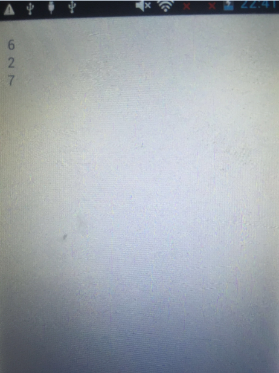

# 详解Android中的重力感应

作者：舒心

学号：1501210982

摘要：随着互联网的发展，移动终端的功能已经不再仅仅可以接打电话了，它已经变成拥有各种辅助功能的移动平台，内置的传感器可以使人们与手机的交互更加的多元化，而其中重力感应的检测是非常重要的，通过重力感应开发移动平台的应用将会使手机的交互方式变得更加有趣

一．智能手机
	
  随着世界互联网的发展，移动终端的功能已经趋向多元化，移动互联时代中仅仅能够实现通话的手机已经不能满足当前用户的需求，用户需要的是一种具有各项辅助功能的智能平台。
  
  对于现在的智能手机而言，人机交互也是用户需求的重点，从以前的应用
  与服务及低功耗的设计，现在人，计算机以及它们之间相互影响的技术已经越来越受到人们的重视，当前的人机交互技术和应用包括感应技术，触控技术和语言识别技术。

二．手机传感器

1.传感器的定义

国家标准GB7665-87对传感器下的定义是：“能感受规定的被测量件并按照一定的规律转换成可用信号的器件或装置，通常由敏感元件和转换元件组成。

2.传感器的作用

人们借助于感觉器官从外界获取信息，而传感器相当于人类五官的延长，在现在的各个方面是不可缺少的部分，随着新技术革命的到来，世界进入了信息时代，通过传感器获取准确可靠的信息对社会的发展是非常重要的。
智能手机发展到今天，内置的各类传感器发挥了不可磨灭的作用，在我们横屏看照片时，它可以非常智能的把照片一起放大并且一起横过来，有电话来时，当我们把耳朵靠近手机屏幕，屏幕就会自动关闭，除此之外，在玩游戏时，我们左右晃动屏幕，屏幕里的主人公就会随着晃动做出相应的动作。

在Android2.3系统中，google提供了11种传感器供应用层使用，具体如下（Sensor类）：

define SENSOR_TYPE_ACCELEROMETER                    //加速度

define SENSOR_TYPE_MAGNETIC_FIELD                   //磁力

define SENSOR_TYPE_ORIENTATION                      //方向

define SENSOR_TYPE_GYROSC                           //陀螺仪

define SENSOR_TYPE_LIGHT                            //光线感应

define SENSOR_TYPE_PRESSURE                         //压力

define SENSOR_TYPE_TEMPERATURE                      //温度

define SENSOR_TYPE_PROXIMITY                        //接近

define SENSOR_TYPE_GRAVITY                          //重力

define SENSOR_TYPE_LINEAR_ACCELERATION              //线性加速度

define SENSOR_TYPE_ROTATION_VECTOR                  //旋转矢量

三.重力感应
	
手机的重力感应技术是指手机受到重力影响时所对应出现的各种功能，这其中最重要的传感器是加速度感应器但又不限于加速度感应器，由于摇动晃动手机所产生的变化感知也属于重力感应的一部分，总的来说重力感应是加速度传感器与重力传感器起到了非常大的作用。

1.	加速度传感器与重力传感器的简介

加速度传感器是一种能够测量加速力的电子设备。加速力就是当物体在加速过程中作用在物体上的力，就好比地球引力，也就是重力。加速力可以是个常量，比如g，也可以是变量。加速度计有两种：一种是角加速度计，是由陀螺仪（角速度传感器）的改进的。另一种就是线加速度计。

重力感应器又叫重力传感器，新型的传感器技术，采用弹性敏感元件制成悬臂式位移器，与采用弹性敏感元件制成的储能弹簧来驱动电触点，完成从重力变化到电信号的转换。目前绝大多数中高端智能手机和平板电脑内置了重力传感器，如苹果的系列产品iphone和iPad，Android系列的手机等。

2.	加速度传感器与重力传感器的原理

加速度传感器主要的目的是感应重力加速力的变化，它的工作原理是将测量得到的加速度转换为相应的电信号，再将模拟信号转
换得到数字信号，通过计算机等终端设备进行显示和存储。
重力感应器是根据压电效应的原理来工作的，所谓的压电效应就是“对于不存在对称中心的异极晶体加在晶体上的外力除了使晶体发生形变以外，还将改变晶体的极化状态，在晶体内部建立电场，这种由于机械力作用使介质发生极化的现象称为正压电效应”。

重力传感器就是利用了其内部的由于加速度造成的晶体变形这个特性。由于这个变形会产生电压，只要计算出产生电压和所施加的加速度之间的关系，就可以将加速度转化成电压输出。当然，还有很多其它方法来制作加速度传感器，比如电容效应，热气泡效应，光效应，但是其最基本的原理都是由于加速度产生某个介质产生变形，通过测量其变形量并用相关电路转化成电压输出

3.	重力感应在手机中的应用

重力感应在手机中的应用有很多，例如在手机横竖的时候屏幕会自动转，在玩游戏可以代替上下左右，说玩赛车游戏，可以不通过按键，将手机平放，左右摇摆就可以代替模拟机游戏的方向左右移动了等，其主要分为几个方面。

3.1	倾斜度检测

在加速度传感器与重力方向不一致时，会产生倾斜角，加速度传感器感应的信号会出现相应的改变，基于信号变化的差别，能够计算出倾斜角的大小和方向。双轴可以测出倾角，第三轴用于校正。

3.2	运动检测

加速度传感器通过对手机的位移进行计算，来检测手机的速度变化，通过这种方式，可以使智能手机拥有计步器和运动检测的功能，为人们在日常生活中提供便利和乐趣。

3.3	定位检测

在地图查找、汽车导航、被盗追踪等场合下，常常希望手机具有定位检测的功能，加速度传感器可以通过加速度信息实现对手机的定位与追踪。

3.4	自由下落检测

这是一个新的功能，主要目的是保护手机的安全，在遇到不可控制的情况下可以及时保护手机里的重要信息，加速度传感器在发生速度的剧烈变化时能够有效地检测并采用其他方法保护硬盘的存储信息以实现在紧急情况下对手机的保护。

四.重力感应开发

1.Sensor类

Sensor类就是传感器类，包含的方法是get型的用来获取所选传感器的一些属性，Sensor类一般不需要new而是SensorManager的方法获得

2.SensorManager类

SensorManager类是Android感应检测管理类,再进行重力感应开发时，需要使
用这类的实例管理Sensor，监听相应的Sensor的变化，做出相应的处理。

3.重力感应开发的步骤

首先，取得SensorManager，调用Context.getSystemService(SENSOR_SERVICE)来取得感应检测的服务

通过感应检测管理类SensorManager类获取目标Sensor类的实例，通过调用SensorManager.getDefaultSensor(Sensor.TYPE_ACCELEROMETER)实现，这里取得的是加速度传感器的实例，或者可以通过SensorManager.getSensorList(Sensor.TYPE_ACCELEROMETER)来获取Sensor实例的列表。

注册监听器，通过调用SensorManager.regesterListener(SensorEventListener listener,Sensor sensor, int rate)实现，第一个参数是监听Sensor事件，第二个参数是Sensor目标种类的值，第三个参数是感应Sensor的延迟时间，因为感应检测Sensor的服务是否频繁和电池的消耗有关同时也会影响处理的效率，所以要兼顾到这两者，设置感应检测Sensor的延迟时间是非常重要的，要根据需求来做适当的设置。

实现感应检测Sensor的监听功能，通常提供两个方法，public void onAccuracyChanged(Sensor sensor, int accuracy)和public void onSensorChanged(SensorEvent event)，前者是在感应到Sensor的精密度产生变化的时候调用，后者是在检测Sensor的值有变化的时候会调用到。

取消注册，调用SensorManager.unregisterListener(SensorEventListener listener)实现。

4.重力感应开发实战

实现一个简单的重力感应应用，在屏幕上返回当前的x，y，z三轴坐标值

    public class MyActivity extends Activity implements SensorEventListener {
        private SensorManager msensorManager;
        private Sensor msensor;
        private TextView testx;
        private TextView testy;
        private TextView testz;
    
        @Override
        public void onCreate(Bundle savedInstanceState){
            super.onCreate(savedInstanceState);
            setContentView(R.layout.activity_main);
            testx=(TextView)findViewById(R.id.testx);
            testy=(TextView)findViewById(R.id.testy);
            testz=(TextView)findViewById(R.id.testz);
            msensorManager=(SensorManager)this.getSystemService(SENSOR_SERVICE);//获取SensorManager
            msensor= msensorManager.getDefaultSensor(Sensor.TYPE_ACCELEROMETER);//获取Sensor
            if(msensorManager==null){
                Log.d("ppaabb","Not Find device");
            }
            msensorManager.registerListener(this,msensor,SensorManager.SENSOR_DELAY_GAME);//注册监听器
        }
        @Override
        public void onAccuracyChanged(Sensor sensor,int accuracy){

        }
        @Override
        public void onSensorChanged(SensorEvent event){//实现感应检测的监听功能
            if(event.sensor==null){
                return;
            }
            if(event.sensor.getType()==Sensor.TYPE_ACCELEROMETER){
                int x=(int)event.values[0];
                int y=(int)event.values[1];
                int z=(int)event.values[2];

                testx.setText(String.valueOf(x));
                testy.setText(String.valueOf(y));
                testz.setText(String.valueOf(z));

            }
        }

        @Override
        protected void onStop(){
            super.onStop();
            if(msensorManager!=null){
                msensorManager.unregisterListener(this);
            }
        }

    }

参考文献

[1] 王梦思、柴华、龙明涛、郎亦虹、吴瑶.重力感应技术在智能手机中的应用分析[J].电视技术.2013,37(S2)

[2] 揭秘手机传感器[J].大众科学.2014,12:52-55

